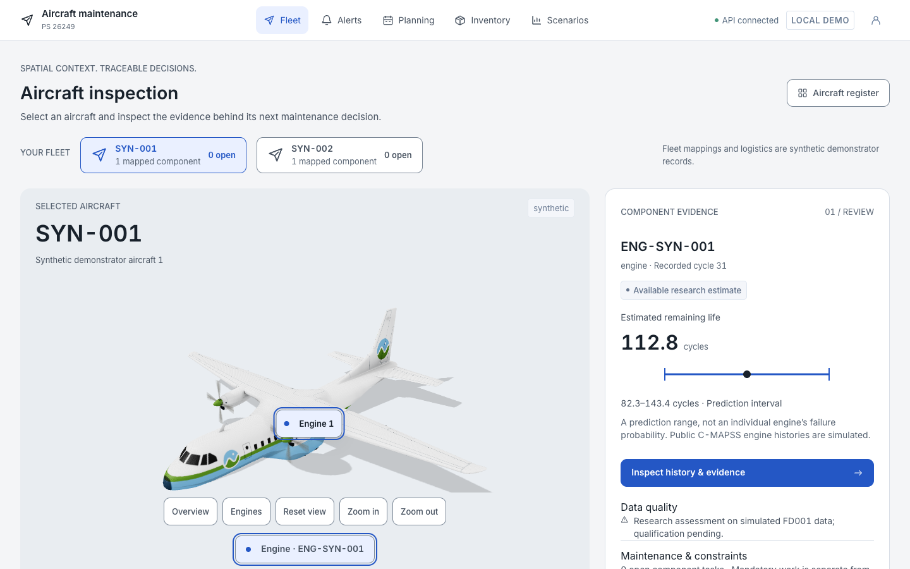

# Aircraft Predictive Maintenance & Fleet Availability

**[Open the product](https://pallavpushkar3-gif.github.io/sih-project/)** · [Startup and deployment guide](docs/operations/pages_and_tunnel.md).

The React product is published through GitHub Pages. Its synthetic demo API runs in an isolated local Docker stack through an HTTPS tunnel. Pages checks backend readiness and opens the complete app on the tunnel origin to avoid third-party cookie restrictions. If the host or tunnel stops, Pages shows **Demo backend offline**.

PS 26249 is a local decision-workspace demonstrator connecting labelled component records, maintenance constraints, inventory reservations and scenario-specific availability simulation. It is not an airworthiness, dispatch or operational-readiness system.

## Current implemented boundary

The default local entry now opens **Start**, with a concise offer and the flow **Review a component → Check maintenance options → Review approval & work**. Primary navigation is Start, Fleet and Planning; supporting tools are grouped under More tools. See the [defined user flow](docs/product/user_flow.md) for screen responsibilities, exception paths and implementation limits.

The website now includes **AI & evidence** (`/ai`) and an explanation on the Fleet entry screen. It explains how supported sensor history becomes an engine-life estimate and how that evidence connects to alerts, constrained planning and simulated downtime. Component selection shows saved API evidence with quality and unavailable states. See [current project status and remaining work](docs/team/project_status.md) for the latest source audit; the original release remains incomplete.

The repository currently provides:

- a React/TypeScript/Vite interface for fleet, component evidence, alerts, planning, inventory and simulation scenarios;
- a FastAPI/SQLAlchemy API with an Alembic schema and labelled synthetic demo records;
- PostgreSQL-backed proposal approval with current-input checks, row locking, reservations and audit records;
- an OR-Tools CP-SAT planner with independent checks for windows, capacity, fixed work, precedence and aggregate stock;
- deterministic SimPy reference scenarios with explicit aircraft-time availability, queue wait and horizon handling;
- Celery/RabbitMQ durable job execution with PostgreSQL outbox dispatch, attempt claiming, cancellation and stale-result rejection; and
- unit, verification, API and browser workflow checks.

The NASA C-MAPSS FD001 baseline now serves immutable, cutoff-bound histories through durable assessment jobs, with hash-verified model/transform/calibration artifacts and noncausal feature sensitivities. The user-approved frozen demonstrator prediction and interval gates passed on the official 100-engine final test: capped MAE 8.722 cycles, RMSE 11.710 cycles, coverage 98%, mean interval width 58.231 cycles. These are this implementation's results, not reproductions of published model scores or operational safety evidence.

Opaque cookie sessions, CSRF/origin checks, account provisioning, atomic labelled fixture imports, stock corrections, immutable revisions, work completion/cancellation, bounded lost-worker recovery and durable per-attempt history are implemented. Validation-only explanation diagnostics and a bounded concurrent HTTP workload benchmark are available. See [production readiness](docs/operations/production_readiness.md) for verified evidence, operator setup and remaining acceptance gaps. The full original release is not yet accepted: independent alert validation, explanation stability, broader robustness and workload performance evidence remain incomplete.

## Prerequisites

- Docker with Compose
- Node.js 24 and Corepack/pnpm 12

The backend image uses Python 3.13, matching `backend/pyproject.toml`. A host Python installation is not required.

## Setup and run

```sh
make setup
make dev
```

Open <http://localhost:8080>. The Compose stack migrates PostgreSQL and seeds the labelled demo records on first API startup. RabbitMQ management is exposed at <http://localhost:15672> for local inspection only.

Environment defaults are in `.env.example`. Do not use the demonstration credentials or session secret outside local development.

## Verified checks

```sh
make web-check
make backend-check
make backend-integration
make e2e
make science-check
make sequence-check
```

`make web-check` runs ESLint, TypeScript, the production build and Vitest. `make backend-check` builds the Python 3.13 test image, then runs Ruff, mypy, and the unit/verification suites. `make backend-integration` runs the integration tests against PostgreSQL, including the concurrent stock-reservation race. `make e2e` starts PostgreSQL, RabbitMQ, the API, outbox dispatcher and worker before running Playwright in Chrome.

PostgreSQL-specific reservation races and broker/process fault injection require the integration environment described in `docs/operations/local_setup.md`; SQLite results must not be used as evidence for those criteria.

After acquiring and preparing FD001 as documented in `docs/operations/local_setup.md`, `make science-train`, `make sequence-train`, `make science-calibrate`, and `make science-robustness` reproduce the validation-only model, calibration, and robustness comparisons. Those training/calibration commands do not inspect official test labels. `make science-evaluate` evaluates the frozen model and targets; the official test has now been inspected, so it cannot be reused as unseen evidence for subsequent tuning.

`make planner-benchmark` compares CP-SAT with the transparent earliest-deadline baseline on the configured deterministic reference instances and writes an ignored result manifest.
`make simulation-reference` runs the matched, explicitly synthetic capacity scenarios and retains per-run metrics without fabricating variability for the single deterministic replication.
`make alert-evaluation` compares the configured hysteresis policy with a no-hysteresis threshold baseline on fixed synthetic validation histories. Its synthetic report verifies comparison wiring; it does not meet the independent alert acceptance requirement.

## Data and claims

- Fleet, tasks, stock, durations, capacities and scenario assumptions are synthetic demonstration inputs.
- Scenario outputs are simulated projections, not observed fleet improvements.
- Sensor names retain generic C-MAPSS-style identifiers unless a source provides a validated physical mapping.
- Bulk data, learned weights and generated result artifacts are intentionally excluded from Git and require manifests/hashes.

See `intent.md`, `scope.md`, `rule.md`, and `docs/product/acceptance_criteria.md` for the governing product and evidence boundaries.


`make explanation-evaluation` runs the validation-only sensitivity diagnostics. `make workload-diagnostic` uses the prepared host .venv313 environment against the local demo stack and creates labelled test job/result records; it is a measured diagnostic, not a production performance gate.

Deployment preparation for the agreed single Ubuntu EC2 VM is documented in [EC2 deployment preparation](docs/operations/ec2_deployment.md). It uses `compose.ec2.yaml` and mandatory `DEPLOYMENT_DOMAIN`; the public demonstration now uses the separately documented [Pages/tunnel deployment](docs/operations/pages_and_tunnel.md); EC2 remains optional preparation. The [FD001 holdout audit](docs/research/fd001_alert_holdout_audit.md) records why complete-trajectory held-out alert evaluation remains blocked.

## Aircraft inspection redesign

Fleet now opens a large illustrative aircraft inspection workspace with API-verified engine selection, actual assessment/quality/task context and a direct path to evidence and planning. The searchable register remains at `/fleet/register`. React Three Fiber/Drei load the licensed local Cesium GLB; Inter and both license notices are bundled locally. The aircraft shape/anchors are illustrative, public C-MAPSS histories simulated and logistics synthetic. No validated physical digital twin or aircraft clearance is claimed.



Actual saved-screen captures: [engine evidence](docs/design/screenshots/engine-evidence.png), [planning and commitment history](docs/design/screenshots/planning-history.png), [scenario comparison](docs/design/screenshots/scenario-comparison.png), [mobile inspection](docs/design/screenshots/inspection-mobile.png), [3D fallback](docs/design/screenshots/inspection-fallback.png). These use public simulated FD001 records and synthetic logistics.

Scenario revisions now support an explicit common synthetic part-ready hour and calculate separate part/bay waits. Compare retained baseline/alternative outcomes under matching demand, fleet count and horizon. Exact-plan approval remains transactional and requires an eligible solver result and supervisor permission.

Use the existing `make dev` workflow (see local setup). The actual redesign screenshots and device/check evidence are indexed in [UI verification](docs/design/ui_verification.md); captures are in `artifacts/ui-redesign/`. To regenerate them against the locally running app, run `node scripts/capture_aircraft_ui.mjs`. See the [asset register](docs/design/asset_register.md), [viewer contract](docs/design/3d_viewer.md), [scoped design evidence](docs/research/ui_design_evidence.md) and [ADR 0004](docs/decisions/0004-aircraft-inspection-ui.md). Model attribution: Copyright 2011–2026 CesiumJS Contributors, Apache 2.0; Inter: Copyright 2016 The Inter Project Authors, SIL OFL 1.1.

Historical aircraft-redesign verification (before release-v2): its built-preview browser suite passed all 22 tests; frontend typecheck/lint/build and six unit tests passed. The completed backend verification now includes 81 passing tests with PostgreSQL and Torch, Ruff and mypy across 121 files. This does not close the blocked external validation/deployment criteria or the pending UI device/user-study acceptance. Deployment preparation and deployment acceptance remain separate.

### Interactive customer trial

Open **http://localhost:8080/demo** after local startup. **Try demo** connects an entered aircraft name, sensor-history cutoff, usage, work duration, deadline and parts supply to real model jobs, scheduling, matched simulation, approval and recorded work. The original aircraft viewer remains at **Aircraft** (`/fleet`). A fitted/calibrated model and sample must be installed for numerical output; [customer trial setup and walkthrough](docs/product/customer_trial.md) documents the verified installer and scientific boundaries. Trials retain separate synthetic resources and results; they do not change ordinary fleet planning scope.

## Release-v2 local workflow and evidence

Open **http://localhost:8080/demo** after `docker compose up -d --build`. Enter a case, calculate AI evidence, calculate the schedule, **Compare this saved plan**, record receipt/replan where needed, then approve/start/complete work. Original aircraft exploration remains available; initial case entry defers its 3D code until requested. Models use public simulated FD001 data and synthetic logistics.

[Current implementation/verification ledger](docs/team/release_acceptance.md), [scientific evaluation](docs/research/release_evaluation.md), [backup/restore](docs/operations/backup_and_restore.md), and [intended-user study](docs/design/user_study_protocol.md) describe the current boundary. Legacy active work without crew/bay booking requires explicit reconciliation or completion/cancellation before ordinary fleet replanning; preserve its history. Dedicated new customer trials remain usable. The original release and operational customer acceptance remain incomplete.
