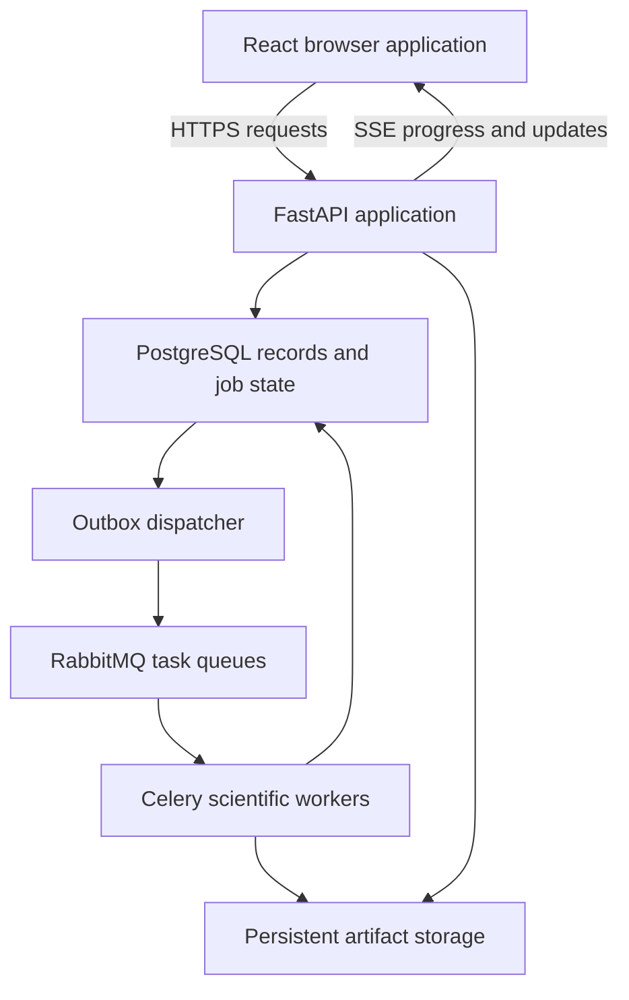

# PS 26249 — Master Project Documentation Bundle

This bundle contains 41 authored Markdown files, organized by exact repository destination. It consolidates the agreed product specifications and the remaining initial documentation. Implementation and validation remain pending. It does not include executable source/configuration, generated lockfiles/clients/migrations, credentials or datasets.

## Instructions for the VS Code Agent

Treat the current open workspace as repository root. For each FILE_START/FILE_END pair below, write only the content between those markers to the indicated relative path. Do not include the outer destination heading or markers. Create missing parent directories. This task authorizes updating these named documentation files to these supplied bodies; preserve unrelated files. If an existing named file contains additional user-authored material beyond the known specifications/placeholders, report that conflict instead of silently losing it. Do not modify source code, install dependencies, generate results, initialize Git, commit, push or deploy.

Read applicable workspace AGENTS.md before edits. Do not execute any command appearing inside a documentation body merely while splitting the bundle. Paths must remain inside the workspace. Verify all 41 destination files were handled, no marker leaked into file content, and no file body was truncated. Report written files and any conflicts. Code/configuration in the repository blueprint remains a separate implementation task.

## Reading and Writing Order

Intent → scope → feature specifications → acceptance criteria → design → rules → agent instructions → research protocols → engineering/UI detail → team/operations. Existing research registers include their source links and reading-depth limitations. Unresolved numerical budgets and official PS URL verification remain explicit; the bundle does not disguise them as completed work.

## Destination Manifest

1. `README.md`
2. `intent.md`
3. `scope.md`
4. `design.md`
5. `rule.md`
6. `AGENTS.md`
7. `CONTRIBUTING.md`
8. `docs/product/problem_statement.md`
9. `docs/product/users_and_workflows.md`
10. `docs/product/feature_specifications.md`
11. `docs/product/acceptance_criteria.md`
12. `docs/product/demo_script.md`
13. `docs/design/screens.md`
14. `docs/design/design_system.md`
15. `docs/design/interaction_states.md`
16. `docs/design/accessibility.md`
17. `docs/engineering/data_model.md`
18. `docs/engineering/api_contracts.md`
19. `docs/engineering/job_lifecycle.md`
20. `docs/engineering/events.md`
21. `docs/engineering/permissions.md`
22. `docs/engineering/observability.md`
23. `docs/research/literature_review.md`
24. `docs/research/evidence_matrix.md`
25. `docs/research/reproduction_log.md`
26. `docs/research/dataset_protocol.md`
27. `docs/research/evaluation_protocol.md`
28. `docs/research/simulation_assumptions.md`
29. `docs/decisions/README.md`
30. `docs/decisions/0001-stack-and-service-boundaries.md`
31. `docs/decisions/0002-data-and-artifact-storage.md`
32. `docs/decisions/0003-jobs-and-result-consistency.md`
33. `docs/team/ownership.md`
34. `docs/team/milestones.md`
35. `docs/operations/local_setup.md`
36. `docs/operations/deployment.md`
37. `docs/operations/backup_and_restore.md`
38. `data/README.md`
39. `experiments/README.md`
40. `backend/tests/fixtures/README.md`
41. `.github/pull_request_template.md`

## Destination: `README.md`

<!-- FILE_START: README.md -->
# Aircraft Predictive Maintenance & Fleet Availability

PS 26249. A research-backed maintenance decision demonstrator connecting component-health evidence, uncertainty, resource-constrained planning, parts and simulated fleet downtime.

## Current Status

Specifications are drafted. Implementation, dependency installation, dataset acquisition, training, integration and acceptance checks are pending. No prediction accuracy, operational savings or deployment readiness is claimed.

## Product Workflow

Import supported histories and labelled logistics → inspect component assessment/evidence → evaluate alerts → propose constrained maintenance → compare simulation alternatives → review and commit a plan → record work/outcomes.

## Documentation

- `intent.md`: purpose and intended outcomes.
- `scope.md`: included/excluded capabilities.
- `design.md`: architecture and data flow.
- `rule.md`: shared engineering rules.
- `AGENTS.md`: repository instructions for coding assistants.
- `docs/product/`: workflows, feature behaviour and acceptance.
- `docs/research/`: sources, dataset/evaluation protocols and assumptions.
- `docs/engineering/`: records, API semantics, jobs, events and access.
- `docs/design/`: screens, interactions and visual system.
- `docs/decisions/`: significant architecture decisions.
- `docs/team/`: responsibilities and milestones.
- `docs/operations/`: setup, deployment and restoration.

## Architecture

React/TypeScript/Vite browser application; Python/FastAPI API and shared scientific package; PostgreSQL; Celery/RabbitMQ; evaluated prediction models; OR-Tools CP-SAT scheduling; SimPy simulation. API and computation run in separate processes.

## Repository Map

`apps/web/` contains the interface. `backend/` contains the installable API/scientific application and tests. `configs/` contains validated policy/experiment configuration. `data/` records sources and small synthetic fixtures. `scripts/` exposes thin application entry points. Generated data/models/results are stored separately from source.

## Setup and Verification

Follow `docs/operations/local_setup.md`. The scaffold does not yet have runnable dependency/service configurations. Add and verify commands as implementation proceeds; do not copy guessed commands here as completed setup.

Acceptance requirements are in `docs/product/acceptance_criteria.md`. Actual results belong in reproduction logs and versioned artifacts. Document the exact source revision and environment used.

## Data and Claims

Public simulated engine histories support component-level experiments. Demonstration fleet/logistics records and availability outcomes must be labelled appropriately. This is not aircraft clearance, real military readiness validation or a certified maintenance system.

## Licence

Repository licence not selected. Track external dataset/model/asset usage separately; do not publish materials without the corresponding rights.
<!-- FILE_END: README.md -->

## Destination: `intent.md`

<!-- FILE_START: intent.md -->
# Project Intent

**Project:** Aircraft Predictive Maintenance & Fleet Availability
**Problem statement:** PS 26249
**Document status:** Initial product intent; implementation and validation pending

## Purpose

Build a maintenance decision workspace that helps aircraft maintenance teams connect component-health evidence with executable maintenance plans and understand the projected effect on fleet availability.

The product should help a planner answer:

> What needs attention, how reliable is that assessment, what work can we perform with the resources available, and how does the proposed plan affect aircraft downtime?

Our goal is to support informed maintenance decisions through one traceable workflow, from incoming data to a reviewed plan. Predictions, recommendations and simulated outcomes must retain their evidence and limitations.

## Problem We Are Addressing

Aircraft availability depends on more than detecting deterioration. Maintenance teams must bring together health-monitoring data, technical histories, required work, spare parts, technicians and workshop capacity.

When these records are fragmented, a health concern can be identified without a practical way to act on it. A proposed task may be blocked by a missing part, unavailable crew or an occupied bay. Changing forecasts can also cause repeated replanning. An apparently precise prediction can conceal incomplete data or substantial uncertainty.

We intend to connect these information and decision gaps. The product should expose what is known, what remains uncertain, what prevents action and which maintenance options are feasible under the stated constraints.

## Primary Users

| User | Decision the product should support |
|---|---|
| Maintenance planner | Decide which tasks to propose, when to perform them and which resources they require. |
| Maintenance engineer or technical reviewer | Inspect sensor evidence, prediction reliability and the basis for a recommendation. |
| Parts or logistics coordinator | Identify shortages, understand lead-time effects and manage reservations for approved work. |
| Fleet maintenance supervisor | Review projected downtime, compare alternatives and approve plans within their authority. |

These are intended responsibilities, not a finalized permission model. Detailed roles and allowed actions belong in the engineering specifications.

## Product Promise

For a supported component with sufficient data, the product should make its health assessment understandable, connect that assessment to maintenance and logistics constraints, and help a human select an executable plan.

When evidence is insufficient, the product should make that limitation visible. A user must be able to distinguish measured records, model estimates, configured rules and simulation assumptions.

## Intended Experience

1. Open the fleet view and identify components or maintenance tasks requiring review.
2. Inspect a component's history, estimated remaining life, uncertainty and supporting sensor evidence.
3. Review the alert history and understand why attention is being requested.
4. Request a maintenance plan that accounts for mandatory deadlines, parts, crew and workshop resources.
5. Inspect bottlenecks and consider compatible work that could share a grounding.
6. Compare projected downtime under alternative plans or logistical assumptions.
7. Review and approve a plan; record the decision and its supporting evidence.
8. Record subsequent work and outcomes so the team can assess prediction and planning quality.

This is intended behaviour. Features become completed capabilities only after implementation and validation.

## Outcomes We Want

- **Connected information:** users can follow the relationship between a component, its observations, health assessments, maintenance tasks and required parts.
- **Understandable uncertainty:** users see the reliability and limitations of estimates before acting on them.
- **Useful alerts:** attention is directed to meaningful deterioration without unnecessary recommendation changes after minor fluctuations.
- **Executable plans:** proposed schedules respect explicit resource limits and mandatory maintenance requirements.
- **Visible bottlenecks:** users understand why work cannot proceed and which assumptions or resources would change the options.
- **Assessable consequences:** users can compare projected downtime and resource effects across alternatives.
- **Accountable decisions:** approved work retains a record of who decided, what evidence was available and which assumptions were used.

We will evaluate these outcomes through prediction tests, scheduling checks, workflow verification and reproducible simulation comparisons. Numerical targets and acceptance criteria belong in the evaluation and product specifications.

## Product Principles

### Evidence accompanies recommendations

Important outputs should identify their input records, model or policy version, and relevant assumptions. Model explanations describe influences on a prediction; they must not be presented as confirmed mechanical fault causes.

### Uncertainty is part of the decision

Life estimates should communicate uncertainty and data quality. A displayed range must have an evaluated meaning rather than an arbitrary confidence label.

### Constraints remain authoritative

Predictions inform maintenance proposals. They do not override mandatory maintenance requirements, resource limits or the need to recheck availability before committing a plan.

### Humans retain approval authority

The product assists technical review and planning. Approval and subsequent execution are explicit human workflow steps, separate from model predictions and simulated projections.

### Research claims remain testable

Use published methods as evidence and starting points. Compare implementations with suitable baselines, preserve unsuccessful results, and distinguish reproduced findings from unverified claims. Choose models and policies based on evaluation rather than architectural novelty.

### The workflow should remain coherent

Every principal feature should contribute to understanding component condition, selecting feasible work or assessing maintenance consequences. Interface detail should help users make those decisions.

## Initial Demonstration Boundary

The initial demonstration will use supported engine degradation data to evaluate component-level life prediction. Where public simulated engine histories are used, their simulated origin must be visible.

Fleet mappings, parts, technician capacity, maintenance duration and maintenance-effect assumptions may be synthetic demonstration inputs. Availability comparisons produced from those inputs are simulated projections, not measured operational improvements.

This demonstration does not establish whole-aircraft diagnostic coverage, actual military fleet readiness, airworthiness clearance or certified maintenance guidance. Expansion requires appropriate data, subsystem evidence and validation. Detailed inclusions, exclusions and extension gates belong in `scope.md`.

## Intended Contribution

Our contribution is an integrated and evaluated decision workflow connecting component prediction, uncertainty, maintenance constraints, parts and fleet downtime simulation.

Individual methods may already exist in research. We should demonstrate what our implementation adds through transparent comparisons and useful interaction, without claiming that integration alone proves superiority or guarantees a competition result.

## Relationship to Other Documents

- `scope.md` defines included capabilities, exclusions and release boundaries.
- `design.md` defines system architecture and module responsibilities.
- `rule.md` defines shared engineering conventions and invariants.
- `docs/product/feature_specifications.md` defines detailed behaviour.
- `docs/product/acceptance_criteria.md` defines completion evidence.
- `docs/research/` records sources, reproduction work, data protocols and evaluation methods.

This document is the canonical statement of product purpose. Revise it deliberately if the users, problem or intended outcomes change.
<!-- FILE_END: intent.md -->

## Destination: `scope.md`

<!-- FILE_START: scope.md -->
# Product Scope

**Project:** Aircraft Predictive Maintenance & Fleet Availability
**Problem statement:** PS 26249
**Document status:** Initial scope specification; implementation and validation pending
**Related intent:** `intent.md`

## 1. Release Boundary

The initial release is a web-based maintenance decision demonstrator. It connects supported engine-health assessments to maintenance planning, parts and resource constraints, and simulated fleet availability comparisons.

It must demonstrate an end-to-end workflow using evaluated component predictions and explicitly identified logistics assumptions. It is not a production aircraft maintenance or clearance system.

The scope includes the eight features below and the application capabilities required to connect them. Detailed behaviour belongs in `docs/product/feature_specifications.md`; measurable completion belongs in `docs/product/acceptance_criteria.md`.

## 2. Included Features

### F01 — Unified Component and Maintenance Records

Include:

- A demonstrator fleet with aircraft-to-component relationships and clear provenance.
- Component usage and supported sensor history.
- Maintenance task records and associated resource/part requirements.
- Observation timestamps or cycle indices, source identifiers, units and data freshness.
- Links from assessments and plans to their input records.

Boundary: initial ingestion supports documented dataset formats and labelled demonstration fixtures. Arbitrary airline/MRO integrations, scanned-document extraction and automatic reconciliation of unknown schemas are outside this release.

### F02 — Remaining-Life Estimates with Uncertainty

Include:

- Component-level remaining useful life (RUL) estimation on a supported engine dataset.
- Classical and sequence-model comparisons under a common evaluation protocol.
- A chosen model accompanied by its transformation and target definitions.
- Prediction intervals or another explicitly evaluated uncertainty representation.
- Model version, assessment time/cycle and applicable data-quality status.

Boundary: predict in the dataset's supported units, initially operating cycles. Calendar projections require an explicit usage assumption. A life interval must not be labelled as an individual engine's failure probability. Architecture choice does not establish prediction accuracy.

### F03 — Prediction Evidence Card

Include:

- Relevant sensor trends and operating context.
- Model-input influences or an interpretable model explanation appropriate to the chosen predictor.
- Missing/stale data indicators and known applicability limits.
- Prediction/model/input provenance and a link to its evaluation summary.

Boundary: explanations describe model behaviour. They do not establish a physical fault cause, prescribe an aircraft-specific repair procedure or replace technical inspection.

### F04 — Stable Maintenance Alerts

Include:

- A versioned alert policy responding to supported health assessments.
- Alert history, trigger reason and review status.
- Evaluation of persistence/hysteresis or another justified stability mechanism against a simple threshold baseline.
- Explicit handling of unavailable or degraded assessments.

Boundary: alert stability must not hide overdue mandatory work or silently discard important changes. Thresholds and margins require documented configuration and validation; they are not certified maintenance limits.

### F05 — Resource-Constrained Maintenance Planner

Include:

- A finite planning horizon with documented time units.
- Maintenance tasks with duration, deadlines, resource needs and applicable ordering constraints.
- Workshop/bay capacity, qualified technician availability and parts availability assumptions.
- Fixed or committed tasks preserved according to defined planning rules.
- A constraint-based proposed schedule and a simple scheduling baseline.
- Visible solver status and an explanation of known bottlenecks or unmet requirements.

Boundary: the planner respects mandatory constraints. It does not relax them merely to produce a schedule. A feasible solution must not be described as proven optimal without solver evidence. No feasible solution, no solution found within the time limit and invalid input are distinct outcomes.

### F06 — Compatible Maintenance Grouping and Parts Bottlenecks

Include:

- Identification of compatible tasks that can share a grounding within permitted windows.
- Visibility of required parts, stock, lead-time assumptions and shortages.
- Reservation of parts/resources during plan approval with consistency checks.
- Evaluation of fewer groundings against early-maintenance penalties or useful life discarded.

Boundary: grouping requires explicit compatibility and task constraints. Synthetic task/component examples do not establish validated brake, avionics or structural predictions. Initial inventory behaviour uses supplied stock and lead times; learned spare-demand forecasting and automatic procurement are excluded.

### F07 — Fleet Availability What-If Simulation

Include:

- Named scenarios with explicit usage, capacity, logistics and maintenance-effect assumptions.
- Comparison of baseline and proposed maintenance policies on common scenarios.
- Changes to selected inputs, such as spare arrival or workshop capacity.
- Projected downtime, resource queues, stockouts and other defined scenario metrics.
- Repeated stochastic runs where applicable, with seeds and variability retained.
- Scenario and result provenance.

Boundary: availability is defined by the simulation's states and assumptions. It is not synonymous with operational readiness or airworthiness. Effects of maintenance, replacement and usage must be explicitly modelled when not observed in the dataset. A calendar-based simulation requires a documented conversion from engine cycles to calendar usage.

### F08 — Data-Quality and Robustness Controls

Include:

- Checks for missing, invalid, out-of-order and stale observations where meaningful.
- Visible handling of operating conditions outside evaluated support.
- A documented policy for qualifying or withholding an assessment.
- Robustness experiments using missing values, contiguous outages, noise and relevant regime changes.
- Explicit distinction between observed and imputed values when imputation is used.

Boundary: imputation must not be presented as recovered ground truth. Withholding a prediction must produce an understandable state, not an invented healthy status. An unsupported-regime warning itself requires a defined detection method and evaluation.

## 3. Supporting Application Capabilities

The following capabilities are included to make the eight features usable and coherent:

| Capability | Initial boundary |
|---|---|
| Access and permissions | Authenticated demonstrator access and documented permissions for viewing, editing and approving. Detailed role definitions belong in `docs/engineering/permissions.md`. |
| Human approval | Review a proposal, recheck current constraints, approve/reject it and record the decision. Approval changes demonstrator records; it does not authorize real aircraft service. |
| Work records | Track approved work and record completion/outcomes manually or through labelled demonstration events. Physical execution is outside the software. |
| Durable jobs | Track queued/running/completed/failed/cancelled calculations, handle retries and reject stale or superseded results. |
| Live progress | Show calculation progress and relevant updates without forcing the user to keep a long HTTP request open. |
| Audit history | Preserve material changes, approvals, record sources and model/policy/scenario versions. This is traceability, not a claim of regulatory certification. |
| Reproducible evaluation | Retain configurations, dataset/split identifiers, artifact hashes and comparison results. |

## 4. Initial Data Contract

### Supported scientific data

Use a documented public engine-degradation dataset, initially NASA C-MAPSS, to evaluate engine-level life estimation. It contains simulated histories; their origin must remain visible in documentation and the demonstration.

Supported subsets and operating regimes are chosen and recorded in `docs/research/dataset_protocol.md`. A release claiming support for a subset must evaluate it. Do not imply all C-MAPSS subsets or unseen operating conditions are supported merely because the parser accepts them.

Training, validation, calibration and test partitions must be separated by engine as appropriate to the evaluation protocol. Test outcomes must not be used to tune preprocessing, thresholds or models. Preserve the split and target definitions with results.

### Demonstration logistics

Small synthetic fixtures may supply aircraft mappings, maintenance jobs, stock, lead times, technician availability and workshop capacity. Identify these as assumptions, not real service records.

Simulation outcomes based on those fixtures are projected demonstration results. The source dataset does not establish repair duration, actual spare demand, maintenance effectiveness or whole-aircraft availability.

### Required provenance

Every material result must be traceable to the applicable input snapshot and model/policy/scenario version. Units, synthetic inputs, imputation and cycle-to-calendar assumptions must be identifiable.

## 5. Explicit Exclusions

The initial release does not include:

- Whole-aircraft physics twins or validated models of all aircraft subsystems.
- Actual military telemetry integration or claims of military deployment validation.
- Cross-system fault diagnosis, confirmed mechanical root-cause analysis or aircraft-specific repair instructions.
- Automatic airworthiness clearance, safety certification or dispatch approval.
- Exact failure dates derived without supported usage assumptions.
- Learned spare-demand or procurement forecasts without suitable historical data.
- Automatic purchases, supplier communications or other external operational actions.
- Reinforcement-learning scheduling as the default planner before a constraint-based baseline exists.
- Flight/mission assignment optimization or tactical operational planning.
- VR/game environments or decorative 3D as required product features.
- LLM-generated numerical predictions or authoritative schedules.
- A separate Rust/Go/Node backend without a measured requirement.
- Distributed streaming infrastructure, Kubernetes or an additional database without an established workload need.

These exclusions define the release; they do not establish that every excluded technology is unsuitable for future work.

## 6. Extension Gates

| Proposed extension | Evidence required before adding it |
|---|---|
| Additional component predictions | Relevant component data, target/fault definitions and held-out evaluation. |
| Actual aircraft/fleet integration | Authorized data access, documented interfaces, validated record mappings and deployment requirements. |
| Physics-informed model/twin | Supported physical parameters, subsystem assumptions and validation against appropriate measurements. |
| Learned spare-demand forecasting | Demand, repairs, stock and lead-time histories plus a fair forecasting/inventory baseline. |
| Reinforcement-learning planner | Credible simulation environment, hard-constraint handling and comparison with existing policies/solvers. |
| Rust/native acceleration | Profiling identifies a meaningful bottleneck; an equivalent implementation demonstrates a worthwhile improvement. |
| More elaborate infrastructure | Measured scale, retention, reliability or deployment requirements justify its role. |

Record a scope change and its architecture/evaluation consequences before treating an extension as part of the release. Avoid silently expanding the product through implementation details.

## 7. Completion Boundary

The release is complete when all eight features form a coherent demonstrated workflow and the following evidence exists:

1. A documented, validated input and provenance path.
2. Held-out prediction and uncertainty evaluation against defined baselines.
3. Evidence cards and visible data-quality limitations.
4. An evaluated alert policy and traceable alert history.
5. A planner whose returned schedules pass independent constraint checks.
6. Consistent reservations and human approval with stale-plan handling.
7. Reproducible availability comparisons with explicit assumptions.
8. Verified calculation recovery/result consistency and the principal end-to-end user flows.

Numerical targets, supported workloads and pass/fail criteria must be specified before the corresponding evaluation in `docs/product/acceptance_criteria.md` and the research protocols. Do not invent thresholds or claim checks have passed before running them.

## 8. Scope Ownership

`intent.md` explains why the product exists. This file defines its release boundary. Feature specifications define behaviour; acceptance criteria define evidence of completion; `design.md` defines how the system is organized.

If a requested feature changes this boundary, update the relevant specifications and decision records deliberately. Keep implemented status separate from planned scope.
<!-- FILE_END: scope.md -->

## Destination: `design.md`

<!-- FILE_START: design.md -->
# System Design

**Project:** Aircraft Predictive Maintenance & Fleet Availability
**Problem statement:** PS 26249
**Repository location:** `design.md`
**Status:** Initial architecture; implementation and validation pending
**Related documents:** `intent.md`, `scope.md`, `docs/product/feature_specifications.md`, `docs/product/acceptance_criteria.md`

## 1. Architecture Decision

Build a modular Python application with a React/TypeScript browser interface. Run the API and scientific workers as separate processes while sharing one installable Python package for domain contracts, transformations and application services.

PostgreSQL is the authoritative operational store. RabbitMQ dispatches durable calculation jobs through Celery. Model/data/result artifacts live in persistent artifact storage and are identified by manifests and hashes. The browser uses the application API rather than directly accessing the database, broker or artifact filesystem.

This design supports the scoped demonstrator. It does not establish a real-time aircraft telemetry system, production high availability or certified maintenance operation.

## 2. Runtime Topology

All database access passes through shared persistence/services code with appropriately scoped sessions. Worker access to PostgreSQL is permitted through that code; workers must not invent separate commitment rules.

The reverse proxy serves the built frontend and routes `/api/` to FastAPI over one browser origin. Configure it to support long-lived SSE responses without inappropriate buffering. It is an entry point, not another business-logic service.

## 3. Selected Technologies and Roles

| Area | Technology | Responsibility |
|---|---|---|
| Browser | React, TypeScript, Vite | Screens, interactions and explicit view states. |
| Interface primitives | Radix UI, Tailwind CSS | Accessible interaction foundations and shared styling tokens. |
| Server-derived state | TanStack Query | Record queries, invalidation and mutations; distinct from unsaved local input. |
| Charts | Apache ECharts | Sensor history, interval plots and scenario comparisons. |
| Application API | FastAPI, Pydantic, Uvicorn | Validated contracts, routes, access checks and application services. |
| Database | PostgreSQL, SQLAlchemy, Alembic | Records, transactions, relationships, reservations and schema history. |
| Calculation jobs | Celery, RabbitMQ | Dispatch and independently running workers. |
| Prediction | PyTorch, scikit-learn, XGBoost | Evaluated neural/classical candidates, inference and uncertainty methods. |
| Scheduling | OR-Tools CP-SAT | Discrete maintenance constraints and optimization. |
| Simulation | SimPy, NumPy | Event-driven fleet/logistics scenarios and replications. |
| Experiments | MLflow and artifact manifests | Research run metadata and artifacts. |
| Packaging | Docker Compose | Local/single-host service topology and persistent volumes. |

Pin maintained versions verified together during implementation. The prediction algorithm remains an evaluation decision; this stack does not require a neural model to win. A custom editable timeline is a separate UI interaction component; ECharts is not assumed to supply a complete planning editor.

## 4. Source Architecture

The monorepo has `apps/web/` and `backend/`. The backend's `src/fleet_maintenance/` package is installed into both API and worker environments. Scripts import the package rather than duplicating its implementation.

| Module | Owns | Boundary |
|---|---|---|
| `api/` | Routes, request/response translation and dependency wiring. | Calls services; no training or optimizer loops in web handlers. |
| `domain/` | Contracts, meanings, units, enums and domain errors. | Does not depend on HTTP request objects or ORM sessions. |
| `services/` | Assessments, alerts, planning orchestration, reservations, approvals, jobs and access. | Owns business workflows, not presentation. |
| `persistence/` | ORM records, repositories, transaction/session handling. | Does not decide numerical models or UI labels. |
| `science/data/` | Loading, validation, engine partitions and transformations. | One transformation implementation for training and inference. |
| `science/prediction/` | Models, training, inference, calibration, explanations and evaluation. | Accepts validated scientific inputs; no approval/reservation effects. |
| `science/scheduling/` | Formulation, constraints, objective, solve and diagnostics. | Produces proposals; does not commit operational reservations. |
| `science/simulation/` | Events, policies, replications and metrics. | Operates on scenario snapshots; does not mutate live stock/plans. |
| `workers/` | Task orchestration, dispatch, attempt lifecycle and completion. | Reuses shared services/contracts. |
| `artifacts/` | Manifest validation, hashing and storage interface. | Source code for storage, distinct from root generated `artifacts/`. |

Use explicit application inputs/results at module boundaries. Avoid importing frontend or transport concerns into scientific code. Persistence records and public API contracts have different responsibilities and should not be treated as interchangeable serialized objects.

## 5. Operational Records and Artifact Storage

### PostgreSQL entities

Detailed fields belong in `docs/engineering/data_model.md`. The initial conceptual groups are:

| Group | Principal records |
|---|---|
| Identity/access | Users, applicable roles/permissions and sessions. |
| Fleet/components | Aircraft, components, installation/mapping history and data sources. |
| Observations | Import versions, observation indices, sensor metadata and quality findings. |
| Health | Model registrations, input snapshots, assessments, explanations and alerts. |
| Maintenance | Tasks, task requirements, proposals, assignments, approvals and work outcomes. |
| Logistics | Parts, stock/arrival records, resources/calendars, reservations and consumption. |
| Scenarios | Scenario revisions, simulation runs and summaries. |
| Reliability | Jobs, attempts, outbox entries, persisted application events and audit history. |

Store records requiring transactional relationships in PostgreSQL. Core relationships use explicit fields/constraints; flexible metadata may use validated JSONB rather than moving every invariant into unstructured JSON.

### Large and immutable content

Raw/processed datasets, split manifests, weights, detailed numerical outputs and event traces may live in artifact storage. PostgreSQL stores their identifiers, hashes, status and relevant relationships. Small operational observations can be indexed in PostgreSQL; the precise threshold for external storage must follow measured query/retention requirements, not an invented row count.

Initially use a persistent mounted directory behind the storage interface. Object storage can later implement the same interface. Database backup and artifact preservation must be coordinated so restored references remain resolvable.

An artifact becomes usable only after its bytes and manifest are durably stored and its registration succeeds. Incomplete writes remain unregistered/quarantined; reconcile abandoned files explicitly. The filesystem and PostgreSQL do not share a transaction, so do not claim atomic cross-store writes.

### Versions and corrections

Capture immutable input snapshots or stable versioned references for assessments/proposals/runs. Corrections append a new record/version and retain lineage. Mutable display records must not silently change the scientific input behind an earlier result.

## 6. Import and Data-Quality Flow

1. An authorized request selects a documented format and source/version.
2. Validate identities, ordering, units and structural requirements.
3. Apply the declared strict/partial acceptance policy and record findings.
4. Store source provenance and accepted observations/artifacts.
5. Use stable identities/checksums and database constraints for reimport deduplication.
6. Make accepted versions discoverable for assessments and research.

Import validation and model eligibility are distinct: a structurally valid record can still be unsuitable for a model. Preserve quality findings at both stages. Imputed values remain identifiable. Do not infer physical sensor names unsupported by the dataset.

## 7. Prediction and Evidence Flow

Model training is an offline research workflow, not a web-request side effect. Training produces a manifest binding weights, target definition, transformations, supported regimes and applicable evaluation/calibration artifacts.

For an assessment:

1. Capture component, cutoff, source snapshot and eligible model version.
2. Validate history and operating support using the defined policy.
3. Run a calculation job when the workload requires it. Cached assessments may be returned only when their complete input/model/configuration identity matches.
4. Apply the exact stored transformation and compute the estimate/uncertainty.
5. Validate output numerics, units and interval semantics.
6. Register the assessment with quality and provenance.
7. Generate optional explanation evidence against the same input/model version.
8. Evaluate the alert policy through an idempotent application service and emit a persisted update.

A failed explanation must not fabricate a cause or invalidate an otherwise usable estimate without an explicit policy. A withheld assessment supplies no numerical life value to planning. Historical cutoffs exclude future observations and target labels.

Units remain explicit: life estimates use cycles; calendar windows require a scenario usage schedule. A calibrated interval is not a per-component failure probability.

## 8. Alert Processing

Alert policies are versioned configuration plus tested application logic. Each transition records the assessment and policy responsible. Process historical assessments in the declared order; duplicate delivery must not create duplicate transitions.

Acknowledgement records review, while resolution records a separate policy/permitted action. Missing or withheld assessments create the configured quality state rather than clearing deterioration. Mandatory task/deadline tracking is independent of model alert thresholds.

A changed model or alert policy cannot silently rewrite historical alerts. Re-evaluation, when permitted, produces separately identified results.

## 9. Planning, Grouping and Approval

### Proposal computation

1. Validate task/resource/stock/calendar inputs and health-to-window assumptions.
2. Capture a proposal input snapshot and create a planning job.
3. Build the discrete constraint model with configured horizon, scaling and objective.
4. Solve within the declared settings.
5. Interpret solver status without confusing unknown, infeasible and failed states.
6. Independently validate any usable schedule against all declared hard constraints.
7. Store the result, objective/bounds when available, diagnostics and versions.
8. Present a proposal for review; it has no committed stock/resource effects yet.

Grouping is part of the formulation: compatible tasks may share a grounding, but durations, resources, windows and early-work tradeoffs remain explicit. Known bottlenecks come from defined prechecks/diagnostic analysis, not a fabricated optimizer explanation.

### Approval transaction

Approval is a business operation separate from optimization:

- Authenticate/authorize the reviewer and identify the exact proposal version.
- Recheck current task, stock, resource and plan commitments under appropriate transaction/concurrency controls.
- Validate the proposal remains applicable; reject stale/conflicting input instead of silently changing the approved plan.
- Commit approval, reservation records, work records and audit/outbox entries consistently.
- Make repeat submissions idempotent using operation identity and database uniqueness/invariants.

Use deterministic locking/order or suitable isolation and retries where required. Database constraints alone cannot express every scheduling rule; combine transactional checks with validated schedules. Do not hold a database transaction open while an optimizer runs.

Cancellation/revision releases eligible reservations according to lifecycle rules. Consumed parts are not recreated. Completion is explicit work-record input, not automatically inferred from a simulation.

## 10. Simulation and Comparison Flow

Simulation consumes versioned scenario snapshots, policies and plans. It never edits live reservations, approvals or component records.

1. Validate initial states, fleet mappings, usage, units, repair/logistics assumptions and metric definitions.
2. Capture configuration/seeds and enqueue a simulation job.
3. Run independent replications in worker processes with configured resource limits.
4. Compare policies on matched scenarios using the evaluation protocol's sampling procedure.
5. Preserve run metrics and sufficient event traces/reference checks.
6. Display results with variability and a visible simulation label.

Simulated maintenance/reset effectiveness is explicitly assumed unless supported by data. Availability definitions must specify the numerator/denominator/state semantics. A deterministic case does not receive fabricated uncertainty. Policy benefits are measured outcomes, not a guaranteed design property.

## 11. Durable Job Design

### Dispatch

The API commits a job and outbox record in one PostgreSQL transaction. A dispatcher publishes a message referencing the job/attempt and immutable inputs, using publisher confirmation and retry. Large datasets are artifact references, not broker payloads.

Publishing and marking dispatch completion are not one atomic distributed transaction. Duplicate messages are expected possibilities; the worker's claim/result protocol must handle them.

### Execution and completion

- Record queued/running/terminal state separately from broker delivery state.
- Atomically claim an eligible job attempt. Duplicate delivery cannot create two authoritative successful completions.
- Retain attempt identity, worker heartbeat/lease where applicable and configurable retry policy.
- Run calculation outside long database transactions.
- Persist artifacts, then register results and completion using conditional attempt/version checks.
- Reject late/stale results if the attempt or job was cancelled/superseded.
- Emit an application update only after authoritative result state exists.

Tasks must be safe to retry. The architecture does not promise exactly-once execution; it aims for consistent accepted effects through idempotency and transactions. A worker can execute work that is later rejected as stale.

### Cancellation and recovery

Cancellation-requested differs from cancelled. Implement cooperative checks where possible; isolate/terminate long computation only through a documented execution policy. Recover expired attempts explicitly, with retries bounded and observable. A broker acknowledgement or process restart alone does not prove application completion.

Detailed transitions, queue configuration and race handling belong in `docs/engineering/job_lifecycle.md` and its decision record.

## 12. Browser and API Design

### Screens

Fleet overview; component history/assessment; evidence card; alert history; maintenance planning; inventory/bottlenecks; scenario comparison; and calculation progress. Login/session and approved-work history support these screens.

### State ownership

Use server-query state for persisted records/results. Keep unsaved filters/form edits locally. Successful commands invalidate affected queries; do not manually maintain several conflicting copies of an approved plan.

All screens handle loading, empty, denied, failed/unavailable, stale and degraded-data states. Display units/provenance and avoid colour-only warnings. Charts request appropriate windows/downsampled views while preserving important signal features; downsampling for display must not silently alter scientific inference inputs.

### Contracts

Public contracts specify identifiers, versions, units, quality flags and stable error codes. Generate OpenAPI/client types from implemented routes, while retaining runtime validation. TypeScript types alone cannot validate received network bytes.

Long job submissions return a job identifier and accepted state; users retrieve authoritative status/results through ordinary endpoints. HTTP commands perform authorization and version checks even if frontend controls hide unavailable actions.

### Events

SSE carries one-way progress and material updates. Events carry identifiers and relevant record/job versions. Support reconnect/replay according to retention rules. If an event gap cannot be replayed, refresh authoritative state. Live delivery is not the sole record of completion.

Exact paths/payloads belong in `docs/engineering/api_contracts.md` and `events.md`. WebSockets are reserved for a demonstrated bidirectional interaction, not required by this design.

## 13. Access, Sessions and Observability

The API enforces authenticated access and the defined permission model for view, edit and approval operations. The single-origin browser deployment should use a documented session mechanism with secure cookie/CSRF handling where applicable; select and document the exact implementation in the permission/access specification. Workers authenticate to internal services/storage through deployment configuration, not browser credentials.

Do not store secrets in source-controlled files or scientific manifests. Keep private records and credentials out of logs. This is implementation hygiene, not a certification claim.

Use request, job, attempt, component/proposal and source-revision identifiers for correlation. Log meaningful transitions, latency, failures and conflicts. Monitor queue delay, job runtime, resource usage and calculation/validation failures. Progress is unknown when not measurable; avoid invented percentages.

## 14. Deployment and Resource Isolation

Docker Compose runs the proxy/frontend, API, PostgreSQL, RabbitMQ, dispatcher and worker pools. Separate queues/pools may isolate inference, planning and simulation. Configure process concurrency and numerical-library threading deliberately to avoid oversubscribing CPU/GPU resources.

Load heavy models in appropriate inference workers rather than every ordinary API process. Training remains a separate controlled command/job with research artifacts. Use persistent volumes for database, broker state where configured and artifacts; empty containers are not persistent storage.

The initial topology is single-host and does not provide automatic failover. Deployment/backup/restore instructions must state how database/artifact versions remain consistent and how incomplete jobs are recovered.

An additional language, service, database or cluster requires a measured requirement and a documented decision. Profiling may justify native acceleration later; do not build it into the initial architecture without evidence.

## 15. Verification and Architectural Decisions

Validate the substantive risks identified in acceptance criteria: engine leakage, transformation parity, unit semantics, schedule constraints, reservation concurrency, stale approval, duplicate/restarted jobs, simulation reference cases and connected user workflows.

Performance claims require specified workload/hardware and measured results. Architectural diagrams describe the intended system, not evidence that it is deployed or tested.

Detailed decisions belong in `docs/decisions/`. Record an architecture change with its reason, alternatives, contract/data implications and validation requirements. Preserve this document as the high-level map and link to detailed specifications rather than duplicating their complete contents.
<!-- FILE_END: design.md -->

## Destination: `rule.md`

<!-- FILE_START: rule.md -->
# Project Engineering Rules

Status: initial canonical project rules. These rules describe implementation expectations, not completed checks. Read with `intent.md`, `scope.md` and `design.md`.

## 1. Evidence and Status

Distinguish planned, implemented and validated behaviour. Never invent model outputs, research results, passed checks or operational benefits. Label synthetic fixtures and simulated projections. Cite paper methods and distinguish accessible full-text review, abstract review and reproduction. Model attribution is not confirmed mechanical causation.

## 2. Units and Time

Use explicit units in contracts, records and charts. RUL uses supported dataset units, initially cycles. Calendar projections require a versioned utilisation assumption. Store actual timestamps with timezone-aware UTC semantics; display timezone separately. Dataset cycles are not wall-clock timestamps. Specify scheduling time granularity and rounding. Display transformations must not change inference inputs.

## 3. Scientific Data

Partition by engine according to the dataset protocol. Namespace identities by dataset/subset/source partition; a train engine numbered 1 is not automatically the test engine numbered 1. Fit transformations on permitted training data only. Freeze test usage. Preserve input cutoff boundaries and transformation parity. Record target/capping definitions; they are modelling choices, not physical limits. Imputed values remain identified.

## 4. Model and Uncertainty

Version weights with preprocessing, feature order, units and calibration artifacts. Validate numerical outputs. Do not equate nominal interval coverage with an individual failure probability. Report coverage and width on declared groups. Unsupported or insufficient evidence must produce a documented warning/withheld state. Compare models fairly; a classical model may be the chosen predictor.

## 5. Domain Boundaries

Routes call services. Scientific modules calculate typed results without committing stock or approvals. Shared packages own transformations and business rules; scripts/workers do not duplicate them. Simulation uses immutable scenario inputs and must not mutate live operational records. One Python package can run in several isolated processes.

## 6. Maintenance Constraints

Mandatory deadlines, qualification, capacity, parts and commitments remain hard constraints. A prediction policy cannot override them. Independently validate usable schedules. Preserve solver status; feasible is not optimal, unknown is not infeasible. Diagnose bottlenecks using implemented checks, not invented explanations. Unapproved proposals do not reserve stock.

## 7. Transactions and Approval

Check authorization and current versions on the server. Plan commitment, reservations and audit/outbox records must be consistent. Protect shared stock/resources against concurrent approvals. Repeated commands are idempotent where material effects could duplicate. Do not hold database transactions open during long scientific calculations. Completed consumption is not undone by deleting a plan.

## 8. Jobs and Artifacts

Long calculations run outside API handlers. Design for duplicate delivery, retries, interruption and stale results. Persist results before announcing success. Cancellation request and termination are different. Artifacts require manifests/hashes and resolvable references. Database/filesystem/broker operations do not automatically share atomicity; use the documented outbox/completion design.

## 9. Interface Behaviour

Implement loading, empty, error, denied, stale and degraded states. Do not substitute fake healthy/zero values for unavailable data. Use text with colour indicators. Keep component/cutoff selection consistent across linked views. Runtime-validate API inputs/outputs; generated TypeScript does not validate network bytes. Relevant provenance/assumptions must be inspectable without overwhelming every screen.

## 10. Repository and Configuration

Commit authored code, docs, small labelled fixtures, reviewed migrations and dependency locks. Keep secrets, bulk datasets, weights, generated numerical outputs, dependencies and caches outside source control. Preserve split/artifact versions outside Git with hashes; ignored does not mean disposable. Do not manually edit generated clients or fabricate locks/migrations.

## 11. Verification and Changes

Run checks appropriate to changed behaviour. Prioritize leakage/parity, constraints, reservations, stale approvals, retry recovery, reference simulation cases and principal workflows. Do not add tests mirroring trivial implementation. Update contracts/specifications when behaviour changes and retain honest check results. Architecture/scope changes require a decision record where material; routine choices within agreed scope do not require invented approval rituals.

## 12. Document Ownership

This is the canonical engineering-rule file. `AGENTS.md` references it rather than maintaining a duplicate rule set. User instructions and applicable system/tool instructions govern assistants; this document does not grant external-action permissions. Resolve internal conflicts explicitly and keep planned scope separate from implementation status.
<!-- FILE_END: rule.md -->

## Destination: `AGENTS.md`

<!-- FILE_START: AGENTS.md -->
# Coding Agent Instructions

## Project and Status

PS 26249 is a maintenance decision demonstrator. Documentation is drafted; do not assume application code, dependencies or commands exist. Inspect the actual workspace before making implementation claims.

## Required Context

Read `intent.md`, `scope.md`, `design.md` and `rule.md` before substantive implementation. For a feature, read its specification and acceptance criteria. For scientific work, read dataset/evaluation/assumption protocols. For jobs/approval, read the corresponding engineering contracts. `rule.md` is the canonical project rule source.

## Repository Boundaries

- Browser code: `apps/web/`.
- Shared installable Python application: `backend/src/fleet_maintenance/`.
- API calls services; science modules calculate; persistence owns transactional storage.
- Worker processes import shared code instead of maintaining parallel implementations.
- Scripts are entry points, not a second application.
- Preserve existing unrelated work and user changes.

## Implementation Workflow

Inspect relevant files and implemented dependency configuration. Work within authorized scope; make coherent, reviewable changes. Do not create empty source modules merely to match a planned tree. Update corresponding documentation/contracts when behaviour changes. Keep source/test status truthful.

For changes requiring schema/client generation, use the implemented tools, review their outputs and include the relevant changes. Do not fabricate generated files or hand-edit generated client code.

## Commands

Discover verified commands from `README.md`, `Makefile`, `package.json`, `backend/pyproject.toml` and CI configuration. They are pending until implemented. Do not claim a guessed command is runnable or a check passed without executing it. Explain unavailable checks and blockers.

## Verification

Run checks appropriate to the change and retain failures/limitations. High-value checks include engine leakage, transformation parity, units, hard constraints, stock concurrency, stale approval and job recovery. A scientific experiment needs input/split/configuration provenance and an honest reproduction entry.

## Boundaries on Claims and Actions

No invented accuracy, saved downtime or aircraft clearance. Distinguish synthetic logistics and simulated projections. Do not interpret this file as authorization to contact people, publish, deploy or access private operational data. Follow the user's explicit authorization and applicable tool policies; do not introduce unnecessary confirmation for routine reversible implementation.

## Reporting

State what changed, why, what was actually verified and any material remaining blocker. Distinguish implemented behaviour from intended future work.
<!-- FILE_END: AGENTS.md -->

## Destination: `CONTRIBUTING.md`

<!-- FILE_START: CONTRIBUTING.md -->
# Contributing

## Shared Context

Read the root intent/scope/design/rules and the relevant specifications. Keep one source of truth for each document/contract. Changes should solve a defined feature or acceptance requirement.

## Branches and Reviews

Use a focused branch such as `feature/maintenance-planner`, `fix/reservation-conflict` or `docs/data-protocol`. Keep changes coherent; coordinate before changing shared contracts or overlapping module ownership. Commit messages state the concrete change. Review through the repository's chosen PR workflow once configured.

## Pull Requests

Explain the problem, resulting behaviour, related requirements, actual verification and material limitations. Call out schema/API changes, generated outputs and scientific assumptions. Do not present screenshots as proof of transaction or numerical correctness. Keep unrun checks explicitly unrun.

## Data and Research

Use only authorized data. Preserve split/transform/model/configuration identities. Keep large bytes in artifact storage, not source control. Record reproduction results including failures and unreplicated claims. Do not retune on final test outcomes without disclosing the protocol change.

## Generated Files and Schema

Generate lockfiles, clients and migrations with the implemented tools. Review migrations before applying; distinguish local setup from real deployments. Generated clients follow the API schema. Never manually create a fake lockfile.

## Verification and Merge

Run relevant automated checks and substantive acceptance cases. Review material domain changes with the responsible teammate. Repository permissions/merge policy will be configured separately; this document does not invent a required number of approvals or authorize external publication.

## Documentation

Update intended behaviour and actual implementation status separately. Significant choices receive a decision record; routine implementation details stay with code/specification. Do not copy the same rule across several files.
<!-- FILE_END: CONTRIBUTING.md -->

## Destination: `docs/product/problem_statement.md`

<!-- FILE_START: docs/product/problem_statement.md -->
# Problem Statement

## Working Identification

PS 26249 — Air Power: Predictive Maintenance & Fleet Availability. Working sponsor context: Ministry of Defence / Defence Services Staff College, software. Verify official identifiers and wording against the competition listing before submission; the listing URL has not been supplied here.

## Brief Used for Product Planning

The supplied brief describes low aircraft availability associated with fragmented, largely reactive maintenance. Health-monitoring records, technical histories, spares and maintenance agencies are insufficiently integrated, contributing to delayed prediction, downtime and underutilization. The indicated technology opportunity includes predictive maintenance, aircraft health monitoring, digital twins and integrated analytics.

This paragraph is a planning paraphrase, not a verified verbatim quotation of the official listing.

## Product Interpretation

Connect supported component evidence to executable maintenance work and scenario-based fleet downtime comparisons. Prediction alone does not resolve parts, crew or workshop constraints. A traceable decision workflow is the intended contribution.

## Demonstration Boundary

Use evaluated simulated engine data and labelled logistics fixtures. Do not relabel these as actual military telemetry or operational readiness validation. Scope and acceptance are defined in the root/product documents.

## Source Status

The original brief was supplied through conversation/images. Official URL, final statement text and any organizer-specific requirements remain to be verified before submission. Do not manufacture them.
<!-- FILE_END: docs/product/problem_statement.md -->

## Destination: `docs/product/users_and_workflows.md`

<!-- FILE_START: docs/product/users_and_workflows.md -->
# Users and Workflows

## Intended Responsibilities

Maintenance planners construct proposals; technical reviewers inspect assessment evidence; logistics coordinators maintain stock/arrival information; supervisors approve plans and compare projected outcomes. Exact permissions are defined separately.

## Main Workflow

1. Browse labelled fleet/component records.
2. Select a supported component and historical cutoff.
3. Inspect quality, estimate/interval and model evidence.
4. Review the alert history and mandatory tasks separately.
5. Select tasks/horizon and request a proposal.
6. Inspect resource/parts constraints and grouping tradeoffs.
7. Revise assumptions as a new version where needed.
8. Compare proposals/policies in a named simulation scenario.
9. Review the exact proposal and approve with current-state checks.
10. Record work/consumption/completion and retain historical evidence.

## Alternative Flows

- Insufficient history: show why prediction is unavailable; existing mandatory tasks remain visible.
- Parts shortage: show quantity/arrival assumptions; do not fabricate stock or silently relax deadlines.
- No solver result: distinguish infeasible, unknown/time-limit and execution failure.
- Stale proposal: require refreshed review; approval cannot silently change the submitted plan.
- Interrupted job: retrieve authoritative state after reconnect/recovery.

## User Success

A user understands the recommendation, its limitations, the proposed action and its constraints. This is not proof that the recommended plan improves actual fleet operations.
<!-- FILE_END: docs/product/users_and_workflows.md -->

## Destination: `docs/product/feature_specifications.md`

<!-- FILE_START: docs/product/feature_specifications.md -->
# Feature Specifications

**Project:** Aircraft Predictive Maintenance & Fleet Availability
**Problem statement:** PS 26249
**Repository location:** `docs/product/feature_specifications.md`
**Status:** Initial behavioural specification; implementation and validation pending
**Related documents:** `intent.md`, `scope.md`, `docs/product/acceptance_criteria.md`

## 1. Specification Conventions

This document defines intended behaviour for the eight scoped features and their supporting workflow. It does not claim the features are implemented. Numerical performance targets belong in acceptance criteria and evaluation protocols.

- **Observation:** recorded sensor/usage input, with source and cycle/time context.
- **Assessment:** a versioned prediction and its uncertainty/data-quality information, computed from a specific input snapshot.
- **Alert:** a review signal produced by an explicit policy; distinct from a maintenance task.
- **Task:** a unit of maintenance work with explicit duration, resource needs and applicable constraints.
- **Proposal:** a computed schedule awaiting review. It does not reserve resources merely by existing.
- **Approved plan:** a proposal accepted after authorization and current-state checks, with committed reservations.
- **Scenario:** a versioned set of assumptions used for planning or simulation.
- **Availability:** a defined simulated state/metric, not an airworthiness declaration.

All material outputs identify their source, relevant units and version. Distinguish recorded data, synthetic fixtures, predictions and projections. Backend rules remain authoritative; interface checks improve feedback but do not replace server validation.

Roles below are conceptual responsibilities, not finalized access-control identifiers. Define exact permissions separately.

## 2. F01 — Unified Component and Maintenance Records

### Purpose and users

Give planners and technical reviewers one traceable view of a component's usage, observations, assessments, maintenance work and related parts.

### Inputs

- Supported dataset files and explicitly versioned import configuration.
- Aircraft and component records, including labelled demonstration mappings.
- Sensor/usage observations with engine identity and cycle/time context.
- Task, resource and inventory fixtures or authorized entered records.

### Behaviour

1. An authorized user selects a supported import and reviews its source/format.
2. The system validates structure, identities, cycles/timestamps and declared units before making the import available to downstream calculations.
3. The import records accepted/rejected counts and actionable validation messages. Strict versus partial acceptance is an explicit import policy, never a silent choice.
4. Reimporting the same source/version must not silently duplicate observations. Conflicting values for an existing identity require an explicit correction/version process.
5. Users can search/filter the fleet and open a component record.
6. The record shows usage, sensor histories, latest available assessment, alert history, task history and relevant part/resource relationships.
7. Historical records remain distinguishable from current records. Corrections retain provenance rather than silently rewriting inputs underlying earlier results.

### Outputs and states

Outputs: searchable records, observation history, import result and provenance links.

States: loading; no records; import validating; import accepted; partially accepted when permitted; rejected; source conflict; inaccessible record. Missing history is shown as missing, not as evidence of good health.

### Boundaries and verification focus

No arbitrary schema inference, scanned-log extraction or live airline integration. Verify joins, deduplication, unit validation, correction history and input traceability.

## 3. F02 — Remaining-Life Estimates with Uncertainty

### Purpose and users

Help a technical reviewer inspect remaining useful life for a supported engine/component, including the estimate's uncertainty and applicability.

### Preconditions and inputs

- An evaluated model artifact with a manifest and its associated preprocessing/calibration artifacts.
- A supported component/input snapshot and sufficient history for that model.
- Declared target definition, units, supported regimes and data-quality policy.

### Behaviour

1. A reviewer opens a component or requests an assessment at a selected historical cutoff.
2. The system resolves an eligible model and validates the available history.
3. Historical replay uses only observations available at the cutoff; future observations/labels cannot enter the input.
4. Inference uses the model's recorded preprocessing. It must not refit normalization on the current test component.
5. Store the estimate, evaluated uncertainty representation, input snapshot, model/calibration versions and quality status together.
6. Display remaining life in its supported units, initially cycles. Any calendar projection additionally displays the usage assumption and is labelled a projection.
7. Show the interval's nominal level and measured evaluation coverage where available, with the evaluation context. Do not translate these into an individual engine's probability of failure.
8. Users can inspect prior assessments and their changing estimates. Mark assessments stale when newer relevant observations or a changed input version exist.

### Outputs and states

Outputs: point estimate, uncertainty representation, provenance, support/quality status and evaluation link.

States: queued; running; completed; insufficient history; unsupported model/regime; qualified result; withheld; stale; failed. Invalid numerical results, invalid bounds or negative life values are handled by a documented output policy. Do not silently clamp a faulty result into a plausible healthy value.

### Boundaries and verification focus

No whole-aircraft readiness score or exact failure-date claim. Compare models under common engine partitions and target definitions; check leakage, preprocessing parity, calibration and error by life stage/regime.

## 4. F03 — Prediction Evidence Card

### Purpose and users

Let a reviewer understand the observations and model behaviour behind an assessment before using it for planning.

### Inputs

An assessment, its recorded input snapshot, sensor metadata, explanation method/version and available evaluation summary.

### Behaviour

1. Open the evidence card from a component, assessment or alert.
2. Display estimate/interval, input cutoff, model version and current/stale status.
3. Show relevant sensor histories and operating context using documented names/units. Unknown physical mappings remain generic sensor identifiers.
4. Display missing/imputed observations and data-quality warnings.
5. When supported, show model-input influences or an interpretable-model explanation with its reference/baseline and limitations.
6. Distinguish an input's influence on the model from a confirmed mechanical cause.
7. Provide links to input provenance and the applicable model evaluation.
8. If explanation generation fails or is unsupported, keep the valid assessment visible with an explanation-unavailable state. Do not invent a narrative.

### Outputs and verification focus

Outputs: trends, explanation, provenance and limitations linked to one assessment version. Explanation results for a different version must not be attached to the current assessment.

Check version alignment, historical cutoff, imputation visibility, explanation stability and appropriate labels. A text summary, if included, must derive from available structured evidence; an LLM is not required.

## 5. F04 — Stable Maintenance Alerts

### Purpose and users

Direct attention to supported deterioration signals while reducing unnecessary alert changes caused by minor prediction fluctuations.

### Inputs

Assessment history; versioned alert thresholds/persistence or hysteresis settings; data-quality policy; applicable task deadlines as separate authoritative records.

### Behaviour

1. Evaluate an eligible new assessment with the configured policy.
2. Compare thresholds in declared units and use only historical information available at evaluation time.
3. Apply the defined stability mechanism and record which evidence triggered or changed the alert.
4. Present the current state and its history: active/unacknowledged, acknowledged, resolved, or superseded as applicable.
5. Acknowledgement records that a person reviewed the alert. It does not resolve deterioration or mark work complete.
6. Resolution requires an explicit policy condition or a permitted recorded action with a reason; retain the history.
7. A newer conflicting assessment may change priority/state but does not delete previous evidence.
8. Withheld/invalid assessments produce a distinct data-quality review indication according to policy. They must not silently resolve a health alert.
9. Overdue mandatory tasks remain visible regardless of the prediction-alert state.

### Outputs and verification focus

Outputs: alert state, trigger evidence, policy version, review history and associated component/assessment.

Check chronological processing, repeat-event deduplication and invalid-data handling. Evaluate warning lead time, missed events, false alerts and recommendation changes against a threshold baseline. Configure targets in the evaluation protocol.

## 6. F05 — Resource-Constrained Maintenance Planner

### Purpose and users

Help a planner construct an executable maintenance proposal and understand constraints preventing work.

### Inputs

- Versioned task set and finite planning horizon.
- Durations, required parts/resources, permitted task windows and mandatory deadlines.
- Resource capacity, qualification/compatibility information and availability calendars.
- Part stock/arrival assumptions and existing reservations.
- Fixed commitments and task precedence.
- Eligible health assessments and the explicit rule translating them into proposed maintenance windows.
- Objective, weights, discretization and solver settings.

### Behaviour

1. The planner selects tasks, horizon and input/scenario version.
2. Validate required fields, unit conversions and contradictory inputs before solving.
3. Capture the input snapshot and submit a durable planning job.
4. The optimizer respects hard constraints and evaluates the configured objective. Optional tasks must be distinguished from mandatory tasks; omitted work remains visible.
5. Store solver status, timings, objective/bounds when applicable, schedule and input/configuration versions.
6. Independently check returned schedules against the declared constraints before presenting them as usable proposals.
7. Display a read-only schedule/timeline initially; any edit creates a revised proposal requiring revalidation.
8. Show assignment details: task, start/end, aircraft/component, crew/bay and parts needs.
9. Identify known bottlenecks. Diagnostics may use prechecks or explicit additional analysis; do not imply the solver automatically provides a complete causal explanation.
10. Changing resources, usage or tasks creates a new version and job. Older results remain historical.

### Required result distinctions

| Result | User-facing meaning |
|---|---|
| Optimal | Solver establishes optimality for the stated model/settings. |
| Feasible | A checked schedule exists; optimality is not established. |
| Infeasible | The solver establishes no feasible schedule for the formulation. |
| Unknown/time limit | No definitive feasibility conclusion or usable result was established. |
| Invalid input/model | The request or mathematical formulation is invalid. |
| Failed | Execution error; distinct from mathematical infeasibility. |

Mandatory constraints must not be silently relaxed. When constraints conflict, the planner may revise assumptions or tasks through an explicit new version; the application does not authorize changing mandatory maintenance rules.

### Verification focus

Check resource overlap/capacity, precedence, parts timing, deadlines, commitments, discretization and independent validation. Compare with an earliest-deadline or another defined baseline on common task instances.

## 7. F06 — Compatible Maintenance Grouping and Parts Bottlenecks

### Purpose and users

Help planners reduce repeat groundings where justified, and help logistics coordinators understand and reserve required parts.

### Inputs

Task compatibility/grouping rules; permitted windows; maintenance durations; part quantities and availability; reservations; early-maintenance penalties or useful-life tradeoffs.

### Behaviour

1. Identify candidate tasks that may share a grounding according to explicit rules.
2. Evaluate group scheduling while retaining deadlines, resources, ordering and task-specific durations. Grouping does not imply all work can happen simultaneously.
3. Show tasks included, the rule permitting grouping, and the estimated tradeoff relative to separate work.
4. For each task/proposal, show required quantities, available/reserved quantities and the assumed arrival of shortages.
5. An unapproved proposal does not consume stock. Approval performs current availability checks and reservations atomically with plan commitment.
6. Concurrent approval requests must not reserve the same unit twice or drive available stock below the permitted quantity.
7. Cancelling/revising committed work releases or adjusts reservations according to explicit lifecycle rules. Consumed stock is not restored merely because a historical plan is cancelled.
8. Manual inventory corrections require authorization, reason and history.

### Outputs and verification focus

Outputs: grouped proposal, bottleneck details, reservation/consumption history and configuration provenance.

Check grouping compatibility, early-work tradeoffs, stock races, revisions and release/consumption behaviour. Inventory forecasting, automatic purchasing and supplier messaging are excluded.

## 8. F07 — Fleet Availability What-If Simulation

### Purpose and users

Help supervisors and planners compare maintenance alternatives under explicit logistics and usage assumptions.

### Inputs

Versioned fleet mappings, starting states, usage schedule, component-life/health assumptions, candidate maintenance policies/plans, repair/arrival distributions or fixed values, resources, horizon and replication settings.

### Behaviour

1. Select a scenario or create a named revision from permitted inputs.
2. Validate units, distributions, relationships and initial conditions.
3. Define the scenario's availability states and denominator before running. Explain whether metrics use aircraft-time, count at a selected instant, or another declared definition.
4. Submit a durable simulation job. Run baseline and candidate alternatives under comparable scenarios; retain seeds and sampling/version details.
5. Model grounding, resource acquisition/waiting, work completion and return to simulated availability according to stated rules.
6. Record downtime, resource waiting, stockouts, unplanned groundings and applicable useful-life penalties. Only report metrics the model supports.
7. Display repeated-run summaries and variability where stochastic replication is used. A deterministic run must not receive a fabricated confidence interval.
8. Label outputs simulated projections, with links to assumptions and scenario/model/policy versions.
9. Comparisons with mismatched horizons, fleet mappings, units or scenario definitions are blocked or explicitly qualified. Changed assumptions produce a new run, never a silent rewrite of prior results.

### Outputs and verification focus

Outputs: scenario revision, run manifest, per-policy metrics, variability and event histories sufficient for relevant checks.

Verify small reference cases, conservation/state transitions, event ordering, common comparison inputs and recorded seeds. Maintenance reset/replacement effects are assumptions unless supported by data. The simulation does not optimize flight/mission assignment or establish operational readiness.

## 9. F08 — Data-Quality and Robustness Controls

### Purpose and users

Help reviewers distinguish usable evidence from incomplete, stale or unsupported inputs.

### Inputs

Observation validation rules; model history requirements; expected units; supported operating regimes; missingness/imputation policy; freshness definition where applicable.

### Behaviour

1. Validate observations at import and model input at assessment time.
2. Record quality findings separately from model estimates.
3. Identify observed versus imputed values. Apply only the model's evaluated imputation/transformation policy.
4. Determine assessment eligibility using explicit criteria. Distinguish blocking failures from warnings.
5. Show qualified results with visible limitations; withhold results when the configured policy requires it.
6. Propagate assessment quality into alert and planning eligibility. A withheld assessment cannot silently supply a numerical maintenance window.
7. Retain mandatory tasks when health prediction is unavailable.
8. Quality flags reflect conditions detectable by the implemented checks. Do not claim detection of every out-of-distribution state.

### Verification focus

Inject missing values, contiguous sensor outages, noise and supported regime changes according to the research protocol. Report prediction/interval degradation and how often results are withheld. Do not interpret imputed signals as measured physical recovery.

## 10. Human Review, Approval and Completion

Approval is a supporting workflow connecting F05/F06 to maintenance records.

1. An authorized reviewer opens a proposal with its evidence, input version and constraints.
2. Review includes warning/quality status and the provenance of any projections used.
3. Approval rechecks the current plan version, tasks, stock and resource commitments. A changed state produces a conflict requiring review; it must not silently approve a modified plan.
4. Commit the approved version and its reservations consistently. Repeated submission of the same operation must not duplicate commitments.
5. Record approver, decision time, proposal version and supplied review reason where required by the permission policy.
6. Create or associate approved work records with the committed tasks.
7. Completion records actual work status, timing and relevant part consumption. Partial completion is distinct from completing every task.
8. Update future views/planning inputs through recorded changes. Do not erase historical predictions or automatically retrain a model after completion.

The initial application records demonstration work; it does not perform repairs or provide aircraft clearance.

## 11. Durable Calculations and Result Consistency

Prediction batches, optimizer runs and simulations may execute outside web processes.

- Record job identity, owner, type, input/configuration snapshot and lifecycle state.
- Distinguish queued, running, succeeded, failed, cancellation-requested and cancelled states; progress may be unknown rather than an invented percentage.
- Retries retain attempt identity and must not duplicate material effects.
- Publish dispatch reliably using the specified job/outbox design.
- Persist results before announcing successful completion.
- Reject late results from invalidated/cancelled/superseded attempts according to explicit lifecycle rules.
- Cancellation may require cooperative processing; distinguish a request from confirmed termination. Never imply a killed computation has rolled back every external effect automatically.
- Restarts allow recovery or a clearly recorded failure rather than silently lost work.
- Users can retrieve current state after reconnecting; live events are not the only record of job completion.

Detailed transport, retry and state-transition contracts belong in `docs/engineering/job_lifecycle.md` and `events.md`.

## 12. Cross-Feature Interface Requirements

Every principal screen provides appropriate loading, empty, unavailable/error, stale and permission-denied states. Data-quality and uncertainty indicators must be understandable without relying on colour alone.

Charts identify units, legends and context. Component selections and date/cycle cutoffs must remain consistent across linked views. Frontend formatting must not change the meaning of backend units. A UI preview does not constitute validated plan approval.

Synthetic/demo inputs are identifiable in relevant views and provenance. Avoid presenting scheduled maintenance status, component health and simulated availability as a single unexplained safety score.

## 13. End-to-End Demonstration Contract

The principal demonstration must be able to:

1. Load labelled fleet/logistics fixtures and a supported held-out engine history.
2. Replay that history at explicit cutoffs without future-input leakage.
3. Display an evaluated assessment, uncertainty and evidence.
4. Display the resulting alert history.
5. Generate a checked proposal with a visible resource/parts constraint.
6. Revise one assumption and obtain a separately versioned proposal.
7. Compare alternatives through a reproducible simulation.
8. Review/approve a plan with current-state reservation checks.
9. Show a sensor-outage case with the prescribed quality response.
10. Retrieve the associated records and manifests explaining what was measured, estimated or assumed.

Do not invent fixed prediction accuracy or availability gains in the demo. Use actual evaluated results and label scripted fixtures. Acceptance criteria will define pass/fail evidence for this specification.
<!-- FILE_END: docs/product/feature_specifications.md -->

## Destination: `docs/product/acceptance_criteria.md`

<!-- FILE_START: docs/product/acceptance_criteria.md -->
# Acceptance Criteria

**Project:** Aircraft Predictive Maintenance & Fleet Availability
**Problem statement:** PS 26249
**Repository location:** `docs/product/acceptance_criteria.md`
**Status:** Initial acceptance specification; no checks claimed as passed
**Related documents:** `intent.md`, `scope.md`, `docs/product/feature_specifications.md`

## 1. How Acceptance Works

This document defines evidence required to accept the scoped demonstrator. Planned capability, implemented capability and validated capability are distinct.

Each criterion receives one status: **not run**, **passed**, **failed**, or **blocked**. A blocked or unrun required criterion does not count as passed. Associate results with a source revision and the exact input/configuration versions used.

Passing functional checks does not establish predictive accuracy, simulation validity or operational suitability. Scientific claims require their own evaluations. The release remains a demonstrator using supported engine data and labelled logistics assumptions.

### Evidence record

For each criterion, retain:

- Criterion identifier and status.
- Source revision, environment and relevant versions.
- Input/fixture/dataset/configuration identifiers and hashes where applicable.
- Test or evaluation command and output artifact.
- Actual outcome and comparison with the required condition.
- Limitations, failures or unresolved dependencies.

Machine-verifiable checks should retain machine-readable results. Screenshots or walkthrough recordings demonstrate interface behaviour but do not substitute for constraint, concurrency or leakage checks.

## 2. Evaluation Decisions Required Before Testing

The following values are not invented here. Define them in the referenced protocol, version that decision, and freeze it before the corresponding final evaluation.

| Decision | Required specification | Owning document |
|---|---|---|
| Dataset support | Subsets/regimes, engine partitions, target definition/capping, cutoff/window rules and preprocessing. | `docs/research/dataset_protocol.md` |
| Prediction acceptance | Baselines, error metrics, late-prediction penalty, aggregation, repetitions and an application-relevant acceptable error bound. | `docs/research/evaluation_protocol.md` |
| Uncertainty acceptance | Nominal interval level, calibration procedure, coverage tolerance, acceptable width, groups and sufficient sample criteria. | Evaluation protocol |
| Alert acceptance | Policy thresholds/margins, event definition, warning horizon, false/missed-event budgets and schedule-change comparison. | Evaluation protocol and alert configuration |
| Planner acceptance | Instance families, units/discretization, objectives, baseline, time limit and required quality/runtime. | Evaluation protocol and scheduling configuration |
| Simulation acceptance | State definitions, usage/repair/logistics assumptions, replications, comparison metrics and sampling procedure. | `docs/research/simulation_assumptions.md` and evaluation protocol |
| Responsiveness | Target hardware/browser, dataset/visible-chart size, user concurrency, concurrent jobs and latency/resource budgets. | Acceptance benchmark configuration linked from evaluation protocol |

Decisions may be informed by training/validation experiments or stakeholder needs. Do not choose thresholds after inspecting the final test outcomes merely to make a result pass. A changed protocol requires a separately identified evaluation and an honest account of previously inspected data.

## 3. F01 — Unified Records

| ID | Required condition | Evidence |
|---|---|---|
| AC-F01-01 | Supported valid imports produce correct component/observation/task relationships and source/unit metadata. | Import fixture checks and database/API assertions. |
| AC-F01-02 | Reimporting an identical source/version does not duplicate observations or tasks; conflicting existing values follow the documented correction policy. | Repeated/conflicting import tests and provenance history. |
| AC-F01-03 | Malformed identities, invalid cycles/times and unsupported units are rejected or explicitly reported under the configured partial-import policy. | Invalid-input cases and accepted/rejected counts. |
| AC-F01-04 | A displayed assessment or proposal links to its actual input snapshot; later corrections do not silently rewrite historical evidence. | Versioned correction and retrieval checks. |

## 4. F02 — Life Prediction and Uncertainty

| ID | Required condition | Evidence |
|---|---|---|
| AC-F02-01 | Engine identities do not leak across required disjoint partitions; fit transformations use only permitted training data. | Split manifests, transformation provenance and leakage checks. |
| AC-F02-02 | Training and serving apply the same versioned transformation, feature ordering, units and target definition. | Parity check on a fixed input with an explicit numerical tolerance. |
| AC-F02-03 | Historical replay cannot consume observations beyond the selected cutoff or future target labels. | Cutoff tests, including modifications to future observations that leave current inputs unchanged. |
| AC-F02-04 | Classical and sequence candidates are evaluated under the same protocol; the selected model meets the predeclared error requirements. | Held-out metrics and subgroup/repeated-run results where specified. |
| AC-F02-05 | Intervals meet the predeclared coverage/width requirements on eligible evaluation groups; insufficiently supported groups are disclosed. | Coverage, width and sample-count reports with calibration provenance. |
| AC-F02-06 | Results contain model/input/calibration versions and quality state; invalid or unsupported results are qualified/withheld by the defined policy. | API/output validation and model-support cases. |

Do not require a neural model to beat a classical model. If the baseline is stronger, it may be selected. If no candidate meets the declared quality requirements, this feature is blocked for its claimed support boundary; revise the scope or method explicitly rather than fabricate success.

## 5. F03 — Prediction Evidence

| ID | Required condition | Evidence |
|---|---|---|
| AC-F03-01 | Evidence charts, influences, cutoff and provenance belong to the same assessment/input version. | Version-alignment assertions and a reviewed evidence card. |
| AC-F03-02 | Units, missing/imputed values and known limitations are visible; unknown physical sensor mappings remain labelled as such. | Interface walkthrough and metadata cases. |
| AC-F03-03 | The chosen explanation method is evaluated under the declared stability/fidelity checks and its limitations are recorded. | Explanation evaluation, reference/baseline definition and examples. |
| AC-F03-04 | Unsupported/failed explanation generation produces an explicit unavailable state without invented fault causes or a misleading narrative. | Failure/unsupported cases. |

## 6. F04 — Stable Alerts

| ID | Required condition | Evidence |
|---|---|---|
| AC-F04-01 | Alert state changes match the versioned policy, including persistence/hysteresis and chronological input rules. | Fixed-history reference cases. |
| AC-F04-02 | Repeated assessment/event delivery does not duplicate transitions; acknowledgement does not resolve deterioration. | Deduplication and review-state tests. |
| AC-F04-03 | Invalid/withheld assessments do not silently clear an active health concern; overdue mandatory work stays visible. | Degraded-data and mandatory-task cases. |
| AC-F04-04 | The selected policy meets the frozen alert budgets and is compared with a threshold baseline. | Warning time, missed/false-event and recommendation-change reports. |

Alert stability alone is insufficient: reducing changes while increasing missed events beyond the accepted budget fails the policy requirement.

## 7. F05 — Maintenance Planner

| ID | Required condition | Evidence |
|---|---|---|
| AC-F05-01 | Every proposal presented as usable passes independent checks for mandatory deadlines, capacity/qualifications, precedence, parts timing and fixed commitments. | Validator outputs for representative and boundary instances. |
| AC-F05-02 | Invalid inputs are distinguished from mathematical infeasibility, execution failure and time-limit/unknown outcomes. | Controlled cases for each exposed outcome. |
| AC-F05-03 | Feasible and optimal labels match solver status; objective/bounds and settings are retained when available. | Solver-result contract checks. |
| AC-F05-04 | Revising a task/resource/assumption creates a new proposal version; editing a timeline cannot bypass validation. | Revision and edit/revalidation tests. |
| AC-F05-05 | The planner meets its declared runtime/quality requirements and is compared against a defined baseline on common instances. | Benchmark manifest, objectives, statuses and runtimes. |

Hard-constraint violations in any accepted proposal fail acceptance. A small-instance feasibility check does not prove all possible schedules are correct; retain the tested scope and use validation on every returned proposal.

## 8. F06 — Grouping and Inventory

| ID | Required condition | Evidence |
|---|---|---|
| AC-F06-01 | Grouped tasks satisfy documented compatibility, windows, duration and resource constraints; grouping benefits/tradeoffs are reported honestly. | Grouping reference cases and comparison with separate work. |
| AC-F06-02 | Unapproved proposals do not consume/reserve stock; approved plans reserve exactly their required quantities. | Stock/reservation assertions before and after approval. |
| AC-F06-03 | Concurrent requests for insufficient shared stock cannot double-reserve it; failed approval does not leave a partial commitment. | Concurrent transaction and rollback tests. |
| AC-F06-04 | Cancellation/revision releases only eligible reservations; previously consumed parts are not automatically recreated. | Reservation lifecycle cases. |
| AC-F06-05 | Shortage quantities, arrivals and inventory corrections are traceable to actual fixture/record versions and authorized changes. | Bottleneck and audit checks. |

## 9. F07 — Availability Simulation

| ID | Required condition | Evidence |
|---|---|---|
| AC-F07-01 | Small deterministic reference cases produce expected grounding/waiting/completion states and metrics within defined tolerances. | Analytically understandable cases and event traces. |
| AC-F07-02 | Resource occupancy respects capacity and aircraft/component state transitions remain consistent. | Simulation invariants, including simultaneous-event cases. |
| AC-F07-03 | Each run records scenario/policy/model versions, horizon, state/metric definitions, usage conversions and sampling settings. | Run manifest inspection. |
| AC-F07-04 | Alternative policies use comparable inputs and the declared sampling procedure; mismatch is blocked or prominently qualified. | Comparison contracts and paired-scenario checks. |
| AC-F07-05 | Stochastic results report the declared replication summaries/variability; deterministic results have no fabricated uncertainty. | Per-run and aggregated outputs. |
| AC-F07-06 | Outputs are labelled simulated projections; repair/reset effectiveness and synthetic logistics assumptions are inspectable. | Interface review and assumption links. |

No fixed availability improvement is assumed. A worse-performing plan must remain visible as such. If claiming improvement, report the baseline, scenarios, repetitions, variability and scope supporting the claim; do not generalize it to an actual fleet.

## 10. F08 — Data Quality and Robustness

| ID | Required condition | Evidence |
|---|---|---|
| AC-F08-01 | Declared checks detect their defined missing/invalid/stale/out-of-order conditions and retain interpretable findings. | Quality-rule fixtures, including valid edge cases. |
| AC-F08-02 | Imputed values remain distinguishable from observations; qualified/withheld states match the policy. | Transformation and assessment-output checks. |
| AC-F08-03 | A withheld assessment cannot silently provide numerical planning input or healthy status; mandatory tasks remain actionable. | Cross-feature degraded-data workflow. |
| AC-F08-04 | Missingness/noise/regime robustness experiments meet the declared support requirements or explicitly narrow the support boundary. | Error/coverage/withholding results for each intervention. |

Do not claim universal out-of-distribution detection. The supported checks, their evaluation and limitations define the feature's acceptance boundary.

## 11. Supporting Workflow and Reliability

| ID | Required condition | Evidence |
|---|---|---|
| AC-S01 | Permissions are enforced server-side; unauthorized viewing/editing/approval is rejected without unintended state changes. | Permission matrix cases. |
| AC-S02 | Approval rechecks current plan/task/stock/resource versions. Stale proposals produce a conflict, not silent approval of changed content. | Competing edit/approval cases. |
| AC-S03 | Repeated approval requests do not duplicate work records or reservations; material decisions retain user/time/version evidence. | Idempotency and audit assertions. |
| AC-S04 | Partial work completion, part consumption and remaining tasks are represented correctly; historical assessments remain unchanged. | Completion lifecycle cases. |
| AC-S05 | Killing/restarting an API or worker produces a recoverable job or explicit failure, with no silently lost recorded job. | Fault-injection recovery record. |
| AC-S06 | Repeated messages/retries cannot duplicate accepted effects; superseded attempts cannot replace the authoritative result. | Retry/deduplication/stale-result cases. |
| AC-S07 | Interrupted dispatch is recoverable under the outbox design; success is announced only after durable result persistence. | Dispatch interruption and completion-order tests. |
| AC-S08 | Cancellation-requested and cancelled states are distinct; late results follow the declared cancellation policy. | Cancellation race cases. |
| AC-S09 | Reconnecting clients can retrieve authoritative job/results independently of live events; replay does not duplicate UI state. | Connection interruption and state-retrieval tests. |

## 12. Interface, Reproducibility and Responsiveness

| ID | Required condition | Evidence |
|---|---|---|
| AC-X01 | Principal screens handle loading, empty, error/unavailable, stale and denied states without plausible-looking substitute outputs. | State walkthrough and applicable E2E checks. |
| AC-X02 | Core actions work with keyboard navigation; focus is usable; warnings/statuses have text labels and are not colour-only. | Keyboard/focus review and automated checks where useful. |
| AC-X03 | Chart units, cutoffs, selected components and provenance stay consistent across linked views. | Linked-interaction checks. |
| AC-X04 | Repeated evaluation with the retained environment/configuration reproduces required outcomes within declared tolerances. | Reproduction commands and comparison outputs. |
| AC-X05 | API/worker isolation and UI responsiveness meet the declared budgets under the declared workload/hardware. | Latency/resource/error reports while calculations run. |
| AC-X06 | Public API/client contracts match the implemented schema; migrations and a representative restoration preserve required relationships/results. | Contract generation checks, migration/restore record. |

Reproducibility is evaluated within the declared environment. Do not promise identical floating-point outputs across every machine or library release. A restored database must retain resolvable artifact references; database backup alone may not preserve model/data files.

## 13. End-to-End Release Gate

The release walkthrough must complete these connected cases using the tested source revision:

1. Import supported engine history and labelled fleet/logistics inputs.
2. Replay a held-out engine without future-input leakage.
3. Inspect assessment, interval, evidence and alert history.
4. Generate a checked proposal exposing a known parts/resource constraint.
5. Revise one logistical assumption and retain separate proposal versions.
6. Compare alternatives through reproducible, labelled simulation results.
7. Approve a plan with current-state checks and consistent reservations.
8. Record work/completion without rewriting historical evidence.
9. Inject degraded sensor input and observe the specified quality response.
10. Interrupt/recover a calculation and retrieve its authoritative state/result.

Required functional criteria must pass, evaluation decisions must be frozen, and scientific criteria must meet those decisions. Any unrun/blocked requirement must remain explicitly incomplete. A narrowed demonstration requires a deliberate scope/specification change; it must not be labelled the original full release.

## 14. Claims Allowed by Acceptance

Acceptance may support statements about tested records, supported simulated engine predictions, constraint-checked proposals and scenario-specific simulation outcomes.

It does not establish real military fleet improvements, regulatory certification, whole-aircraft diagnosis, guaranteed failure prevention or airworthiness clearance. Competition presentation and documentation must stay within the evidence actually retained.
<!-- FILE_END: docs/product/acceptance_criteria.md -->

## Destination: `docs/product/demo_script.md`

<!-- FILE_START: docs/product/demo_script.md -->
# Demonstration Script

Status: planned demonstration; use actual evaluated artifacts when available.

## Preparation

Select a tested source revision, labelled fixtures, supported held-out engine, model manifest and precomputed reproducible comparison. Verify every claimed result against the artifact. Clearly label staged inputs; never substitute a scripted number for a model output.

## Sequence

1. Introduce the maintenance decision problem and public/synthetic data boundary.
2. Open fleet/component records and show their source.
3. Replay supported engine history at a cutoff; inspect assessment, interval and input quality.
4. Open the evidence card and explain model influence versus physical cause.
5. Show successive alerts and mandatory tasks.
6. Request a proposal with a known fixture constraint, such as an occupied bay or delayed part.
7. Explain solver status/bottleneck and revise one logistical assumption.
8. Compare the resulting versioned alternatives in simulation; show variability and assumptions.
9. Review/approve with current-state reservations and inspect history.
10. Inject a predefined sensor outage and show the documented quality response.

## Honest Failure Handling

If calculation fails, show its actual state and any labelled saved run separately. Do not present a previous run as live execution. Poorer policy performance stays visible. Do not claim universal savings, real military validation or aircraft clearance.

## Evidence Checklist

Every displayed metric has units and provenance; every benefit has a baseline/comparison; simulation assumptions and model support are inspectable. Final recording/script length can be adapted to the organizer's actual submission format.
<!-- FILE_END: docs/product/demo_script.md -->

## Destination: `docs/design/screens.md`

<!-- FILE_START: docs/design/screens.md -->
# Screen Specifications

## Navigation

Primary navigation: Fleet, Alerts, Planning, Inventory, Scenarios. Component details are reached from fleet/alerts/tasks. Jobs appear contextually with a status drawer or linked page. Approval/work history is available from a plan.

| Screen | Principal content | Actions |
|---|---|---|
| Fleet | Searchable aircraft/component records, maintenance status, freshness and provenance. | Open component; filter. |
| Component | Usage/sensor histories, assessment, quality, alerts and work history. | Choose cutoff; request assessment; inspect evidence. |
| Evidence | Life estimate/interval, trends, influences and model/input versions. | Inspect provenance/evaluation. |
| Alerts | Review state, reason, age/cycle and affected record. | Acknowledge; open evidence/tasks. |
| Planning | Task/horizon inputs, proposal timeline, solver status and constraints. | Compute; revise; open approval. |
| Inventory | Available/reserved/consumed quantities and arrival assumptions. | Authorized correction; inspect shortages. |
| Scenarios | Inputs, alternatives, run state, metrics and variability. | Create revision; simulate; compare. |
| Approval | Exact proposal/version, warning status, resources and audit trail. | Approve/reject according to permission. |

## Content Hierarchy

Prioritize decision context, quality/status, proposed action and constraints. Put detailed manifests/research behind inspectable links. Do not mix predicted health, mandatory task status and simulated availability into an unexplained readiness score.

## Layout

Use an application shell, readable tables and coordinated detail panels. Dense desktop workflows may use side panels; smaller screens stack content and retain essential labels. An editable timeline must have equivalent accessible task forms. Implementation screens must match supported behaviour rather than inventing unvalidated widgets.
<!-- FILE_END: docs/design/screens.md -->

## Destination: `docs/design/design_system.md`

<!-- FILE_START: docs/design/design_system.md -->
# Design System

## Visual Direction

A clear technical workspace emphasizing evidence and decision status. Avoid decorative effects competing with plots or warnings. Typography, spacing and contrast serve dense records and sustained reading.

## Proposed Tokens

Use semantic CSS variables for background, surface, text, muted text, border, focus, accent, warning, error and success. Choose light/dark values through contrast checks rather than assuming a palette is accessible. A 4px spacing base with 8/12/16/24/32px steps is a proposed layout convention, not a performance requirement.

Use a readable sans-serif UI font and tabular numerals for quantities. Sizes should retain legibility at browser zoom. Define chart colours consistently; status also requires text/icon meaning.

## Components

Shared controls include buttons, dialogs, status badges, asynchronous states, form fields and chart wrappers. Use Radix foundations for focus/keyboard behaviour; complete labels, errors and contrast in application code. Avoid feature-specific business rules in generic controls.

## Chart Language

Show axis units, cutoff/context, legends and a clear distinction between observations, estimates and intervals. Match labels to available metadata. Do not display a confidence band without its actual evaluated meaning.

## Review

Review tables, forms, charts and timeline views with realistic data and error states. Final tokens and screenshots become implementation artifacts after UI work; this file does not claim a completed visual design.
<!-- FILE_END: docs/design/design_system.md -->

## Destination: `docs/design/interaction_states.md`

<!-- FILE_START: docs/design/interaction_states.md -->
# Interaction States

| State | Required response |
|---|---|
| Loading | Identify what is loading; keep known context where safe. |
| Empty | Explain absence of records/results and permitted next action. |
| Failed/unavailable | State the operation/problem; offer retry when appropriate; no fake output. |
| Denied | Explain the action is unavailable under current access; preserve other permitted views. |
| Stale | Show version/freshness and refresh/review action. |
| Qualified | Show valid output with explicit limitations. |
| Withheld | Show why no prediction is available; no numerical substitute. |
| Queued/running | Link to job state; progress may be indeterminate. |
| Cancellation requested | Distinguish request from confirmed termination. |
| Conflict | Explain changed state; reload/review without silently losing edits. |

## Mutations

Disable repeated UI submission while pending but enforce idempotency server-side. Do not optimistically show stock reservation/plan approval as final before server confirmation. Keep failed unsaved edits recoverable where possible.

## Versioned Results

Revised inputs create a new result request. A late result for an older selection must not replace the current view without identification. Live events invalidate/refetch authoritative records and are deduplicated by event identity.

## Historical Replay

Keep the cutoff visible; changing it changes assessment/evidence context. Future data must not appear as if available at that cutoff. Explanations and plots must refer to the displayed assessment version.
<!-- FILE_END: docs/design/interaction_states.md -->

## Destination: `docs/design/accessibility.md`

<!-- FILE_START: docs/design/accessibility.md -->
# Accessibility Requirements

## Interaction

Support keyboard navigation for core workflows, visible focus, logical order and labelled fields. Dialogs manage focus and return it to a meaningful trigger. Editable timeline tasks have a form-based equivalent.

## Meaning

Warnings and quality/solver states include text and do not depend on colour alone. Label units, errors, mandatory fields and disabled-action reasons. Announce important asynchronous completion/failure without excessive screen-reader noise.

## Charts and Tables

Provide textual summaries and accessible tabular values for key chart outcomes. Use headings and proper table semantics. Preserve contrast for interval bands, text and selected states. Support browser zoom without hiding required controls.

## Verification

Review the principal flows manually with keyboard/focus and combine with useful automated checks. Automated success is not complete accessibility proof. Record deficiencies and target browsers; do not claim a standard certification without appropriate assessment.
<!-- FILE_END: docs/design/accessibility.md -->

## Destination: `docs/engineering/data_model.md`

<!-- FILE_START: docs/engineering/data_model.md -->
# Data Model

Status: conceptual contract for implementation; ORM/migration files pending.

## Identity and Versioning

Use stable opaque record identifiers, separate human-readable labels and explicit revision numbers for mutable proposals/scenarios. Engine scientific identity includes dataset, subset, source partition and engine number. Observation identity includes source/version, engine and cycle plus sensor identity where normalized.

| Entity | Required meaning/relationships |
|---|---|
| Aircraft | Demonstrator identity, provenance and component mappings. |
| Component/mapping | Component type, aircraft installation/mapping context and effective version/time when available. |
| Source/import | Format, provenance, hash/version, acceptance policy and validation outcome. |
| Observation | Component/engine context, cycle/time, sensor/value/unit and observed/imputed provenance. |
| Model registration | Artifact manifest, supported inputs, transformation and calibration references. |
| Assessment | Input cutoff/snapshot, model version, estimate/interval and quality status. |
| Explanation | Assessment identity, method/reference version, output and availability. |
| Alert/transition | Component, assessment, policy, state and review history. |
| Maintenance task | Required work, duration/window/deadline, precedence and resources/parts. |
| Resource/calendar | Capacity, type, qualifications/compatibility and availability. |
| Part/stock/arrival | Identity, quantities, recorded arrivals and provenance. |
| Proposal/assignment | Immutable input version, solver result and scheduled tasks. |
| Approval/work record | Exact proposal, actor/time, committed assignments and actual completion status. |
| Reservation/consumption | Part/resource, plan/task, quantity/window and lifecycle; consumption is distinct. |
| Scenario/run | Versioned assumptions, policies, seed manifest and metric definitions/results. |
| Job/attempt | Input identity, type/state, attempt/lease, result and error references. |
| Outbox/event/audit | Dispatch/update identity, actor/correlation/version and material transition. |

## Invariants

Validate nonnegative stock where applicable, positive durations, valid windows and referential relationships. Public life units remain explicit. Plan/resource conflict protection needs transactions and domain validation as well as database constraints. No proposal changes inventory by existing. Preserve actual consumption even if a plan is later cancelled.

## Snapshot and Storage

Operational relationships are relational. Versioned metadata may use validated JSONB. Large scientific arrays/weights/traces use artifact references and hashes. A result snapshot resolves the exact versions used. Keep history instead of cascading deletion that destroys evidence; define retention/deletion policy before any production data use.

## Concurrency

Use version tokens for mutable commands, idempotency identity for approval/jobs and consistent transaction scopes. Define lock/isolation strategy during persistence implementation and verify conflicting approvals. Do not hold transactions throughout optimization.

## Schema Changes

Implement reviewed Alembic migrations. Test a representative upgrade and restore. The conceptual table list is not permission to invent unneeded tables or duplicated state; refine fields against implemented workflows and document material changes.
<!-- FILE_END: docs/engineering/data_model.md -->

## Destination: `docs/engineering/api_contracts.md`

<!-- FILE_START: docs/engineering/api_contracts.md -->
# API Contracts

Status: proposed API semantics. Generate final OpenAPI from implemented FastAPI routes and keep this document aligned.

## Conventions

Prefix application routes with `/api/v1`. Use opaque identifiers, explicit versions/units, timezone-aware timestamps and structured quality/provenance. Paginate collections and bound history windows. A success response must not imply unperformed validation.

Errors include a stable `code`, readable `message`, optional field/details and `request_id`, without secret/internal trace disclosure. Distinguish unauthenticated (401), forbidden (403), missing (404), version/stock conflict (409), invalid input (422), temporary service failure (503) and unexpected failure (500). Use 202 for accepted long jobs; distinguish accepted work from completed results.

## Proposed Endpoint Groups

| Operation | Proposed route | Semantics |
|---|---|---|
| Session | `POST /session`, `GET /session`, `DELETE /session` | Auth/session identity/logout. |
| Fleet | `GET /fleet`, `GET /fleet/{id}` | Permitted records and provenance. |
| Components | `GET /components/{id}` | Component and linked current/history metadata. |
| Observations | `GET /components/{id}/observations` | Bounded cycle/time query with units/quality. |
| Imports | `POST /imports`, `GET /imports/{id}` | Authorized supported-format import and outcome. |
| Assessment request | `POST /components/{id}/assessments` | Cutoff/model/input version; returns existing exact result or job reference. |
| Assessment retrieval | `GET /assessments/{id}` | Estimate/interval/quality/provenance. |
| Evidence | `GET /assessments/{id}/evidence` | Same assessment version and explanation availability. |
| Alerts | `GET /alerts`, `POST /alerts/{id}/acknowledgements` | Review signal/history; acknowledgement is not resolution. |
| Tasks/resources | `GET /tasks`, `GET /resources` | Planning records, capacities and permissions. |
| Proposals | `POST /proposals`, `GET /proposals/{id}` | Versioned planning request/result; no reservation. |
| Revision | `POST /proposals/{id}/revisions` | New input version/request, never hidden mutation of old result. |
| Approval | `POST /proposals/{id}/approvals` | Expected version and idempotency identity; atomic current-state checks. |
| Plans/work | `GET /plans/{id}`, `POST /work-records/{id}/updates` | Approved records and authorized actual progress/consumption. |
| Inventory | `GET /inventory`, `POST /inventory/adjustments` | Quantities/arrivals; traceable corrections. |
| Scenarios | `POST /scenarios`, `POST /scenarios/{id}/revisions` | Versioned assumptions. |
| Simulation | `POST /scenarios/{id}/runs`, `GET /simulation-runs/{id}` | Durable run/result with comparison context. |
| Jobs | `GET /jobs/{id}`, `POST /jobs/{id}/cancellation` | Authoritative lifecycle; request not guaranteed termination. |
| Updates | `GET /events` | Authorized SSE with cursor/replay policy. |
| Health | `GET /health/live`, `GET /health/ready` | Process and dependencies; no scientific reliability claim. |

## Contracts by Result

Assessment identifies component, input cutoff/snapshot, model/calibration, unit, point/interval, support/quality and evaluation reference. Proposal identifies tasks/input versions, horizon/unit, solver status, assignments, validation result and objective/bounds when available. Simulation identifies scenario/policies, horizon/state definitions, sampling/replications and metric units. Job identifies type/attempt/state/timestamps, optional measured progress and result/error reference.

## Mutation Consistency

Approval/revision/correction submits the expected record version. Use an idempotency key where retries could duplicate effects; identical keys with different request bodies are conflicts. A client confirmation dialog is not authorization. Job creation requires valid immutable input identity before enqueueing.

## Generated Client

Export OpenAPI from implemented code and generate the TypeScript client through the configured tool. Check regeneration in CI once implemented. Do not maintain a contradictory handwritten schema or invent executable routes before implementation.
<!-- FILE_END: docs/engineering/api_contracts.md -->

## Destination: `docs/engineering/job_lifecycle.md`

<!-- FILE_START: docs/engineering/job_lifecycle.md -->
# Job Lifecycle

## Authoritative States

`queued`, `running`, `succeeded`, `failed`, `cancellation_requested`, `cancelled`. Supersession is tracked through input/result applicability and may mark a job obsolete; do not overwrite history with a new request.

An attempt has its own identity, worker ownership/lease and timestamps. A retry creates a new attempt according to a bounded, configured policy. A terminal attempt does not necessarily mean the overall job is terminal if a retry is pending.

## Submission and Dispatch

Validate/snapshot inputs, then save job and outbox entry in one PostgreSQL transaction. A dispatcher publishes job references with publisher confirmation. Mark dispatch separately. Interrupted publication can duplicate delivery; consumers claim attempts atomically. Large bytes are artifact references.

## Execution

Validate that the job/attempt is eligible before calculation. Run outside long transactions, heartbeat where needed, report measured/indeterminate progress honestly and retain correlation/version information. Separate worker resources for inference/planning/simulation as needed.

## Completion

Persist output bytes/manifests before registering a usable result. Transactionally accept completion only from the current eligible attempt and applicable job. Persist update/outbox state with accepted result metadata. Reject late results from cancelled/superseded attempts; reconcile orphaned artifacts separately.

## Retry and Failure

Classify transient transport/resource failure separately from invalid input/model and scientific infeasibility. Retry only eligible errors with configured bounds/backoff. Avoid retries duplicating approvals, reservations or result registration. Capture failure codes without sensitive stack details in user responses.

## Cancellation and Recovery

A cancellation request transitions state and signals cooperation. Confirm `cancelled` only when the policy establishes no further result will be accepted. A worker may still consume compute after logical cancellation; document termination mechanics. Reclaim expired attempts only under defined lease/retry rules, and prevent old attempts from later becoming authoritative.

## Required Race Cases

Duplicate message; publish-before-dispatch-mark failure; worker loss before/after artifact write; completion-before-ack loss; cancellation versus completion; new attempt versus old result; API restart; reconnect after event retention gap. Evidence belongs in acceptance records.
<!-- FILE_END: docs/engineering/job_lifecycle.md -->

## Destination: `docs/engineering/events.md`

<!-- FILE_START: docs/engineering/events.md -->
# Application Events

## Purpose

SSE provides one-way progress/material updates. PostgreSQL/job/result retrieval remains authoritative; event delivery is not proof of completion.

## Event Envelope

Define `event_id`, `type`, `occurred_at`, relevant record/job identity and version, correlation ID and a small payload. Use stable event names for assessment availability, alert change, proposal availability, plan commitment, inventory change and job state/progress. Final names are generated into shared contracts once implemented.

## Delivery and Access

Authorize subscriptions and filter records by the same access rules as ordinary retrieval. Replay with `Last-Event-ID` or the implemented equivalent. Deduplicate client processing by ID/version. Define bounded retention; if the cursor cannot be resumed, emit a resync indication and refetch authoritative state. Do not stream unauthorized provenance or private payloads.

## Progress

Progress is optional/indeterminate unless measured. Throttle high-frequency updates and keep payloads bounded. Emit terminal availability only after durable result registration. Proxy configuration must permit streaming and heartbeats.

## Interface Handling

Events invalidate/refetch relevant query data; they should not create independent unvalidated replicas of approved plans. Keep old-view results from replacing a newer selection. Test duplicate/disconnect/replay and access filtering.
<!-- FILE_END: docs/engineering/events.md -->

## Destination: `docs/engineering/permissions.md`

<!-- FILE_START: docs/engineering/permissions.md -->
# Access and Permissions

Status: initial application permission model for the demonstrator; identity provisioning and session implementation pending.

## Role Responsibilities

| Role | Permitted responsibilities |
|---|---|
| Viewer | Read records/results within assigned scope. |
| Technical reviewer | Viewer plus request assessments and acknowledge/review alerts. |
| Planner | Viewer plus create/revise planning and simulation scenarios/proposals. |
| Logistics coordinator | Viewer plus authorized stock/arrival corrections and bottleneck review. |
| Maintenance supervisor | Read applicable evidence and approve/reject/cancel plans or record authorized work outcomes. |
| Administrator | Account/role/configuration administration; operational approval is a separately granted permission. |

An account may hold multiple responsibilities. Dataset import, model registration and policy activation are explicit controlled permissions assigned to appropriate maintainers, not implicitly granted by read access. Final record scoping follows actual deployment needs; do not invent tenant isolation claims.

## Enforcement

Authenticate every protected command/query and check operation plus record scope on the server. Verify expected versions for material edits. Hiding a button does not enforce access. Test denial leaves state unchanged.

## Session Design

For the single-origin browser demonstrator, prefer a maintained server-side session/auth library with opaque session cookies. Configure HttpOnly, appropriate Secure/SameSite, expiry and CSRF protection for state-changing requests. Define local development exceptions explicitly. Do not write a custom cryptographic scheme or put session secrets in fixtures.

## Audit

Record actor/time/version/reason for material adjustments and approvals. Do not treat technical review as aircraft certification. Account provisioning, external identity integration and real operations require separate explicit authorization.
<!-- FILE_END: docs/engineering/permissions.md -->

## Destination: `docs/engineering/observability.md`

<!-- FILE_START: docs/engineering/observability.md -->
# Observability

## Correlation

Propagate request, job, attempt and result identity plus source revision/configuration version through API, dispatch and workers. Record material transitions and conflicts in structured logs. Avoid leaking credentials, raw private records or full sensitive payloads.

## Measurements

Track API latency/error rate, database conflicts/query latency, queue wait/dispatch failures, worker runtime/heartbeat/retries, artifact failures and independent-validation failures. Scientific error/coverage belongs in evaluation reports, not an unexplained operational health counter.

## User Errors

Expose stable codes and actionable messages. Keep stack traces in appropriately controlled logs, not API responses. Distinguish invalid input, inaccessible record, stale state, no solver result and runtime failure.

## Health and Readiness

Liveness means the process runs; readiness checks required dependencies/configuration. Neither asserts a model is accurate. Model registrations need their own validity/support state.

## Verification

Test cross-process correlation and fault cases. Alert budgets/resource targets must be configured from the declared workload; no production SLO is claimed before measurement.
<!-- FILE_END: docs/engineering/observability.md -->

## Destination: `docs/research/literature_review.md`

<!-- FILE_START: docs/research/literature_review.md -->
# PS 26249: research and feature decisions

Review date: 3 October 2026. Topic: aircraft predictive maintenance and fleet availability.

## Scope and honesty about coverage

This is a targeted literature review for product decisions, covering 3 October 2021–3 October 2026. It is not an exhaustive systematic review of every published paper. Searches covered engine remaining useful life (RUL), uncertainty, explainability, sensor failures, maintenance scheduling, maintenance grouping, spare parts, and aviation digital twins. Publisher pages, author manuscripts, institutional repositories, NASA documentation, and PHM Society papers were preferred. Reviews were used for context and discovery; they are not independent experimental validations.

The evidence register below contains 17 relevant publications, with different reading depths explicitly marked. “Full-text sections” means accessible methods/results/limitations were examined; it does not claim every line or reference was read. Abstract-only and search-excerpt sources are weaker evidence. Some publisher pages, repositories and PMC pages were unavailable or presented access challenges. Their findings have not been treated as fully verified. Papers' code and numerical results have not been reproduced in this review.

The window includes partial 2021 and 2026. Earlier dataset foundations are listed separately. Indexing gaps, inaccessible publications and private defence research remain outside coverage. No claim is made that these features will guarantee a competition win.

## Product decision

Build a maintenance decision workspace that connects sensor evidence, uncertainty in engine life, parts availability, and workshop constraints. Demonstrate a complete loop: identify a deteriorating engine; assess prediction reliability; propose a feasible maintenance slot; explain bottlenecks; compare projected fleet downtime; record the planner's decision.

The strongest competition differentiation is this integrated, testable workflow. Individual techniques below already appear in published research, so do not describe them as inventions. A defensible contribution would be our implementation and evaluation of their combination under missing data, resource shortages, and uncertain life estimates.

## Evidence register

| ID | Publication and source | Reading depth | Finding relevant to the product | Limitation / decision |
|---|---|---|---|---|
| R1 | de Pater, Reijns & Mitici, **Alarm-based predictive maintenance scheduling for aircraft engines with imperfect Remaining Useful Life prognostics** (2022), [DOI](https://doi.org/10.1016/j.ress.2022.108341), [institutional record](https://research.tudelft.nl/en/publications/alarm-based-predictive-maintenance-scheduling-for-aircraft-engine/) | Institutional abstract | Uses the evolution of periodically updated RUL forecasts to trigger alarms before scheduling, addressing repeated rescheduling; combines prediction and integer programming. | Strong match for persistent alarms and schedule stability. Published fleet experiments are not proof of performance on our data. |
| R2 | Tseremoglou & Santos, **Condition-Based Maintenance scheduling of an aircraft fleet under partial observability: A Deep Reinforcement Learning approach** (2024), [DOI](https://doi.org/10.1016/j.ress.2023.109582), [record](https://research.tudelft.nl/en/publications/condition-based-maintenance-scheduling-of-an-aircraft-fleet-under-2/) | Institutional abstract | Models uncertain health and combines condition-based tasks with preventive/corrective maintenance in a rolling planning horizon under limited resources. | Adopt rolling planning and uncertainty handling; reinforcement learning is an optional research extension, not a prerequisite. |
| R3 | **The Impact of Prognostic Uncertainty on Condition-Based Maintenance Scheduling: an Integrated Approach** (2022), [DOI](https://doi.org/10.2514/6.2022-3967), [repository](https://repository.tudelft.nl/record/uuid:04872763-171b-435b-9624-55c89f53c3ca) | Repository abstract | Connects probabilistic life predictions and fleet maintenance decisions, assessing consequences of uncertainty rather than prediction accuracy alone. | Supports measuring downstream downtime and scheduling outcomes. Do not assume lower RMSE automatically improves maintenance decisions. |
| R4 | Lee, de Pater, Boekweit & Mitici, **Remaining-Useful-Life prognostics for opportunistic grouping of maintenance of landing gear brakes for a fleet of aircraft** (2022), [DOI](https://doi.org/10.36001/phme.2022.v7i1.3316), [full paper](https://repository.tudelft.nl/file/File_a7c05e19-7159-42c8-85ac-9ff51bd08c0a) | Full-text sections | Bayesian linear degradation modelling and integer programming group brake maintenance within downtime opportunities and hangar constraints. Uses brake histories and fleet simulations. | Useful principle: group compatible work to avoid repeat groundings while accounting for useful life discarded. An engine dataset cannot validate brake predictions. |
| R5 | Kaslin et al., **Integrated Stochastic Optimization of Maintenance Scheduling and Tail Assignment with Health-Aware Models in Aviation** (2025), [DOI](https://doi.org/10.36001/phmconf.2025.v17i1.4610), [full paper](https://papers.phmsociety.org/index.php/phmconf/article/download/4610/phmc_25_4610) | Full-text sections | Integrates maintenance and aircraft assignment with sampled health uncertainty. Describes a small airline case and preliminary robustness findings. | Evidence is preliminary, with extensive future work. Borrow uncertainty scenarios for maintenance what-if comparisons; do not claim demonstrated military fleet benefits. |
| R6 | **Uncertainty-aware remaining useful life prediction for predictive maintenance using deep learning** (2023), [DOI](https://doi.org/10.1016/j.procir.2023.06.021), [institutional record](https://research.uni-hannover.de/en/publications/uncertainty-aware-remaining-useful-life-prediction-for-predictive/) | Institutional abstract | Explores uncertainty estimates with deep ensembles and turbofan experiments. | Candidate comparator for uncertainty modelling; robustness claims require our own tests on unseen engines and operating regimes. |
| R7 | Diao et al., **Turbofan Engine Remaining Useful Life Prediction with Reliable Prediction Intervals via LSTM-Based Quantile Regression and Conformal Calibration** (2026), [DOI](https://doi.org/10.3390/s26072249), [PubMed](https://pubmed.ncbi.nlm.nih.gov/41978034/) | Abstract and figure captions | Combines quantile RUL estimates with conformal calibration; reports improved interval coverage on C-MAPSS. | Priority candidate. Cross-condition experiments include target-domain fine-tuning; this is not evidence of unrestricted transfer. A prediction interval is not a per-engine probability of failure. |
| R8 | Tang, **A deep learning framework for remaining useful life prediction of turbofan engines with partial sensor failure** (2026), [full article](https://journals.plos.org/plosone/article?id=10.1371/journal.pone.0347312), [September correction](https://journals.plos.org/plosone/article?id=10.1371/journal.pone.0357561) | Full-text sections and correction | Studies reconstruction of missing sensor values alongside RUL prediction, with a generative model and CNN–LSTM. | Supports testing sensor outages. Start with explicit missingness and simple imputation baselines before adding a GAN. GPU timing does not establish performance on an edge device. Correction concerns funding. |
| R9 | Kobayashi & Alam, **Explainable, Interpretable & Trustworthy AI for Intelligent Digital Twin: Case Study on Remaining Useful Life** (2023 preprint / 2024 journal), [DOI](https://doi.org/10.1016/j.engappai.2023.107620), [manuscript](https://arxiv.org/html/2301.06676v2) | Full-text sections | Demonstrates interpretable models and global/local explanations for RUL in a web-connected digital-twin framework. | Demonstration uses one engine with a within-engine train/test split. It is interface/method evidence, not unseen-fleet accuracy evidence. Cycle count dominates explanations; attribution does not prove physical fault cause. |
| R10 | Cummins et al., **Explainable Predictive Maintenance: A Survey of Current Methods, Challenges and Opportunities** (2024), [preprint](https://arxiv.org/html/2401.07871v1) | Full-text sections; secondary review | Maps explanation methods and challenges in predictive maintenance. | Context for choosing interpretable baselines and evaluating explanations. A survey is not an independent trial of our proposed features. |
| R11 | Goel, Galchar & Kanu, **Remaining Useful Life Estimation for Turbofan Engines: A Comparative Study of Classical, CNN, and LSTM Approaches** (2026), [preprint](https://arxiv.org/html/2604.27234v1) | Full-text sections | Compares engineered classical baselines with CNN/LSTM using consistent preprocessing and splits by engine. Classical models are competitive in its experiments. | FD001/FD003 only, preprint evidence. Compare models under our own common protocol instead of assuming a transformer or LSTM will be best. |
| R12 | Moenck et al., **Digital twins in aircraft production and MRO: challenges and opportunities** (2024), [full article](https://link.springer.com/article/10.1007/s13272-024-00740-y) | Full-text sections | Discusses integration, interoperability and industrial use cases for digital twins. | Conceptual/use-case evidence, not validation of a particular deployed twin. Supports linked records and clear interfaces; 3D graphics alone do not establish a digital twin. |
| R13 | Sabag, Yakimenko & Alian, **Digital Twin of an Aircraft Landing Gear to Enhance Failure Analysis and Manage Predictive Maintenance** (2024), [ICAS paper](https://www.icas.org/icas_archive/icas2024/data/papers/icas2024_0065_paper.pdf) | Full-text sections | Describes a component-specific physics/monitoring approach involving flight data and wear/material work. | Shows why a physics twin requires subsystem-specific data and validation. Defer a whole-aircraft physics twin; use a clearly labelled maintenance simulation. |
| R14 | Szrama, **Turbofan Engine Remaining Useful Life Prediction based on Physics-aware Hybrid Framework and Fatigue Cycles** (2026), [DOI](https://doi.org/10.36001/ijphm.2026.v17i1.4733), [full paper](https://papers.phmsociety.org/index.php/ijphm/article/download/4733/2826) | Full-text sections | Explores fatigue-informed features and hybrid neural architectures, using both benchmark and author-reported real fleet data. | Physics features need valid stress/material assumptions. Real-data results include negative R-squared; the paper's explanation incorrectly associates R-squared with fitting a linear degradation trend. Do not adopt headline improvement claims without checking target scaling, baselines and replication. |
| R15 | Sciau et al., **Using constraint programming to address the operational aircraft line maintenance scheduling problem** (2024), [DOI](https://doi.org/10.1016/j.jairtraman.2024.102537) | Publisher search excerpts; full text unavailable | Describes operational scheduling through constraint programming. | Supporting lead for a feasible task/resource scheduler, not a fully reviewed performance claim. |
| R16 | Scott et al., **A Systematic Literature Review of Predictive Maintenance for Defence Fixed-Wing Aircraft Sustainment and Operations** (2022), [DOI](https://doi.org/10.3390/s22187070), [PubMed](https://pubmed.ncbi.nlm.nih.gov/36146419/) | Abstract and indexed excerpts; secondary review | Highlights differences between civil and defence contexts and the importance of robust decisions from available data. | Relevant domain framing. Commercial or simulated engine results cannot be relabelled as validated defence aircraft results. |
| R17 | Kwakye, Jennions & Ezhilarasu, **Platform health management for aircraft maintenance—a review** (2024), [publisher](https://journals.sagepub.com/doi/abs/10.1177/09544100231219736) | Abstract and bibliography; secondary review | Discusses platform-level health management and interactions between faults. | Useful long-term architecture context; our available engine data does not support validated diagnosis of cross-system interactions. |

Additional screened leads, not used as strong evidence: Zhuang et al. (2023), [Bayesian prognostics-driven maintenance](https://doi.org/10.1016/j.ress.2023.109181); [AOG and spare-parts forecasting](https://doi.org/10.3390/app15095129) (2025); and [reliability-driven spare-parts framework](https://www.acadlore.com/article/JEMSE/2025_4_3/jemse040305) (2025). The first two full texts were unavailable. The third was accessible, but its review designation, differing reported performance figures, and limited reproducibility detail mean its savings claims should not guide our expected outcomes. A dedicated inventory evidence review remains necessary before proposing learned spare-demand forecasting.

## Eight selected features and how to validate each

These are our engineering recommendations inferred from the research, not verbatim features proved by a single paper.

| Feature | What the user sees | Evidence | Implementation and acceptance test |
|---|---|---|---|
| **1. Unified component record** | Engine identity, cycles, sensor history, maintenance tasks, parts needed and data freshness in one view. | R12; platform context R17 | Versioned records with source/time/unit fields. Check joins, duplicate handling and traceability from any prediction back to its input. Maintenance and stock fixtures must be labelled synthetic. |
| **2. Remaining-life estimates with uncertainty** | Estimated cycles remaining, an interval, and observed interval reliability on held-out data. | R6, R7, R11 | Compare engineered regression/boosting and a sequence baseline. Evaluate quantile prediction with separate engine-level calibration. Report RMSE, MAE, asymmetric overestimation penalty, coverage and interval width. |
| **3. Prediction evidence card** | Sensor trends, influential model inputs, operating conditions, model version and missing data. | R9, R10 | Prefer an interpretable baseline or suitable attribution method. Check whether removing influential signals changes the prediction and whether explanations remain stable. Label attribution as model evidence, not mechanical diagnosis. |
| **4. Stable maintenance alerts** | An alert with its history, trigger reason and recommended review window. Small prediction changes do not constantly move the plan. | R1 | Compare a single-threshold alert against persistence/hysteresis with configured margins. Measure alert lead time, missed events, false alarms and schedule changes. Tune on validation data only. |
| **5. Resource-constrained maintenance planner** | Timeline of tasks respecting bays, crew, durations, parts arrival and mandatory deadlines; explanations when no feasible slot exists. | R1, R2, R3, R15 | Use integer/constraint optimization with a simple earliest-deadline baseline. Preserve fixed tasks and committed work. Validate zero hard-constraint violations and report solver status/runtime. Planning dates require explicit cycle-to-calendar utilisation assumptions. |
| **6. Maintenance grouping and parts bottlenecks** | Which compatible jobs can share a grounding; which part prevents execution; stock reservation and lead-time effects. | R4; engineering extension from resource scheduling | Group tasks only within permitted windows. Compare groundings avoided against useful life discarded. Start with deterministic stock/lead-time fixtures; do not imply validated demand forecasting. |
| **7. Fleet availability what-if workspace** | Compare baseline maintenance with the proposed plan; change workshop capacity, part arrival or usage assumptions and see projected downtime. | R3, R5 | Discrete-event simulation with repeated seeded runs. Report downtime, unscheduled groundings, unused life, stockouts and variability. Compare on common scenarios. Results are simulated projections, not measured readiness gains. |
| **8. Data-quality and robustness controls** | Missing/stale sensor warnings, unsupported operating regimes, and predictions withheld when input quality fails configured checks. | R8; uncertainty context R6/R7 | Inject random missing values, contiguous outages, noise and regime changes. Compare simple imputation plus missingness masks with more complex methods. Measure error, interval coverage and abstention frequency under each condition. |

## What a strong demonstration looks like

The opening screen shows a small demonstrator fleet with maintenance status and projected availability. These aircraft-to-engine mappings and logistics records are fixtures, not actual service records.

1. Replay a held-out engine's sensor history without exposing future observations to the model.
2. Open its evidence card, including estimated life in cycles and the interval's measured validation coverage.
3. Show a persistent alert and its evolution across successive observations.
4. Open the planner. A proposed job is blocked by a delayed spare part or occupied bay; the constraint is visible.
5. Change one logistical assumption. The planner produces a feasible alternative and retains committed tasks where possible.
6. Compare policies in simulation, with uncertainty across runs and all assumptions visible.
7. Inject a sensor outage. The product flags degraded input quality and withholds or qualifies predictions according to the evaluated policy.
8. Record human approval and preserve an audit trail of the chosen plan and evidence.

Illustrative numbers and scripted fixtures must be labelled. They must not be displayed as trained-model outputs or verified cost savings.

## Dataset boundaries

Use [NASA C-MAPSS documentation](https://data.nasa.gov/dataset/cmapss-jet-engine-simulated-data) as the dataset authority. It is an older foundation outside the review window. Its engine histories are simulated, with run-to-failure training sequences, truncated test sequences and RUL labels. FD001–FD004 differ in operating conditions and fault-mode settings. Use held-out engines; do not randomly split overlapping windows from the same engine across training and validation.

C-MAPSS does not provide spare stock, technician rosters, repair duration, maintenance effectiveness, or a whole-aircraft readiness label. Add explicit synthetic logistics fixtures for the planner. Do not claim prediction of actual military engine failure, or extrapolate an engine model to avionics, brakes and structure. A simulated reset/replacement after maintenance is an assumption, not a transition learned from this dataset.

Prediction units are operating cycles. Calendar deadlines can be scenario projections using a stated utilisation schedule. A calibrated population-level interval does not establish a particular engine's failure probability, and conformal coverage depends on calibration/test assumptions; evaluate coverage by engine, regime and life stage rather than pooling correlated windows indiscriminately.

## Research-to-code sequence

| Stage | Concrete deliverable before advancing |
|---|---|
| 1. Data protocol | Dataset provenance, engine-based split manifest, train-only transformations, target/capping definition, units and leakage checks. |
| 2. Prediction comparison | Reproducible classical and sequence baselines under the same protocol; held-out metrics and errors by regime. |
| 3. Uncertainty and evidence | Calibration partition, coverage/width plots, example evidence cards and explanation limitations. |
| 4. Alert policy | Threshold versus persistence comparison with lead time, missed alerts and rescheduling counts. |
| 5. Planning | Documented hard constraints, simple baseline, feasible optimized schedule and infeasibility explanations. |
| 6. Fleet simulation | Explicit assumptions and baseline comparisons across common seeded scenarios; uncertainty on reported outcomes. |
| 7. Integrated demonstration | Replayed prediction-to-plan workflow, synthetic logistics labels, quality warnings and human approval history. |

No particular ML architecture is selected as the winner before benchmarking. Choose the model based on held-out performance, calibration, interpretability and serving requirements. After reproduction, every module should retain its source references and a short note explaining what we changed relative to the paper.

## Defer until evidence and data justify them

- Whole-aircraft physics twins: require subsystem models, parameters and validation unavailable in C-MAPSS.
- Reinforcement-learning scheduling: first establish a transparent constraint solver and a fair policy baseline.
- Learned spare-demand forecasting: requires demand/repair/procurement histories; parts reservation is already useful.
- Automated cross-system root-cause diagnosis: requires appropriate labels and interaction data.
- Exact failure dates, claimed safety clearance, or universal fleet readiness scores from an engine predictor.
- Chatbots, blockchain, VR and decorative 3D as headline contributions: this review does not establish that they solve the central prediction-to-maintenance integration problem.

Before implementing any advanced paper-specific method, recover its full text where currently unavailable, inspect code/data licensing, and reproduce a baseline. This report selects the product direction; it does not pretend those reproduction steps are already complete.
<!-- FILE_END: docs/research/literature_review.md -->

## Destination: `docs/research/evidence_matrix.md`

<!-- FILE_START: docs/research/evidence_matrix.md -->
# Research Evidence Matrix

Paper identifiers refer to `literature_review.md`. Reading-depth labels and links remain there. Research results have not been reproduced yet.

| Feature | Evidence | What we adopt | What remains to establish |
|---|---|---|---|
| Unified records | R12/R17 | Integrated records/provenance. | Actual import mapping and traceability. |
| RUL/uncertainty | R6/R7/R11 | Model comparisons and evaluated intervals. | Common-protocol error/calibration; supported regimes. |
| Evidence cards | R9/R10 | Inspectable influences and limitations. | Version fidelity/stability; no physical-cause claim. |
| Stable alerts | R1 | History-dependent scheduling alerts. | False/missed-event tradeoff and useful warning time. |
| Planner | R1/R2/R3/R15 | Constraints and rolling replanning. | Independent feasibility, runtime and baseline comparison. |
| Grouping/parts | R4 plus engineering extension | Compatible shared grounding and reservations. | Life-discard/grounding tradeoff and transactional stock. |
| What-if | R3/R5 | Uncertainty-aware scenario comparisons. | Valid reference cases and honest simulated outcomes. |
| Quality | R8/R6/R7 | Missing-data/support checks. | Robustness experiments and withholding policy. |

## Limits

Reviews are context, not independent experiment replication. Preliminary scheduling findings do not establish military fleet savings. Single-engine explanation demonstrations do not establish unseen-fleet accuracy. Public engine data cannot validate all aircraft subsystems. Inventory forecasting evidence needs a dedicated review before scope expansion.

## Updating

For a new method record source/reading depth, dataset, assumptions, reproducibility access, chosen change and validation requirement. Do not label ordinary published methods as our inventions.
<!-- FILE_END: docs/research/evidence_matrix.md -->

## Destination: `docs/research/reproduction_log.md`

<!-- FILE_START: docs/research/reproduction_log.md -->
# Reproduction Log

## Current Status

Literature has been reviewed at the depths recorded in `literature_review.md`. No paper code/result has been reproduced, no model trained and no performance check is claimed here.

## Entry Template

For each attempted reproduction, record: date/owner; paper/method/source; reading depth; code/data licence and acquisition; source revision/environment; dataset/split/target/transforms; configuration/seeds; exact commands; artifact hashes; baseline/results; deviations from paper; failures; and what conclusion is supported.

## Result States

Use not attempted, blocked, running, completed-with-results or failed. Distinguish method adaptation from exact reproduction. A different dataset/protocol cannot directly validate a paper's numerical claim.

## Failure Handling

Keep failures and unfavorable comparisons. Do not replace a logged result silently; append a new identified attempt. Final test inspection affects later claims and must be disclosed. Unavailable full text/code remains a limitation until recovered legitimately.
<!-- FILE_END: docs/research/reproduction_log.md -->

## Destination: `docs/research/dataset_protocol.md`

<!-- FILE_START: docs/research/dataset_protocol.md -->
# Dataset Protocol

Status: proposed reproducible protocol; acquisition and partition manifests pending. Freeze choices before evaluation.

## Source and Initial Support

Initial candidate: NASA C-MAPSS. Authority: https://data.nasa.gov/dataset/cmapss-jet-engine-simulated-data. Treat histories as simulated. Start reproduction on FD001; expanding to FD002/FD003/FD004 requires separately declared/evaluated support. FD001 is an implementation starting point, not a completed support claim.

## Acquisition and Identity

Record source/version/acquisition time, actual file hashes and usage terms. Namespace engine IDs with dataset, subset and train/test source partition. Preserve raw bytes. Validate column schema, engine identity, cycle ordering, duplicate rows, finite values and operating-setting/sensor metadata.

## Partition Proposal

For FD001's supplied training engines, deterministically allocate 70% fit, 15% validation and 15% calibration by engine, using a recorded seed and actual ID manifest. Keep the supplied test partition/labels for final evaluation. Percentages are proposed experimental design choices and must be finalized before training. All windows of one engine stay in its partition.

## Transformations and Targets

Derive training RUL from permitted run-to-failure histories. Decide/record whether a piecewise cap is used, its value and rationale before final evaluation. Fit sensor selection/scaling/operating-condition handling on fit data only. Compare model candidates under the same target/splits. Choose history/window settings with validation data; do not tune against final labels.

## Calibration Caveat

Engine separation prevents leakage but does not itself establish exchangeability of every correlated window or cutoff distribution. Specify the calibration sampling unit and its relation to the final test cutoff before conformal claims. Report actual coverage/width under that protocol and relevant life/regime groups. Do not claim universal conditional coverage.

## Replay and Robustness

Cutoffs expose observations only through the selected cycle. Corrupt inputs through a separately recorded intervention generator; keep clean/missing/imputed provenance. Test labels remain evaluation-only.

## Artifacts

Preserve source hashes, ID manifests, target definitions, fitted transforms, preprocessing code version and processed artifact references. Logistics/task mappings are separately labelled synthetic inputs and do not become engine truth labels.
<!-- FILE_END: docs/research/dataset_protocol.md -->

## Destination: `docs/research/evaluation_protocol.md`

<!-- FILE_START: docs/research/evaluation_protocol.md -->
# Evaluation Protocol

Status: metrics/procedure drafted; final numerical quality/performance budgets remain to be frozen before their test evaluations. These unresolved budgets block corresponding release claims.

## Common Rules

Record revision, environment, dataset/split/target/manifests, model/configuration and seeds. Use identical candidate comparison inputs and preserve failures. Define sampling, aggregations and repeated-run procedure before final test inspection. Distinguish validation tuning from final evaluation.

## Prediction

Compare engineered classical regression/boosting and a sequence candidate. Report MAE, RMSE and a defined asymmetric late-prediction score. Specify whether aggregation is engine-level final-cutoff or trajectory-level; do not compare incompatible protocols. Report relevant life-stage/regime results and sample counts. Final acceptable error/late-prediction bounds require a recorded decision.

## Uncertainty

Record nominal interval level, calibration sampling unit, empirical coverage and width. Compare before/after calibration where applicable. Avoid apparent coverage gained by uselessly wide intervals: freeze both coverage tolerance and width criterion. Groups with insufficient sample support are disclosed. No interval-to-individual-failure-probability conversion.

## Alerts

Compare single-threshold and selected stability policies on common histories. Define the reference event, detection window and false-alert counting unit. Report warning lead time, misses, false alerts and recommendation changes. Freeze budgets and allowed tradeoffs before test evaluation.

## Scheduling

Define task instance families, hard constraints, granularity and objective. Compare the selected solver to a simple policy on the same instances/settings. Report validation failures, solver status, feasible objective, bounds/gap when meaningful, runtime and replanning changes. Zero hard-constraint violations in usable output is mandatory; quality/runtime budgets remain to be set.

## Simulation

Use analytically understandable reference cases first. Compare policies with matched scenario definitions and a documented common-input/random-stream design where applicable. Report aircraft-time availability/downtime, queue waits, stockouts, unplanned groundings and useful-life penalties only when supported. Specify replications and variability calculation; retain per-run results. Benefits are measured, not required invented percentages.

## Robustness

Define random missing values, contiguous outages, noise and regime interventions. Compare simple imputation/masks against advanced candidates if used. Report errors, interval coverage and withholding rates under each intervention, rather than hiding excluded inputs.

## Interface/System Performance

Declare actual target hardware/browser, data sizes, visible-chart sizes, users/concurrent jobs and retention assumptions. Measure relevant p95/p99 API/interaction latency, queue wait, memory/CPU and errors while jobs run. Freeze budgets before interpreting acceptance. Do not infer project throughput from generic framework benchmarks.

## Final Decisions

Register metric definitions, budgets and support boundary as a versioned evaluation configuration. Choose the model/policy from actual valid results; the best baseline may win. Any inspected-test retuning requires disclosed new evaluation status and limits on subsequent claims.
<!-- FILE_END: docs/research/evaluation_protocol.md -->

## Destination: `docs/research/simulation_assumptions.md`

<!-- FILE_START: docs/research/simulation_assumptions.md -->
# Simulation Assumptions

Status: required assumption schema; scenario values supplied through validated fixtures/configuration and not claimed as real fleet measurements.

## Required Scenario Fields

Define fleet/component mappings, initial availability/health, horizon/time unit, usage schedule, task deadlines/durations, qualification/capacity calendars, stock/arrivals, maintenance effectiveness, failure/degradation sampling and baseline/candidate policy versions.

## Calendar Conversion

Life predictions are cycles. A scenario maps cycles to calendar usage through an explicit schedule. Do not assume every day consumes the same cycles unless the fixture deliberately states that assumption.

## Maintenance Effect

Specify whether simulated work replaces/reset a component, partially restores condition or changes no degradation state. Public run-to-failure histories do not establish repair-effect transitions. No assumption is a learned fact unless appropriate data validates it.

## Availability and Metrics

Define available, grounded, waiting and maintenance states, and any excluded time. A primary candidate metric is available aircraft-time divided by total eligible aircraft-time over the horizon; finalize denominator/state treatment per scenario. This is scenario availability, not readiness/airworthiness.

## Uncertainty

Distinguish evaluated prediction uncertainty from invented logistics distributions. A prediction interval alone does not supply a full failure-time distribution. If sampling requires a distribution, justify/calibrate it or use explicitly labelled sensitivity scenarios. Record dependencies/correlation assumptions and seeds/random-stream handling.

## Comparison

Match fleet/horizon/usage and scenario versions across policies. Preserve event traces/reference cases and report poor outcomes. Store the exact assumption manifest with every run.
<!-- FILE_END: docs/research/simulation_assumptions.md -->

## Destination: `docs/decisions/README.md`

<!-- FILE_START: docs/decisions/README.md -->
# Architecture Decision Records

Record significant choices with context, decision, alternatives, consequences, validation and revisit triggers. Number records monotonically. Supersede a decision through a new record/link rather than erasing its history. Routine local implementation choices do not require an ADR.

Initial records: stack/service boundaries; data/artifact storage; and job/result consistency. These are design decisions, not proof of deployed behaviour.
<!-- FILE_END: docs/decisions/README.md -->

## Destination: `docs/decisions/0001-stack-and-service-boundaries.md`

<!-- FILE_START: docs/decisions/0001-stack-and-service-boundaries.md -->
# PS 26249 — technology selection study

Date: 3 October 2026. Decision: React/TypeScript frontend, Python/FastAPI application backend and scientific workers, PostgreSQL, Celery/RabbitMQ, PyTorch/XGBoost, OR-Tools CP-SAT, and SimPy.

## 1. Decision and scope

The earlier Rust/Axum recommendation was too confident. Rust is a strong operational backend option, but we have not established that our workload needs its throughput or latency advantages. Selecting it because it is a high-performance language does not establish that a mixed Rust/Python architecture is the best product architecture.

After comparing the requirements and official documentation, the recommended application is a modular Python backend with separately running scientific workers and a TypeScript browser interface. This is a technical-fit decision, not a concession to development difficulty, team familiarity, or the hackathon deadline. Sharing scientific transformations and domain logic, controlling process boundaries, and avoiding duplicate implementations are reliability advantages even with unlimited engineering time.

This is a documentation-backed architecture study. It is not an executed performance benchmark, security audit, library compatibility test or exhaustive survey of every technology. Capability statements are linked to primary documentation. Selection judgments are our inferences from those capabilities and the intended product. The study does not claim that documentation proves universal superiority.

## 2. Requirements that drive the choice

| Requirement | Concrete consequence for the architecture |
|---|---|
| Sensor histories and replay | Batch ingestion, explicit units, data provenance and repeatable historical queries. Initially public engine datasets, not a measured high-frequency aircraft telemetry deployment. |
| Predictive-maintenance research | Reproduce classical and neural baselines, add calibration, and retain exactly the preprocessing used in training. |
| Maintenance decisions | Combine predictions with mandatory jobs, part availability, technician capacity and workshop slots. |
| Long calculations | Optimizations and repeated simulations must not block browser requests or disappear when an API process restarts. |
| Multi-user approval | Prevent double reservation of stock, detect edits to stale plans, and preserve approval history. |
| Rich browser interface | Linked charts, tables, filters, evidence cards, task timelines and progress updates. |
| Reproducibility | Dataset split, transformation version, model artifact, solver settings, simulation seed and source revision must accompany results. |
| Deployment independence | A deployment should be able to run with local datasets/models without depending on external inference APIs. This is not a claim of certified air-gapped operation. |
| Five-person collaboration | One domain vocabulary, shared contracts and explicit ownership across modules. AI-generated code still needs validation and contract checks. |

No fleet size, ingestion rate, concurrency target, retention horizon, hardware budget, or real-time deadline has been established. Inventing those numbers would produce a misleading performance justification. Performance tests below define how to resolve those unknowns.

## 3. Final stack and responsibilities

| Layer | Decision | Responsibility | Confidence in requirement fit |
|---|---|---|---|
| Browser application | React + TypeScript + Vite | Dashboard, evidence cards, plan editor and scenario comparison. | Moderate: Vue and Svelte also fit well. |
| UI and server state | Radix UI, Tailwind CSS, TanStack Query | Accessible interaction primitives, consistent design tokens, fetched-data cache and mutations. | Moderate: implementation quality matters more than brand. |
| Analytical charts | Apache ECharts | Sensor traces, interval bands, heatmaps and fleet comparisons; custom read-only timeline where appropriate. | Moderate: validate the actual chart workloads. |
| Application API | Python + FastAPI + Pydantic + Uvicorn | Requests, validated contracts, workflow rules, permissions, jobs and result retrieval. | Strong for a Python scientific application. |
| Persistence | PostgreSQL + SQLAlchemy + Alembic | Relational records, transactional reservations, plans, job state and migrations. | Strong for shared operational records. |
| Long-running work | Celery workers + RabbitMQ | Durable dispatch of prediction batches, planning and simulation jobs. | Strong for restartable background calculations; reliability requires configuration. |
| Neural research | PyTorch | Sequence models, custom losses and uncertainty experiments. | Moderate: original paper code can justify another framework. |
| Classical baselines | scikit-learn + XGBoost | Engineered-feature regression, baseline comparison and quantile candidates where supported by the chosen model. | Strong as comparators; final model remains empirical. |
| Scheduling | OR-Tools CP-SAT | Discrete task placement, resource capacity, precedence, deadlines and commitments. | Strong for the proposed discrete scheduling formulation. |
| Fleet simulation | SimPy + NumPy | Event-driven downtime, resource queues and repeatable stochastic scenarios. | Strong for logistics events, not flight physics. |
| Research traceability | MLflow + versioned artifact manifests | Experiment parameters, metrics and model artifacts. | Strong for organizing experiments; does not itself guarantee reproducibility. |
| Packaging | Docker Compose, dependency lockfiles | Repeatable service topology and environments. | Strong for a single-host demonstrator; not a high-availability platform. |

Use maintained stable versions verified together at implementation time; do not blindly select the newest version or development documentation version. Keep artifacts behind a storage interface, initially a mounted persistent directory with hashes and manifests. Move to object storage when multi-host access or retention requirements justify it.

## 4. Frontend comparison

React's component/state model maps naturally to a page where selecting an engine updates charts, details, predictions and planning controls together. TypeScript helps make states and contracts explicit. Vite provides a build tool appropriate for a client application. [React state](https://react.dev/learn/managing-state), [TypeScript support](https://react.dev/learn/typescript), [Vite](https://vite.dev/guide/).

| Alternative | Actual strength | Why it is not selected here | When we should reconsider |
|---|---|---|---|
| React + TypeScript | Explicit component composition and state modelling. | Selected. Needs disciplined state ownership and careful rendering. | Change if prototype measurements or an existing component system favour another framework. |
| Svelte | Compiler-based components and reactive state. | Fully credible. We have no evidence React renders this dashboard faster. React is a composition preference, not a performance victory. | A measured smaller/faster interface or a better matching existing UI system. [Svelte](https://svelte.dev/docs/svelte/overview). |
| Vue | Reactive components and a progressive application model. | Also fully credible. No missing fundamental capability prevents using it. | Strong existing Vue components or superior prototype results. [Vue](https://vuejs.org/guide/introduction). |
| Next.js | React framework with server/client rendering facilities. | Our authenticated, interactive workspace already has an API and does not currently require a server-rendered frontend. Its additional runtime has no established architectural role here. | Public searchable pages, server-rendered reports or a justified frontend server layer. [Next.js](https://nextjs.org/docs/app/getting-started/server-and-client-components). |
| Raw JavaScript | Complete control over DOM and rendering. | Possible, but state coordination, lifecycles and error/loading states would be custom infrastructure rather than an explicit shared component model. | A very small interface or a narrowly isolated visualization widget. |
| Rust/Wasm UI | Rust types and compiled browser computations. | It changes the browser integration model without improving our server-side scientific results. We have no demonstrated browser numerical bottleneck. | A specific CPU-heavy browser computation with measured benefit. [Wasm integration](https://developer.mozilla.org/en-US/docs/WebAssembly/Guides/Using_the_JavaScript_API). |

TanStack Query should own server-derived state; local component state should own unsaved interactions. Do not duplicate a fetched plan in several independent state stores. Its documented caching and mutation facilities support this distinction. Radix supplies focus and keyboard behaviour foundations, but labels, contrast and application accessibility still need our checks. [TanStack Query](https://tanstack.com/query/latest/docs/framework/react/overview), [Radix accessibility](https://www.radix-ui.com/primitives/docs/overview/accessibility).

Tailwind is a styling choice. It does not establish product usability or performance superiority over CSS Modules. Keep design tokens consistent regardless of styling syntax.

## 5. Charts and graphics

Select ECharts for the dashboard's ordinary analytical charts because its chart abstraction and Canvas/SVG options suit traces, comparisons and dense views. This is a fit inference from documented capabilities, not a universal speed claim. [ECharts renderers](https://echarts.apache.org/handbook/en/best-practices/canvas-vs-svg/).

| Alternative | Decision rationale |
|---|---|
| D3 | Excellent for custom scales, brushing, geometry and bespoke interactions. It is a lower-level visualization toolbox. Use selected modules for a custom planning editor if necessary, rather than rebuilding every chart. [D3](https://d3js.org/what-is-d3). |
| Plotly | Strong scientific visualization alternative. Choose it if research-oriented plots or its available chart types dominate the interface; we have not benchmarked it against ECharts. [Plotly](https://plotly.com/javascript/). |
| Custom Canvas/WebGL | Appropriate for a demonstrated rendering bottleneck or special interaction; requires our own hit testing, accessibility and chart semantics. |
| 3D aircraft graphics | An optional component-navigation aid. It supplies no predictive validation and should not determine the architecture. |

ECharts is not assumed to be a complete editable Gantt scheduler. The plan editor may need a dedicated React timeline using SVG or a scheduling component chosen after an interaction prototype. Never show raw millions of sensor points by default: retrieve a window and downsample while preserving important extrema.

## 6. Backend: why Python/FastAPI replaces Rust/Axum

FastAPI documents validated Python request models and OpenAPI contracts; its concurrency guidance distinguishes waiting on I/O from parallel computation. The application can import the same domain and scientific packages as its workers. [FastAPI features](https://fastapi.tiangolo.com/features/), [concurrency](https://fastapi.tiangolo.com/async/).

Example: a temperature-series transformation used during training must be identical during prediction. Sharing one tested implementation reduces training/serving differences. The planner can consume the same typed life estimates as the simulator. Rust plus Python can also do this correctly through a contract, but that boundary must be managed without an established benefit for this workload.

| Candidate | Credible advantage | Why it is not the default |
|---|---|---|
| Python/FastAPI | Direct scientific integration, validated API models, shared application/worker packages. | Selected. API responsiveness depends on keeping compute outside request handlers. |
| Rust/Axum | Ownership/type checking prevents many memory/concurrency errors; Axum integrates with Tokio/Tower. | Those guarantees do not validate maintenance logic, database transactions or model assumptions. Additional language/service contracts have not yet earned their place. [Rust concurrency](https://doc.rust-lang.org/book/ch16-00-concurrency.html), [Axum](https://docs.rs/axum/latest/axum/). |
| Go | Goroutines and a runtime built for concurrent services. | Strong API/ingestion option, but scientific calculations still naturally live in another process. No workload currently requires that split. [Go](https://go.dev/doc/effective_go#concurrency). |
| Node.js/TypeScript | Shared frontend/backend language and asynchronous I/O. | Scientific integration still crosses a boundary. CPU-heavy work must not block the event loop. Node is not incapable of parallel work. [Node guidance](https://nodejs.org/en/learn/asynchronous-work/dont-block-the-event-loop). |
| Django | Integrated ORM and administrative application facilities. | Prefer it if back-office record administration dominates. Our chosen focus is a contract-oriented scientific API and worker system. [Django overview](https://docs.djangoproject.com/en/5.2/intro/overview/). |
| Flask | Flexible Python application foundation. | Credible, but FastAPI directly supplies the typed API contract model we want. Flask can support async views; its deployment model still needs consideration. [Flask async](https://flask.palletsprojects.com/en/stable/async-await/). |

Rust remains an extension candidate for a measured parsing, ingestion or numerical hotspot. Isolate that component through a native extension or service only after profiling. We do not promise Python satisfies an unspecified hard real-time deadline.

## 7. Database: why PostgreSQL

Our records are relational: a component belongs to an aircraft, a job requires parts, an approved plan reserves resources, and a prediction references a model and input snapshot. PostgreSQL offers constraints, transaction isolation and JSONB for flexible metadata. Those capabilities align with shared reservations and traceability. They require correct schema design and transaction handling. [Constraints](https://www.postgresql.org/docs/current/ddl-constraints.html), [isolation](https://www.postgresql.org/docs/current/transaction-iso.html), [JSON](https://www.postgresql.org/docs/current/datatype-json.html).

| Candidate | Why it is not our primary database |
|---|---|
| MongoDB | Supports multi-document transactions, so claiming it cannot provide consistency would be wrong. Its document model offers less direct alignment with our many shared relationships and cross-record reservations. [MongoDB transactions](https://www.mongodb.com/docs/manual/core/transactions/). |
| MySQL/InnoDB | A valid relational alternative with foreign keys. PostgreSQL's constraint/metadata combination is our preference, not a claim that MySQL cannot implement the product. [MySQL foreign keys](https://dev.mysql.com/doc/refman/8.4/en/create-table-foreign-keys.html). |
| SQLite | Excellent embedded/offline option. A shared service with concurrent writers is better matched to a client/server database. [SQLite uses](https://www.sqlite.org/whentouse.html). |
| DuckDB | Strong analytical database for local research and large scans. It can complement operational storage; it is not our chosen multi-process shared-record service. [DuckDB](https://duckdb.org/docs/current/connect/concurrency). |
| Separate time-series database | Potentially useful if measured ingestion/retention demands require it. Initially it introduces another store to reconcile with parts, jobs and approvals. |

SQLAlchemy manages persistence units of work; Alembic manages schema history. Give each request/task its own session. Models do not make race conditions disappear. Use transactions and explicit reservation checks; optimistic plan versions detect stale edits. [Sessions](https://docs.sqlalchemy.org/en/20/orm/session_basics.html), [Alembic](https://alembic.sqlalchemy.org/en/latest/).

## 8. Prediction framework: why PyTorch, and why not one predetermined model

PyTorch is the default neural experimentation framework; scikit-learn/XGBoost supply classical comparators. We need controlled preprocessing, custom asymmetric losses, uncertainty estimates and ablations. That does not establish that a neural model wins. The final model is selected on unseen-engine error, interval coverage/width, robustness and serving behaviour. [PyTorch](https://docs.pytorch.org/docs/), [XGBoost](https://xgboost.readthedocs.io/en/stable/python/python_intro.html).

| Alternative | Decision |
|---|---|
| TensorFlow/Keras | Equally capable of custom training. Use it when the paper's original implementation or an existing validated model makes it a stronger reproduction choice. PyTorch is not inherently more accurate. [Custom training](https://www.tensorflow.org/guide/keras/writing_a_training_loop_from_scratch). |
| JAX | Strong transformation/JIT-based numerical system; reconsider for a workload demonstrably benefiting from that execution model. No such need is established. [JAX JIT](https://docs.jax.dev/en/latest/jit-compilation.html). |
| Rust/Burn | A real Rust ML option. Reimplementing the scientific workflow there has no demonstrated advantage over retaining our chosen Python libraries and paper implementations. [Burn](https://burn.dev/books/burn/). |
| ONNX/native inference | An export/deployment option after a model is chosen. Verify operators, transformations and numerical equivalence; it is not a replacement for training and evaluation. |

MLflow records runs and artifacts; also preserve input hashes, engine splits and source revisions. PyTorch documentation warns that reproducibility is not guaranteed across all releases/platforms; log environments and test tolerances rather than promising universal identical outputs. [MLflow](https://mlflow.org/docs/latest/ml/tracking/), [PyTorch reproducibility](https://docs.pytorch.org/docs/main/notes/randomness.html).

## 9. Scheduling: why CP-SAT, and its boundary

Our proposed planner assigns discrete maintenance tasks to resources over a finite horizon. Interval variables, precedence and no-overlap constraints match this structure. OR-Tools documents a job-shop formulation illustrating these capabilities. [Job-shop scheduling](https://developers.google.com/optimization/scheduling/job_shop).

CP-SAT uses integer formulations. Choose and document time/cost discretization, scaling and rounding. A feasible result is not necessarily optimal: retain status, objective and available bounds; do not label a timed-out solution optimal. [CP-SAT](https://developers.google.com/optimization/cp/cp_solver).

| Alternative | When it is better / why it is not our default |
|---|---|
| MILP with HiGHS or SCIP | Strong alternative for continuous costs, inventory flows or scenario-based linear formulations. Benchmark against CP-SAT if the planner takes that form. [HiGHS](https://highs.dev/), [SCIP](https://www.scipopt.org/doc/html/WHATPROBLEMS.php). |
| Earliest-deadline heuristic | Essential baseline and possible fallback. It does not generally search global combinations of grouping/resources. |
| Reinforcement learning | Candidate for repeated sequential decisions after a credible environment exists. Learned policies still need hard-constraint handling and fair comparisons. |
| LLM-generated schedule | Could explain a validated solver result. Text generation must not be the authority for feasibility or reservations. |

We are selecting an optimization formulation, not letting the stack itself prove maintenance safety. Mandatory deadlines remain hard constraints; prediction-driven recommendations do not override them.

## 10. Simulation: why SimPy

Grounding, waiting for parts, acquiring a bay, completing work and returning a component to simulated service are events and resource queues. SimPy directly models processes that interact through events. [SimPy concepts](https://simpy.readthedocs.io/en/latest/simpy_intro/basic_concepts.html).

A game engine/3D physics simulator addresses different mechanics. A custom Rust/C++ event simulator could outperform Python on a particular workload, but we have no measurement requiring it. SimPy does not guarantee correct assumptions or computational speed. Parallelize independent replications and retain seeds, input manifests and policy versions. Compare downtime and resource contention under common scenarios. Maintenance effectiveness remains explicitly assumed when unsupported by the dataset.

## 11. Jobs, messaging and live updates

Select Celery with RabbitMQ for long calculations. The Python workers import shared packages but run independently of FastAPI. FastAPI's documentation explicitly points to tools such as Celery for heavy computation beyond small in-process background tasks. [FastAPI caveat](https://fastapi.tiangolo.com/tutorial/background-tasks/), [Celery](https://docs.celeryq.dev/en/stable/getting-started/introduction.html).

RabbitMQ supports durable messaging mechanisms, acknowledgements and publisher confirms. Configure these deliberately. Delivery can be repeated; tasks must be idempotent. Neither broker choice nor Celery provides an automatic exactly-once application outcome. [RabbitMQ reliability](https://www.rabbitmq.com/docs/reliability), [Celery task semantics](https://docs.celeryq.dev/en/stable/userguide/tasks.html).

PostgreSQL is the authority for job state and results. Save a job and an outbox entry atomically, then dispatch with confirmation and retry. Deduplicate by job/attempt identity; reject stale results from cancelled or superseded jobs. This is a proposed design, not behaviour supplied automatically by the libraries.

Redis is a supported alternative broker/cache, but RabbitMQ's task-messaging role is the chosen default. Kafka becomes relevant for independently replayed high-volume event streams across many consumers; no such requirement is established for our current job workflow. A database-only job queue is viable but would require us to implement dispatch, leasing and retry semantics. Avoid introducing it solely to reduce the service count.

Use REST/OpenAPI for commands and result queries; generate frontend types/clients and still perform runtime validation. Use SSE for one-way progress/alert updates, with event IDs and reconnection handling. Use WebSockets when a specific bidirectional interaction warrants them. [SSE](https://developer.mozilla.org/en-US/docs/Web/API/Server-sent_events/Using_server-sent_events). gRPC offers generated cross-language RPC contracts and can be appropriate for service streaming, but no internal RPC-heavy architecture is required here. [gRPC](https://grpc.io/docs/what-is-grpc/core-concepts/).

## 12. System topology and module ownership

The browser calls one application API. That API accesses PostgreSQL and submits durable jobs. Worker pools handle inference, planning and simulation separately, allowing different process limits and hardware. They share application packages, validation rules and result schemas; they do not duplicate the web application's business rules.

One Python codebase does not mean one process or one overloaded service. Keep modules for records, health assessments, alerts, planning, inventory, scenarios and approval history. Allocate CPU/GPU resources explicitly and keep heavyweight model loading out of ordinary record endpoints.

| Product feature | Principal module / technology |
|---|---|
| Unified records | FastAPI domain services + PostgreSQL relationships |
| Life estimates and intervals | Python inference workers + trained/calibrated artifacts |
| Evidence cards | Stored prediction provenance + React/ECharts |
| Stable alerts | Versioned Python policy + database alert history |
| Feasible maintenance plans | OR-Tools worker + transactional approval/reservation |
| Grouping and parts bottlenecks | Planner constraints + inventory service |
| Fleet what-if comparisons | SimPy workers + scenario/result manifests |
| Data-quality warnings | Shared ingestion/preprocessing checks + visible UI states |

For the five-person team, useful responsibility boundaries are: interface/design; records/API/persistence; data/prediction; planning/inventory; and simulation/integration. Shared contracts and integration reviews remain collective responsibilities.

Docker Compose describes the service network and persistent volumes; it does not create clustering or automatic failover. Keep deployment manifests portable and bundle model/data artifacts needed by the demonstration. [Compose model](https://docs.docker.com/compose/intro/compose-application-model/).

## 13. What would prove the choice, and what could overturn it

The following are planned acceptance comparisons, not tests already performed. Define numerical budgets from actual hardware and requirements before interpreting results.

| Decision | Fair validation | Change trigger |
|---|---|---|
| FastAPI backend | Replay representative ingestion and multi-user commands while background jobs run; measure p95/p99 latency, CPU/RAM, queue delay and failures. | A profiled API/parsing bottleneck remains after batching, query tuning and process isolation; test a Rust/Go implementation of that component. |
| React/ECharts | Test realistic visible points, linked selections, interval plots and timeline editing on target browsers. | Failed interaction latency or required interactions are better served by another renderer/component system. |
| PostgreSQL | Concurrent plan approval/stock reservations, rollback, stale-version rejection, representative history queries and restore tests. | Measured retention/analytics workload justifies a complementary store; do not discard transactional authority casually. |
| PyTorch/model choice | Compare identical engine splits and transformations, multiple runs, prediction error, calibration, missing-data robustness and inference cost. | Another framework's reproducible implementation or another model yields better validated tradeoffs. |
| CP-SAT | Compare feasible objectives/runtime/bounds against heuristic and MILP on the same task instances. | Continuous formulation or benchmark outcomes favour MILP. |
| SimPy | Check small analytically understandable scenarios, event ordering, seeds and policy comparisons; profile large replications. | Simulation overhead is the measured limit and an alternative gives equal validated behaviour faster. |
| Celery/RabbitMQ | Kill/restart workers and API processes, repeat messages, interrupt dispatch and submit cancellations. | Jobs are lost or effects duplicated: repair semantics/configuration before changing brands. |

Architecture quality cannot substitute for empirical model quality. NASA simulated engines plus synthetic logistics do not establish real military readiness, irrespective of programming language.

## 14. Commitment

Commit to the Python-centred scientific application architecture. React and PyTorch are replaceable choices within it; PostgreSQL and separation of durable computation from web requests have particularly strong requirement support. Reserve Rust for an identified component with a measured benefit.

The best-supported advantage is consistency from dataset preparation through prediction, scheduling and simulation, combined with transactional records and a responsive interface. No evidence presently establishes a universal fastest stack, and our selection should remain falsifiable through the tests above.
<!-- FILE_END: docs/decisions/0001-stack-and-service-boundaries.md -->

## Destination: `docs/decisions/0002-data-and-artifact-storage.md`

<!-- FILE_START: docs/decisions/0002-data-and-artifact-storage.md -->
# ADR 0002 — Operational Records and Artifact Storage

Status: accepted design, implementation pending.

## Context

Approvals, reservations and provenance require transactional relationships. Numerical arrays, weights and traces may be large and immutable. One storage form need not serve both workloads.

## Decision

Use PostgreSQL for operational records/versions and an artifact interface for large immutable bytes. Initially use a persistent mounted directory with hashes/manifests; register usable references after durable storage. Keep split versions even when excluded from Git. Archive database and artifact references coherently.

## Alternatives

MongoDB is credible but less direct for the chosen relational reservation model. SQLite suits embedded use. DuckDB may complement research analytics. A separate time-series store/object-storage service is deferred until measured needs justify it.

## Consequences

Cross-store atomicity is not automatic. Reconcile incomplete/orphaned bytes and keep registered references immutable/resolvable. Queries and storage thresholds require workload measurement.

## Validation/Revisit

Verify traceability, concurrent reservations, correction history, artifact integrity and a representative restore. Revisit storage implementation for multi-host access, retention or measured analytical/ingestion pressure.
<!-- FILE_END: docs/decisions/0002-data-and-artifact-storage.md -->

## Destination: `docs/decisions/0003-jobs-and-result-consistency.md`

<!-- FILE_START: docs/decisions/0003-jobs-and-result-consistency.md -->
# ADR 0003 — Durable Jobs and Accepted Results

Status: accepted design, implementation pending.

## Context

Predictions, optimization and simulations can outlive a web request. Broker delivery, database writes and artifact storage do not form one transaction.

## Decision

Use PostgreSQL job/attempt state and an outbox, Celery/RabbitMQ dispatch, separate workers and conditional result acceptance. Expect duplicate delivery. Persist artifacts/result state before success events. Use idempotency and current-attempt checks for accepted effects.

## Alternatives

In-process tasks are inadequate as the durable long-computation foundation. Redis is a credible broker alternative. A database-only queue would require explicit leasing/retry machinery. A replay-stream platform has no established role in current dispatch.

## Consequences

No exactly-once execution claim. Cancellation/retry races and orphaned artifacts need explicit rules and tests. Shared scientific/application packages avoid duplicated business logic across processes.

## Validation/Revisit

Interrupt dispatch/API/workers; repeat messages; cancel during completion; submit stale results. Confirm authoritative state and no duplicated material commitments. Revisit messaging topology only for demonstrated requirements.
<!-- FILE_END: docs/decisions/0003-jobs-and-result-consistency.md -->

## Destination: `docs/team/ownership.md`

<!-- FILE_START: docs/team/ownership.md -->
# Team Ownership

Status: proposed five-person responsibility split; names not assigned.

| Responsibility | Primary area | Important review partner |
|---|---|---|
| Interface/design | React screens/charts/interaction states | API owner for contracts; science owner for meaning. |
| Records/API/persistence | Contracts, imports, access, database and approvals | Planner/logistics owner for concurrency/invariants. |
| Data/prediction | Dataset protocol, transforms, models/calibration/evidence | Simulation/integration owner for evaluation and provenance. |
| Planning/inventory | Constraints, grouping, reservations and baseline | Persistence owner and science owner. |
| Simulation/integration | Scenarios, reference cases, jobs and end-to-end checks | All feature owners at shared boundaries. |

Ownership means responsibility and coordination, not exclusive file permission. Assign names and fallback reviewers when the team agrees. Coordinate shared-contract changes early; avoid independent incompatible copies. Reproduction and operational claims need collective scrutiny.
<!-- FILE_END: docs/team/ownership.md -->

## Destination: `docs/team/milestones.md`

<!-- FILE_START: docs/team/milestones.md -->
# Milestones

Status: dependency-ordered plan, no completion claims or dates assigned.

1. Establish documentation/contracts and reproducible environments.
2. Acquire/validate supported data; freeze splits/targets and labelled fixtures.
3. Implement records/provenance and a first classical evaluation baseline.
4. Compare models/calibration; expose supported assessments and evidence.
5. Implement/evaluate quality controls and stable alerts.
6. Implement constrained scheduling, grouping and baseline comparisons.
7. Add transactional approval/reservations and lifecycle checks.
8. Implement reference simulations and scenario comparisons.
9. Integrate durable jobs, reconnect/recovery and end-to-end workflows throughout the prior stages.
10. Run declared acceptance evaluations and prepare the truthful demo.

Each milestone requires evidence links, source revision, owner and actual status. Integration is continuous, not postponed until every module is independently finished. Dates/resource budgets are set by the team separately.
<!-- FILE_END: docs/team/milestones.md -->

## Destination: `docs/operations/local_setup.md`

<!-- FILE_START: docs/operations/local_setup.md -->
# Local Setup

Status: procedure specification; dependency/service files and exact runnable commands pending.

## Required Environment

Use a supported Node/package-manager environment for the web app, a supported Python environment for the backend and Docker/Compose where running container services. Choose compatible stable versions together and commit generated locks. GPU access is optional depending on the experiment; CPU benchmarks must state their environment.

## Setup Sequence

1. Inspect current README/configuration and actual implementation status.
2. Copy safe environment placeholders to a local ignored configuration and set local credentials.
3. Install locked dependencies using the selected package managers once manifests exist.
4. Start PostgreSQL/RabbitMQ/proxy as configured; check health.
5. Apply reviewed local migrations.
6. Load small labelled demonstration fixtures.
7. Acquire datasets through the implemented script and record hashes/usage terms.
8. Run API, dispatcher and worker processes plus the frontend.
9. Run relevant smoke/contract/acceptance checks with retained results.

## Commands and Troubleshooting

Populate verified commands from implemented Makefile/scripts after they work. Do not claim scaffold placeholders run. For failures check configuration, dependency readiness, migration state, artifact permissions and job/attempt logs. Avoid deleting persistent volumes as an automatic repair.
<!-- FILE_END: docs/operations/local_setup.md -->

## Destination: `docs/operations/deployment.md`

<!-- FILE_START: docs/operations/deployment.md -->
# Deployment

Status: intended single-host demonstrator topology; no deployment performed.

## Components

Serve the built frontend through a reverse proxy; route API requests and SSE to FastAPI. Run PostgreSQL, RabbitMQ, an outbox dispatcher and Celery worker pools with persistent storage. Model/artifact access is through the controlled application/storage interface.

## Configuration

Pin images/dependencies, supply secrets through deployment configuration and set CPU/GPU/concurrency deliberately. Configure TLS/browser session protection, stream buffering/timeouts, health/readiness and storage permissions. Bundle permitted dataset/model assets required for a local demonstration; external inference APIs are not required.

## Release Procedure

Build/test the exact revision, retain artifact manifests, back up current state, apply reviewed migrations under the agreed procedure and verify principal workflows. Define rollback/schema compatibility before a real deployment. Demonstrator authentication/configuration must not be represented as production certification.

## Limits

Compose does not supply automatic failover or clustered reliability. Multi-host scale, private telemetry, organizational identity integration and production hosting require established requirements and authorization. Do not publish or deploy simply because this document exists.
<!-- FILE_END: docs/operations/deployment.md -->

## Destination: `docs/operations/backup_and_restore.md`

<!-- FILE_START: docs/operations/backup_and_restore.md -->
# Backup and Restore

## Data to Preserve

PostgreSQL operational history/job state, registered artifact bytes/manifests, immutable split versions, permitted source references and deployment configuration metadata. Store actual secrets through the appropriate protected mechanism, not ordinary research archives.

## Consistency

Database and artifact snapshots must preserve resolvable references. Document the point-in-time boundary and any pause/reconciliation needed. Broker messages are dispatch signals; database job state remains authoritative. Do not equate copying a database with preserving trained models.

## Restore Procedure

Restore into an isolated environment; verify schema/version, artifact hashes and relationships; reconcile incomplete/orphaned jobs; establish compatible code/configuration; recover eligible attempts under the job policy. Verify representative record retrieval, assessment/evidence linkage and reservations before treating the restore as usable.

## Verification

Retain an actual restore record with revisions, manifests and outcomes. Retention schedule, storage location, recovery budgets and encryption are deployment decisions pending actual requirements. Do not claim a recovery time without measuring it.
<!-- FILE_END: docs/operations/backup_and_restore.md -->

## Destination: `data/README.md`

<!-- FILE_START: data/README.md -->
# Data Directory

`sources.yaml` records actual source/version/checksum/usage metadata when datasets are acquired. `demo/` contains small synthetic mappings, tasks, resources, stock and scenarios with explicit labels. `raw/` preserves downloaded bytes; `processed/` contains reproducible transformations; `splits/` preserves immutable partition artifacts.

Bulk and generated data are ignored by Git but retained through the artifact workflow. Never regenerate a split silently because its local file is missing. Refer to dataset and simulation protocols. No acquisition or dataset validation has been completed by these specifications.
<!-- FILE_END: data/README.md -->

## Destination: `experiments/README.md`

<!-- FILE_START: experiments/README.md -->
# Experiments

Implement experiment entry points as thin scripts importing the backend package. Configurations belong in `configs/`; datasets/models/results are versioned artifacts; MLflow records runs where configured.

Each experiment records method, dataset/split/target/transforms, revision/environment, configuration/seeds, commands and output hashes. Reproduction status and failures belong in the research log. Notebooks are optional exploratory tools and must not become the only implementation of production transformations.
<!-- FILE_END: experiments/README.md -->

## Destination: `backend/tests/fixtures/README.md`

<!-- FILE_START: backend/tests/fixtures/README.md -->
# Test Fixtures

Use small, deterministic, clearly synthetic records for substantive boundary cases. Fixtures may reference shared labelled demo inputs when appropriate, but tests must isolate mutable state and not edit demonstration artifacts.

Important cases include unit/order validation, future-cutoff isolation, conflicting stock approvals, task constraint conflicts, repeat dispatch, stale attempts and analytically understandable simulation events. Do not commit bulk real datasets or private maintenance records. Scientific evaluation requires its separate manifested datasets.
<!-- FILE_END: backend/tests/fixtures/README.md -->

## Destination: `.github/pull_request_template.md`

<!-- FILE_START: .github/pull_request_template.md -->
## Problem and Resulting Behaviour

Describe the concrete change and related feature/acceptance IDs.

## Verification

List checks actually run and relevant evidence. Clearly identify unrun/blocked checks.

## Contracts, Data and Assumptions

Describe any API/schema/migration changes, generated outputs, scientific assumptions or changed support boundary. State whether research outputs were reproduced or remain provisional.

## Material Limitations

Record remaining risks/blockers relevant to review. Omit this section if none apply; do not invent a checklist of hypothetical problems.
<!-- FILE_END: .github/pull_request_template.md -->
