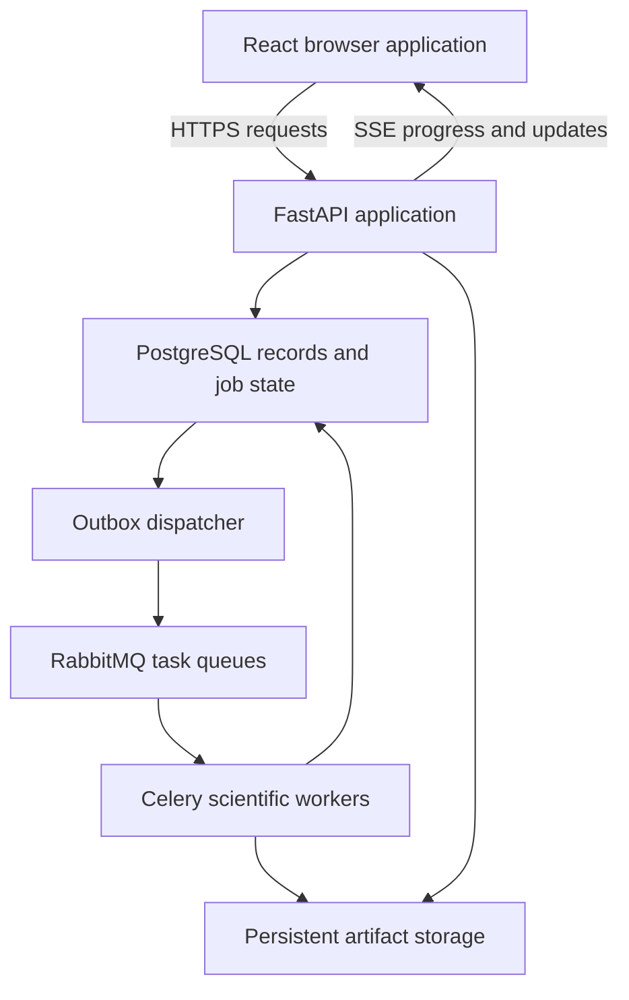

# System Design

**Project:** Aircraft Predictive Maintenance & Fleet Availability
**Problem statement:** PS 26249
**Repository location:** `design.md`
**Status:** Initial architecture; implementation and validation pending
**Related documents:** `intent.md`, `scope.md`, `docs/product/feature_specifications.md`, `docs/product/acceptance_criteria.md`

## 1. Architecture Decision

Build a modular Python application with a React/TypeScript browser interface. Run the API and scientific workers as separate processes while sharing one installable Python package for domain contracts, transformations and application services.

PostgreSQL is the authoritative operational store. RabbitMQ dispatches durable calculation jobs through Celery. Model/data/result artifacts live in persistent artifact storage and are identified by manifests and hashes. The browser uses the application API rather than directly accessing the database, broker or artifact filesystem.

This design supports the scoped demonstrator. It does not establish a real-time aircraft telemetry system, production high availability or certified maintenance operation.

## 2. Runtime Topology

All database access passes through shared persistence/services code with appropriately scoped sessions. Worker access to PostgreSQL is permitted through that code; workers must not invent separate commitment rules.

The reverse proxy serves the built frontend and routes `/api/` to FastAPI over one browser origin. Configure it to support long-lived SSE responses without inappropriate buffering. It is an entry point, not another business-logic service.

## 3. Selected Technologies and Roles

| Area | Technology | Responsibility |
|---|---|---|
| Browser | React, TypeScript, Vite | Screens, interactions and explicit view states. |
| Interface primitives | Radix UI, Tailwind CSS | Accessible interaction foundations and shared styling tokens. |
| Server-derived state | TanStack Query | Record queries, invalidation and mutations; distinct from unsaved local input. |
| Charts | Apache ECharts | Sensor history, interval plots and scenario comparisons. |
| Application API | FastAPI, Pydantic, Uvicorn | Validated contracts, routes, access checks and application services. |
| Database | PostgreSQL, SQLAlchemy, Alembic | Records, transactions, relationships, reservations and schema history. |
| Calculation jobs | Celery, RabbitMQ | Dispatch and independently running workers. |
| Prediction | PyTorch, scikit-learn, XGBoost | Evaluated neural/classical candidates, inference and uncertainty methods. |
| Scheduling | OR-Tools CP-SAT | Discrete maintenance constraints and optimization. |
| Simulation | SimPy, NumPy | Event-driven fleet/logistics scenarios and replications. |
| Experiments | MLflow and artifact manifests | Research run metadata and artifacts. |
| Packaging | Docker Compose | Local/single-host service topology and persistent volumes. |

Pin maintained versions verified together during implementation. The prediction algorithm remains an evaluation decision; this stack does not require a neural model to win. A custom editable timeline is a separate UI interaction component; ECharts is not assumed to supply a complete planning editor.

## 4. Source Architecture

The monorepo has `apps/web/` and `backend/`. The backend's `src/fleet_maintenance/` package is installed into both API and worker environments. Scripts import the package rather than duplicating its implementation.

| Module | Owns | Boundary |
|---|---|---|
| `api/` | Routes, request/response translation and dependency wiring. | Calls services; no training or optimizer loops in web handlers. |
| `domain/` | Contracts, meanings, units, enums and domain errors. | Does not depend on HTTP request objects or ORM sessions. |
| `services/` | Assessments, alerts, planning orchestration, reservations, approvals, jobs and access. | Owns business workflows, not presentation. |
| `persistence/` | ORM records, repositories, transaction/session handling. | Does not decide numerical models or UI labels. |
| `science/data/` | Loading, validation, engine partitions and transformations. | One transformation implementation for training and inference. |
| `science/prediction/` | Models, training, inference, calibration, explanations and evaluation. | Accepts validated scientific inputs; no approval/reservation effects. |
| `science/scheduling/` | Formulation, constraints, objective, solve and diagnostics. | Produces proposals; does not commit operational reservations. |
| `science/simulation/` | Events, policies, replications and metrics. | Operates on scenario snapshots; does not mutate live stock/plans. |
| `workers/` | Task orchestration, dispatch, attempt lifecycle and completion. | Reuses shared services/contracts. |
| `artifacts/` | Manifest validation, hashing and storage interface. | Source code for storage, distinct from root generated `artifacts/`. |

Use explicit application inputs/results at module boundaries. Avoid importing frontend or transport concerns into scientific code. Persistence records and public API contracts have different responsibilities and should not be treated as interchangeable serialized objects.

## 5. Operational Records and Artifact Storage

### PostgreSQL entities

Detailed fields belong in `docs/engineering/data_model.md`. The initial conceptual groups are:

| Group | Principal records |
|---|---|
| Identity/access | Users, applicable roles/permissions and sessions. |
| Fleet/components | Aircraft, components, installation/mapping history and data sources. |
| Observations | Import versions, observation indices, sensor metadata and quality findings. |
| Health | Model registrations, input snapshots, assessments, explanations and alerts. |
| Maintenance | Tasks, task requirements, proposals, assignments, approvals and work outcomes. |
| Logistics | Parts, stock/arrival records, resources/calendars, reservations and consumption. |
| Scenarios | Scenario revisions, simulation runs and summaries. |
| Reliability | Jobs, attempts, outbox entries, persisted application events and audit history. |

Store records requiring transactional relationships in PostgreSQL. Core relationships use explicit fields/constraints; flexible metadata may use validated JSONB rather than moving every invariant into unstructured JSON.

### Large and immutable content

Raw/processed datasets, split manifests, weights, detailed numerical outputs and event traces may live in artifact storage. PostgreSQL stores their identifiers, hashes, status and relevant relationships. Small operational observations can be indexed in PostgreSQL; the precise threshold for external storage must follow measured query/retention requirements, not an invented row count.

Initially use a persistent mounted directory behind the storage interface. Object storage can later implement the same interface. Database backup and artifact preservation must be coordinated so restored references remain resolvable.

An artifact becomes usable only after its bytes and manifest are durably stored and its registration succeeds. Incomplete writes remain unregistered/quarantined; reconcile abandoned files explicitly. The filesystem and PostgreSQL do not share a transaction, so do not claim atomic cross-store writes.

### Versions and corrections

Capture immutable input snapshots or stable versioned references for assessments/proposals/runs. Corrections append a new record/version and retain lineage. Mutable display records must not silently change the scientific input behind an earlier result.

## 6. Import and Data-Quality Flow

1. An authorized request selects a documented format and source/version.
2. Validate identities, ordering, units and structural requirements.
3. Apply the declared strict/partial acceptance policy and record findings.
4. Store source provenance and accepted observations/artifacts.
5. Use stable identities/checksums and database constraints for reimport deduplication.
6. Make accepted versions discoverable for assessments and research.

Import validation and model eligibility are distinct: a structurally valid record can still be unsuitable for a model. Preserve quality findings at both stages. Imputed values remain identifiable. Do not infer physical sensor names unsupported by the dataset.

## 7. Prediction and Evidence Flow

Model training is an offline research workflow, not a web-request side effect. Training produces a manifest binding weights, target definition, transformations, supported regimes and applicable evaluation/calibration artifacts.

For an assessment:

1. Capture component, cutoff, source snapshot and eligible model version.
2. Validate history and operating support using the defined policy.
3. Run a calculation job when the workload requires it. Cached assessments may be returned only when their complete input/model/configuration identity matches.
4. Apply the exact stored transformation and compute the estimate/uncertainty.
5. Validate output numerics, units and interval semantics.
6. Register the assessment with quality and provenance.
7. Generate optional explanation evidence against the same input/model version.
8. Evaluate the alert policy through an idempotent application service and emit a persisted update.

A failed explanation must not fabricate a cause or invalidate an otherwise usable estimate without an explicit policy. A withheld assessment supplies no numerical life value to planning. Historical cutoffs exclude future observations and target labels.

Units remain explicit: life estimates use cycles; calendar windows require a scenario usage schedule. A calibrated interval is not a per-component failure probability.

## 8. Alert Processing

Alert policies are versioned configuration plus tested application logic. Each transition records the assessment and policy responsible. Process historical assessments in the declared order; duplicate delivery must not create duplicate transitions.

Acknowledgement records review, while resolution records a separate policy/permitted action. Missing or withheld assessments create the configured quality state rather than clearing deterioration. Mandatory task/deadline tracking is independent of model alert thresholds.

A changed model or alert policy cannot silently rewrite historical alerts. Re-evaluation, when permitted, produces separately identified results.

## 9. Planning, Grouping and Approval

### Proposal computation

1. Validate task/resource/stock/calendar inputs and health-to-window assumptions.
2. Capture a proposal input snapshot and create a planning job.
3. Build the discrete constraint model with configured horizon, scaling and objective.
4. Solve within the declared settings.
5. Interpret solver status without confusing unknown, infeasible and failed states.
6. Independently validate any usable schedule against all declared hard constraints.
7. Store the result, objective/bounds when available, diagnostics and versions.
8. Present a proposal for review; it has no committed stock/resource effects yet.

Grouping is part of the formulation: compatible tasks may share a grounding, but durations, resources, windows and early-work tradeoffs remain explicit. Known bottlenecks come from defined prechecks/diagnostic analysis, not a fabricated optimizer explanation.

### Approval transaction

Approval is a business operation separate from optimization:

- Authenticate/authorize the reviewer and identify the exact proposal version.
- Recheck current task, stock, resource and plan commitments under appropriate transaction/concurrency controls.
- Validate the proposal remains applicable; reject stale/conflicting input instead of silently changing the approved plan.
- Commit approval, reservation records, work records and audit/outbox entries consistently.
- Make repeat submissions idempotent using operation identity and database uniqueness/invariants.

Use deterministic locking/order or suitable isolation and retries where required. Database constraints alone cannot express every scheduling rule; combine transactional checks with validated schedules. Do not hold a database transaction open while an optimizer runs.

Cancellation/revision releases eligible reservations according to lifecycle rules. Consumed parts are not recreated. Completion is explicit work-record input, not automatically inferred from a simulation.

## 10. Simulation and Comparison Flow

Simulation consumes versioned scenario snapshots, policies and plans. It never edits live reservations, approvals or component records.

1. Validate initial states, fleet mappings, usage, units, repair/logistics assumptions and metric definitions.
2. Capture configuration/seeds and enqueue a simulation job.
3. Run independent replications in worker processes with configured resource limits.
4. Compare policies on matched scenarios using the evaluation protocol's sampling procedure.
5. Preserve run metrics and sufficient event traces/reference checks.
6. Display results with variability and a visible simulation label.

Simulated maintenance/reset effectiveness is explicitly assumed unless supported by data. Availability definitions must specify the numerator/denominator/state semantics. A deterministic case does not receive fabricated uncertainty. Policy benefits are measured outcomes, not a guaranteed design property.

## 11. Durable Job Design

### Dispatch

The API commits a job and outbox record in one PostgreSQL transaction. A dispatcher publishes a message referencing the job/attempt and immutable inputs, using publisher confirmation and retry. Large datasets are artifact references, not broker payloads.

Publishing and marking dispatch completion are not one atomic distributed transaction. Duplicate messages are expected possibilities; the worker's claim/result protocol must handle them.

### Execution and completion

- Record queued/running/terminal state separately from broker delivery state.
- Atomically claim an eligible job attempt. Duplicate delivery cannot create two authoritative successful completions.
- Retain attempt identity, worker heartbeat/lease where applicable and configurable retry policy.
- Run calculation outside long database transactions.
- Persist artifacts, then register results and completion using conditional attempt/version checks.
- Reject late/stale results if the attempt or job was cancelled/superseded.
- Emit an application update only after authoritative result state exists.

Tasks must be safe to retry. The architecture does not promise exactly-once execution; it aims for consistent accepted effects through idempotency and transactions. A worker can execute work that is later rejected as stale.

### Cancellation and recovery

Cancellation-requested differs from cancelled. Implement cooperative checks where possible; isolate/terminate long computation only through a documented execution policy. Recover expired attempts explicitly, with retries bounded and observable. A broker acknowledgement or process restart alone does not prove application completion.

Detailed transitions, queue configuration and race handling belong in `docs/engineering/job_lifecycle.md` and its decision record.

## 12. Browser and API Design

### Screens

Fleet overview; component history/assessment; evidence card; alert history; maintenance planning; inventory/bottlenecks; scenario comparison; and calculation progress. Login/session and approved-work history support these screens.

### State ownership

Use server-query state for persisted records/results. Keep unsaved filters/form edits locally. Successful commands invalidate affected queries; do not manually maintain several conflicting copies of an approved plan.

All screens handle loading, empty, denied, failed/unavailable, stale and degraded-data states. Display units/provenance and avoid colour-only warnings. Charts request appropriate windows/downsampled views while preserving important signal features; downsampling for display must not silently alter scientific inference inputs.

### Contracts

Public contracts specify identifiers, versions, units, quality flags and stable error codes. Generate OpenAPI/client types from implemented routes, while retaining runtime validation. TypeScript types alone cannot validate received network bytes.

Long job submissions return a job identifier and accepted state; users retrieve authoritative status/results through ordinary endpoints. HTTP commands perform authorization and version checks even if frontend controls hide unavailable actions.

### Events

SSE carries one-way progress and material updates. Events carry identifiers and relevant record/job versions. Support reconnect/replay according to retention rules. If an event gap cannot be replayed, refresh authoritative state. Live delivery is not the sole record of completion.

Exact paths/payloads belong in `docs/engineering/api_contracts.md` and `events.md`. WebSockets are reserved for a demonstrated bidirectional interaction, not required by this design.

## 13. Access, Sessions and Observability

The API enforces authenticated access and the defined permission model for view, edit and approval operations. The single-origin browser deployment should use a documented session mechanism with secure cookie/CSRF handling where applicable; select and document the exact implementation in the permission/access specification. Workers authenticate to internal services/storage through deployment configuration, not browser credentials.

Do not store secrets in source-controlled files or scientific manifests. Keep private records and credentials out of logs. This is implementation hygiene, not a certification claim.

Use request, job, attempt, component/proposal and source-revision identifiers for correlation. Log meaningful transitions, latency, failures and conflicts. Monitor queue delay, job runtime, resource usage and calculation/validation failures. Progress is unknown when not measurable; avoid invented percentages.

## 14. Deployment and Resource Isolation

Docker Compose runs the proxy/frontend, API, PostgreSQL, RabbitMQ, dispatcher and worker pools. Separate queues/pools may isolate inference, planning and simulation. Configure process concurrency and numerical-library threading deliberately to avoid oversubscribing CPU/GPU resources.

Load heavy models in appropriate inference workers rather than every ordinary API process. Training remains a separate controlled command/job with research artifacts. Use persistent volumes for database, broker state where configured and artifacts; empty containers are not persistent storage.

The initial topology is single-host and does not provide automatic failover. Deployment/backup/restore instructions must state how database/artifact versions remain consistent and how incomplete jobs are recovered.

An additional language, service, database or cluster requires a measured requirement and a documented decision. Profiling may justify native acceleration later; do not build it into the initial architecture without evidence.

## 15. Verification and Architectural Decisions

Validate the substantive risks identified in acceptance criteria: engine leakage, transformation parity, unit semantics, schedule constraints, reservation concurrency, stale approval, duplicate/restarted jobs, simulation reference cases and connected user workflows.

Performance claims require specified workload/hardware and measured results. Architectural diagrams describe the intended system, not evidence that it is deployed or tested.

Detailed decisions belong in `docs/decisions/`. Record an architecture change with its reason, alternatives, contract/data implications and validation requirements. Preserve this document as the high-level map and link to detailed specifications rather than duplicating their complete contents.
