# Interactive customer trial

Implemented local demonstration, 2026-10-05. Entry: **Start → Try it with your data**, or **Try demo** in primary navigation. The illustrative interactive aircraft remains at **Aircraft** (`/fleet`) and is reused in the trial (`/demo`). Start uses its local poster so the welcome page stays lightweight.

A seller introduces the maintenance decision; the customer supplies a case and performs the steps. The customer sees outputs calculated from their selected engine history and logistics inputs, rather than a preset result or a text-only tour.

```mermaid
flowchart LR
    A[Enter history cutoff and logistics] --> B[Import immutable history]
    B --> C[Real AI assessment job]
    C --> D[Review estimate, interval and quality]
    D --> E[Explicit usage and trial review-window policy]
    E --> F[Real constrained scheduling job]
    F --> G[Matched parts-ready simulations]
    G --> H[Review synthetic decision]
    H --> I[Receive demo kit and replan if necessary]
    I --> J[Human approval and reservation]
    J --> K[Record started and completed work]
```



## What the customer enters and sees

| Entered input | Calculation / visible consequence |
|---|---|
| Aircraft/customer name | Own synthetic aircraft/component/task/kit; name does not change scientific input |
| Observed cutoff cycle | Only history through that cycle is imported; the registered model calculates a new estimate and calibrated interval |
| Supplied FD001 history JSON | Same strict consecutive-cycle/24-feature contract as ordinary imports; actual rows can be downloaded and inspected |
| Cycles/day | Explicit assumed utilisation converts the lower interval endpoint to hours for the trial review window |
| Inspection duration | Entered eight-hour-slot work duration must fit the review window and deadline |
| Mandatory deadline | Remains a hard upper bound; AI never extends it |
| Kits on hand / expected arrival | Real dedicated synthetic inventory and expected-delivery records; schedule waits when appropriate |
| Explicit receipt | Credits the demo stock through the existing audited inventory service; invalidates the old proposal and submits a fresh one |
| Explicit approval/start/completion | Existing supervisor workflow reserves then consumes a kit; saved work states survive reload |

Each case creates a distinct immutable trial identity. Conflicting retries cannot overwrite earlier inputs. A saved-trial library and the `?trial=` URL reopen results. Changed assumptions use another case. The initial form is prefilled; saved input view shows that trial’s actual values and offers its exact imported rows for download.

## Scientific and planning meaning

The local installed model is the existing gradient-boosting baseline trained under frozen validation-v1 settings, with its fitted standardizer and separate calibration artifact. The sample is **NASA_CMAPSS:FD001:train:1**, a held-out validation engine, through cycle 180 at most. The sample installer checks the source hash and partition against the fitted manifest; it reads no final-test labels. It does not retrain a model through a web request. The registration retains `scientific_release=not_qualified`; installation is not new release qualification.

The customer can choose the cutoff or upload a supported history. Uploaded history is labelled user-supplied FD001-format data; formatting alone does not establish applicability to operational engines. Below 30 cycles or with missing values, the existing model withholds the assessment. No healthy estimate or schedule is substituted.

**Trial policy `trial-lower-bound-window-v1`:** `projected_lower_hours = lower_cycles × 24 / cycles_per_day`; floor to eight-hour slots, then use the earlier of this window and the entered mandatory deadline. This is a deliberately visible synthetic review-window assumption, not a predicted failure time, certified maintenance limit or evaluated alert policy. It may produce an invalid/infeasible schedule; that result remains visible. The proposal snapshot records assessment/input/model identity, usage, policy and both deadlines. An original recorded task remains mandatory when model evidence is insufficient; the trial does not present a numerical evidence-informed recommendation until matching evidence is available.

Trial resources form separate synthetic workspaces: one dedicated engine-qualified crew and its own kit stock. Ordinary fleet proposals exclude trial tasks, parts and commitments. Trial approval uses the same locks, current-input hash, constraint validation and reservation/work services. It cannot spend ordinary stock or promise shared real fleet capacity. Corrected histories invalidate the original trial scope rather than silently approving stale evidence.

## What the comparison measures

Two saved scenarios share the same **single aircraft, inspection at hour 0, entered work duration, one service resource, 112-hour horizon and deterministic seed 26249**. Only kit availability differs: ready now versus initially entered stock/delivery time. Results expose downtime in aircraft hours, part waiting in hours and aircraft-time availability. They do not simulate predicted failure, maintenance effectiveness, a whole-aircraft health state or real savings. After a demo receipt, the original immutable comparison remains labelled with its original supply assumptions.

For the prefilled **16-hour work / no stock / hour-24 delivery** case, the analytically expected reference results are 16 versus 40 aircraft-hours of downtime and 0 versus 24 hours of part wait. The browser displays saved server simulation results, not these reference numbers embedded in application code.

## Local setup and repeatable sales exercise

The current local stack already has the model/sample installed. Open `http://localhost:8080/demo`.

For a new checkout, start Docker Desktop and `docker compose up -d --build`. Acquire the documented public data using `scripts/fetch_dataset.py`, prepare with `scripts/prepare_dataset.py`, train with `scripts/train_model.py --artifact-dir artifacts/models/customer-trial-v1`, and calibrate with `scripts/calibrate_model.py --artifact-dir artifacts/models/customer-trial-v1`. These require the installed science dependencies. The equivalent preparation commands and the exact installer below were executed in Python 3.13 containers; they avoid a host Python certificate-store problem without disabling certificate checks:

```sh
docker compose run --rm --user root -v "$PWD:/workspace" -w /workspace -e PYTHONPATH=/workspace/backend/src api python scripts/fetch_dataset.py
docker compose run --rm --user root -v "$PWD:/workspace" -w /workspace -e PYTHONPATH=/workspace/backend/src api python scripts/prepare_dataset.py
docker compose run --rm --user root -v "$PWD:/workspace" -w /workspace -e PYTHONPATH=/workspace/backend/src api python scripts/train_model.py --artifact-dir artifacts/models/customer-trial-v1
docker compose run --rm --user root -v "$PWD:/workspace" -w /workspace -e PYTHONPATH=/workspace/backend/src api python scripts/calibrate_model.py --artifact-dir artifacts/models/customer-trial-v1
docker compose run --rm --user root -v "$PWD:/workspace" -w /workspace -e PYTHONPATH=/workspace/backend/src api python scripts/install_customer_demo.py
```

Weights, bulk data and sample bytes stay in ignored local artifacts / the persistent Compose artifact volume. The installer rejects conflicting already-installed model bytes. Preserve those volumes; stopping services does not require removing them.

1. Create the prefilled case under the customer’s name. Inspect/download the rows, calculate AI and inspect its evidence.
2. Calculate the schedule and run the parts comparison. Identify why expected supply moves work later and adds simulated downtime.
3. Review, record a demo receipt and wait for the fresh schedule. Approve, record work started, then completion; inspect reservation consumption.
4. Create another case with one kit on hand and compare outcomes. Keep the earlier case available.
5. Test cutoff 25 to see withholding. Test cutoff 180 with 120 cycles/day to see a review window too short for the default inspection. Explain the actual outcome without relaxing constraints.

Browser verification establishes these transitions, not sales effectiveness or participant comprehension. Intended-device performance, customer usability observation and the broader release workstreams remain open.

Verification record: the full original 34-case browser suite passed in one run; adding the edited-history case yielded 34/35, followed by a passing corrected upload assertion against the actual transmitted JSON. All 35 distinct cases passed across the final runs. A 75-case backend run included isolated PostgreSQL concurrency; final 13 targeted checks covered the seven trial cases and API contracts. See [UI verification](../design/ui_verification.md) for exact scope and failures corrected.

## Saved-plan comparison — 2026-10-05

After Calculate my schedule, choose Compare this saved plan. Inspect its actual/FIFO downtime under declared/overrun assumptions and its exact plan/hash/event timeline. The original parts comparison remains separately labelled logistics sensitivity. Receiving a kit and replanning creates a new proposal; comparing again uses the new plan, not the old result. The one-inspection example has zero advantage over FIFO under identical supply: both schedules are equal. Expected kit arrival at hour 24 yields simulated downtime 40 hours; recorded receipt/replan at hour zero yields 16 hours under the declared-duration case. These are projected scenario results, not observed saved downtime.
