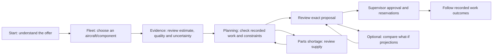

# Maintenance decision user flow

## The offer in one sentence

Help maintenance teams review engine deterioration evidence and find a feasible way to perform recorded maintenance, with parts, crew and human approval in the same decision workflow.

This addresses PS 26249's fragmented information and reactive maintenance problem. The current demonstrator uses simulated FD001 engine histories and synthetic logistics. It has no established operational availability gain. The promise should be understandable before users encounter a chart, model version, solver status or aircraft renderer.

## The main journey

The three user-facing phases are **Review a component → Check maintenance options → Review approval & work**. The detailed sequence above is an information/action flow, not a wizard that automatically completes approval. Evidence review is required; what-if comparison is optional. A user should never have to open every module simply to review one component.

## Each screen has one job

| Screen / route | User question | First information shown | Main next action |
|---|---|---|---|
| Start (`/overview`, default `/`) | What does this product do, and where do I begin? | One-sentence offer, three phases, recorded aircraft with open work | Start with your fleet |
| Fleet register (`/fleet/register`) | Which aircraft/component should I review? | Searchable records and open maintenance task counts | Open component evidence |
| Component (`/components/:id`) | What do we know about this engine, and can I use the estimate? | Saved model estimate/interval or unavailable state; findings and provenance; sensor evidence | Review maintenance options with component context |
| Planning (`/planning`) | What recorded work can we actually schedule? | Fleet-wide scope, calculate action, current proposals, actual solver outcome and constraints | Calculate maintenance schedule, then review the exact result |
| Exact proposal review (planning dialog) | Is this the proposal I intend to commit? | Proposal/input identity, status, resource/parts constraints and approval consequences | Authorized supervisor approves; otherwise keep it a proposal |
| Reservations & work history (selected plan) | What was reserved, and what work has been recorded? | Server-retained quantities, work status, consumption and timestamps | Review history; outcome entry remains governed by the authorized API contract |

For an interactive customer exercise, [Try demo](customer_trial.md) now connects entered history and logistics to real AI, scoped planning, matched supply simulation and recorded work. Its aircraft model is a primary visual entry, and each case retains its inputs/results.

A register link currently opens the first mapped component. The illustrative inspection page (`/fleet?aircraft=…&component=…`) retains the existing aircraft/component selector for reviewing other mappings. It is an alternate inspection tool, not the default welcome page or proof of a physical digital twin. A richer component chooser in the register remains a future improvement for multi-component fleets.

## Supporting tools appear when they help

Primary navigation is **Start · Aircraft · Try demo · Planning**. **More tools** opens the accessible navigation dialog with Fleet register, Alerts, Parts & deliveries, What-if comparisons and AI & evidence. Mobile uses the same dialog, with clear main/supporting groups and keyboard focus restoration.

- **Alerts:** enter when an assessment requests review, or when the engineer needs to acknowledge an alert. An acknowledgement does not resolve deterioration or complete maintenance.
- **Parts & deliveries:** enter from a proposal bottleneck or for a logistics role. Show actual free stock, expected arrivals and receipt/cancellation. Return to planning and calculate a fresh proposal after an input change.
- **What-if comparisons:** enter when comparing the effects of capacity or supply assumptions. Show saved matched results as simulated projections. A scenario is not automatically an approved plan, and its events do not complete actual work records.
- **AI & evidence:** enter through “How the AI helps” or More tools. Explain what the model consumes/produces and let the reviewer inspect saved component output. It is supporting explanation rather than a required detour before planning.

These tools retain their independent routes for experienced users. The normal journey does not repeatedly advertise them as equally important next actions.

## Information should unfold in this order

1. **Decision summary:** component identity, estimate or unavailable state, units and uncertainty.
2. **Reason to qualify the decision:** quality/applicability findings, mandatory recorded work and known resource/parts blockers.
3. **One clear next action:** review evidence, calculate options, or review the exact proposal depending on the stage and permissions.
4. **Supporting detail:** sensor charts/tables, influences, input/model identity, solver details and audit history.

Keep warnings and uncertainty visible. Move repeated explanatory prose and deep technical metadata into supporting sections rather than removing important limitations. Avoid duplicate RUL metrics and workflow-card grids on every page. Preserve units and text status labels. “Open work” must not read as an aircraft safety/readiness score.

## Exceptions are part of the flow

| Condition | Explain | Available next step |
|---|---|---|
| Model/input unavailable | No eligible life estimate; state the supplied quality reason | Inspect recorded data and existing maintenance work |
| No recorded open tasks | No open work is recorded; this does not establish health | Browse component evidence and saved plans |
| API unavailable | Records could not be loaded; no zero/healthy substitute | Retry; product explanation remains readable |
| Parts insufficient | Required quantities, free stock and expected arrivals | Review supply; receive physical stock through authorized workflow, then recalculate |
| Solver infeasible/unknown/failed | Actual distinct outcome, with recorded diagnostics | Review inputs and calculate a new proposal; do not approve |
| Stale approval | Inputs changed since calculation | Return to planning, calculate and review the new version |
| Read-only user | Explain the role needed for calculation/approval | Keep evidence and saved proposals accessible |
| Calculation running | Real recorded job state; no invented progress percentage | Follow result; cancellation follows existing permission/lifecycle rules |

## What is implemented and what remains

The presentation includes default Start with an aircraft poster and customer-trial CTA, grouped navigation, simplified fleet register, estimate/evidence first on component pages, context-preserving maintenance CTA, and plain-language calculation actions. The interactive aircraft remains at `/fleet` and is reused in `/demo`.

The [customer trial](customer_trial.md) implements entered case inputs, downloadable/uploadable FD001 history, registered-model assessment, explicit utilisation/window assumptions, dedicated trial planning and parts, matched simulations, receipt/replanning, approval and work start/completion. Cases are saved separately and reopen by URL/library. Ordinary fleet plans still schedule recorded task windows; the trial policy is a labelled synthetic bridge, not a qualified operational maintenance policy.

A real calibrated baseline and labelled simulated validation history are now installed in the current local stack. Missing setup, insufficient history or missing values remain explicit unavailable/withheld states. Model qualification, separate qualified-bay constraints, independent alert validation and broader scientific/performance acceptance remain open. General fleet task editing and multi-component register selection still need improvement; trial form/work entry do not establish those general capabilities.

## How to evaluate understandability

Ask a new participant to complete these without developer guidance:

1. Explain what the product helps a maintenance team decide and which output comes from AI.
2. Find an aircraft with recorded open work and identify its component.
3. Distinguish a model estimate, a prediction range, a maintenance task and a simulated projection.
4. Explain an unavailable assessment and find the recorded maintenance options anyway.
5. Follow a proposal to its exact review and explain what approval reserves.
6. Find the parts tool when a shortage is shown and return to the main journey.

Record wrong turns, help requests and participant interpretations. Browser tests establish route/state behaviour, not participant comprehension. No usability-study pass is claimed until actual participants and criteria are recorded.
